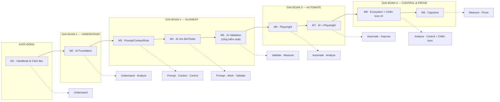

# CURRICULUM BLUEPRINT — AI FOR BA & TESTER

> Đây là **tài liệu gốc quản lý toàn bộ chương trình**.
>
> Dùng để: lập kế hoạch đào tạo, điều phối giảng viên, chấm điểm,
> đối chiếu coverage với **AI Handbook** (14 chương) và **ISTQB CT-GenAI v1.1**,
> và cải tiến khoá sau.
>
> Mỗi dòng trong bảng là **một lesson**. Một lesson = một phiên thực hành
> theo format 10 bước (PROBLEM → WHY → THEORY → DIAGRAM → DEMO → TOOL →
> PRACTICE → VALIDATE → MEASURE → REAL PROJECT → REUSE).
>
> Ký hiệu **ch.Y** = chương trong AI Handbook (xương sống nội dung).

---

## A. THÔNG SỐ TỔNG THỂ

| Thông số | Giá trị |
|---|---|
| Đối tượng | BA + Tester (đã có nền tảng kiểm thử) |
| Project xuyên suốt | E-commerce Checkout (requirement, business rules, UI, test cases, bugs) |
| Xương sống nội dung | **AI Handbook** (14 chương) + **ISTQB CT-GenAI v1.1** |
| Công cụ AI chính | Claude (thống nhất theo đội; có thể thay ChatGPT/Copilot) |
| Công cụ automation | Playwright |
| Cấu trúc | 5 pha (khởi động + 4 giai đoạn) · 9 module · 37 bài học |
| Định dạng lesson | 10 bước thống nhất, mỗi bài ra 1 artifact bắt buộc |
| Châm ngôn xương sống | **Do not delegate thinking. Delegate work.** |

---

## B. BẢN ĐỒ GIAI ĐOẠN → MODULE → NĂNG LỰC

---

## C. BLUEPRINT CHI TIẾT TỪNG MODULE

### KHỞI ĐỘNG

#### MODULE 1 — Handbook & Cách đọc

> **AI Handbook:** ch.00 (Start Here) · ch.13 (Cách đọc) · ch.14 (Core Message)

| # | Bài học | Objective | Theory | Practice | Tool | Output | KPI |
|---|---|---|---|---|---|---|---|
| 1.1 | Mục đích & nguyên tắc | Kể được mục đích, 4 nguyên tắc, và "AI hỗ trợ, con người quyết định" | Chương 00 — nguyên tắc; ch.14 — core message | Viết lời cam kết cá nhân với AI | — | Personal AI Code of Conduct | nêu đúng 4 nguyên tắc |
| 1.2 | Cách đọc & map công việc | Dùng ch.13 làm cửa vào theo vai trò; map công việc thật của mình sang chương | Chương 13 — "đọc theo hoàn cảnh" | Bảng: việc của tôi → đọc chương nào | — | `/lab/personal-map.md` | Mọi việc map được chương |

**Đạt khi (GATE):** Có lời cam kết cá nhân · bản đồ công việc → chương ·
hiểu "Do not delegate thinking. Delegate work."

---

### GIAI ĐOẠN 1 — UNDERSTAND

#### MODULE 2 — AI Foundation

> **AI Handbook:** ch.01 (GenAI/LLM · Limitations)
> **ISTQB CT-GenAI:** Chương 1 (GenAI-1.1.1 → 1.2.2) + GenAI-3.1.1 (hallucination)

| # | Bài học | Objective | Theory | Practice | Tool | Output | KPI |
|---|---|---|---|---|---|---|---|
| 2.1 | "AI" không phải một thứ duy nhất | Phân biệt symbolic AI, classical ML, deep learning, GenAI, LLM | Phổ AI (ch.01.1); LLM = GenAI chuyên chữ (GenAI-1.1.1) | Phân loại 5 tool/feature trong công ty | — | Bảng phân loại | 5/5 tool xếp đúng nhóm |
| 2.2 | LLM làm việc như thế nào | Giải thích tokenization, embedding, giới hạn thật của LLM | Token, context window, non-determinism; "plausible ≠ correct" (GenAI-1.1.2, 3.1.4) | Tách manual text thành token; đếm token, quan sát context window, thay đổi temperature | Claude + tokenizer | Bảng token + 2 output nhiệt độ khác nhau | Hiểu token count ảnh hưởng chi phí/độ dài |
| 2.3 | Hỏi thiếu → trả lời "hay nhưng sai" | Cấu trúc tối thiểu Task + Context + Format cho một prompt | Prompt không context = sinh theo kiến thức chung | Viết 2 version hỏi (kém vs rõ), chạy, ghi 3 khác biệt | Claude | Bảng so sánh 2 prompt | Nhận diện đủ 3 thành phần trong prompt rõ |
| 2.4 | Sai mà trông giống đúng | Nhận diện 3 kiểu lỗi: bịa / lệch / thiên lệch | Hallucination, reasoning error, bias (ch.01.2; GenAI-3.1.1) | AI Challenge: liệt kê rule từ tài liệu thật, soi từng câu | Claude + doc thật | **AI Limitation Report** | Mọi câu AI đều phân loại Đúng/Bịa/Lệch |
| 2.5 | Hai cách làm việc với AI | So sánh AI chatbot vs LLM-powered test tool | Hai interaction model (GenAI-1.2.2); map năng lực LLM vào test tasks (GenAI-1.2.1) | Đối chiếu việc mình đang làm với năng lực LLM | — | Bảng capability map | Mỗi task gán đúng interaction model |

**Đạt khi (GATE):** Limitation Report đủ phân loại theo nguồn gốc ·
phân biệt được hai interaction model · biết khi nào AI "không nên được dùng một mình".

---

### GIAI ĐOẠN 2 — AUGMENT

#### MODULE 3 — Prompt + Context + Rule

> **AI Handbook:** ch.02 (Working with AI — Prompt·Context·Rule·Output)
> **ISTQB CT-GenAI:** Chương 2 (GenAI-2.1.1 → 2.1.3, 2.3.2) + GenAI-3.1.4, 3.2.3

| # | Bài học | Objective | Theory | Practice | Tool | Output | KPI |
|---|---|---|---|---|---|---|---|
| 3.1 | Prompt 6 thành phần + few-shot | Viết prompt có: Role, Context, Instruction, Input, Constraint, Output format | Cấu trúc prompt (ch.02.1; GenAI-2.1.1); few-shot/zero-shot/one-shot (GenAI-2.1.2) | Prompt có/không Example, chạy 2 lần so format | Claude | `/prompt/checkout-test-conditions.md` v1..vn | 2 lần chạy cùng format; ít sửa tay hơn v0 |
| 3.2 | Context pack | Đóng gói context thành bộ file tái dùng được | Context = source of truth chống hallucination (ch.02.2); data minimization (GenAI-3.1.3, 3.2.3) | Dựng `/context/checkout/` 3 file tối thiểu | Claude | `/context/` | Prompt dùng pack không bịa quy tắc |
| 3.3 | Rulebook chống bịa | Viết 8+ rule, phân loại, map sang từng lỗi M2 | Constraint/rule (ch.02.3); bảo mật dữ liệu trong prompt (GenAI-3.2.3) | Viết rule cho từng lỗi trong Limitation Report | — | `/rules/checkout-ai-rules.md` | Mỗi lỗi M2 có ≥1 rule đối ứng |
| 3.4 | Structured output + temperature | Ép output ra JSON theo schema; siết non-determinism | Structured output = nền cho machine-processing (ch.02.4); temperature/seed (GenAI-3.1.4) | Schema JSON test case, verify parse | Claude | `/output/checkout-tc-sample.json` | JSON parse 100%, đúng schema |
| 3.5 | Chaining + Meta prompting + System/User | Phân biệt prompt chaining, meta prompting, system vs user prompt | Ba kỹ thuật lõi (GenAI-2.1.2, 2.1.3); chọn theo đặc điểm task (GenAI-2.2.5) | 1 việc giải bằng chaining; viết 1 system prompt | Claude | 1 prompt chaining + 1 system prompt | Chọn đúng kỹ thuật cho task |

**Đạt khi (GATE):** Đủ 3 asset `/prompt` `/context` `/rules` ·
prompt chạy 2 lần ra cùng structure · mọi TC JSON hợp schema ·
giải thích được vì sao chọn từng kỹ thuật prompting.

---

#### MODULE 4 — AI cho BA/Tester + Playbook

> **AI Handbook:** ch.03 (BA Work) · ch.04 (Tester Work) · ch.11 (Workflow) · ch.12 (Playbooks)
> **ISTQB CT-GenAI:** Chương 2 (GenAI-2.2.1 → 2.2.5, 2.3.2)

| # | Bài học | Objective | Theory | Practice | Tool | Output | KPI |
|---|---|---|---|---|---|---|---|
| 4.1 | BA: Review requirement + câu hỏi làm rõ | Mở rộng phát hiện ambiguity bằng AI, người lọc | Test analysis với AI (ch.03.1; GenAI-2.2.1); prompt chaining có human verify (HO-2.2.1b) | Manual 10' vs AI 10', bảng Only-Human/Only-AI/Both | Claude | `/playbook/ba-01-review-questions.md` + clarifications | Số ambiguity giữ lại; % câu AI bị loại |
| 4.2 | BA: Business Rules + Acceptance Criteria | Viết AC Given/When/Then có truy vết nguồn | AC = contract; extract ≠ invent (ch.03.2, ch.03.3; GenAI-2.2.1) | 3 AC payment (success/fail/timeout) — Manual 1, AI 1, merge | Claude | `/context/checkout/acceptance-criteria.md` | 100% AC có nguồn, 0 AC ngoài scope |
| 4.3 | BA: Impact analysis | AI liệt kê impact candidate, BA chốt danh sách | Impact analysis = system × flow × data × stakeholder (ch.03.5) | CR "thêm ví mới" → impact matrix | Claude | `/output/checkout-impact.md` | 0 area bịa; số area sót = 0 (peer check) |
| 4.4 | Tester: Conditions + Scenarios | Chuyển AC → test conditions, phát hiện gap/orphan | Test condition, coverage, prioritization theo risk (ch.04.1, ch.04.2) | Coverage matrix AC_ID × Condition_ID | Claude | `/output/checkout-conditions.md` + scenarios | Coverage ≥90% AC; 0 orphan |
| 4.5 | Tester: Test data | Sinh test data tách khỏi TC, không PII thật | Test data synthesis; anonymization (ch.04.5; GenAI-2.2.2, 3.2.3) | Data cho payment success/fail, out-of-stock | Claude | `/data/checkout-testdata.md` | Không chứa PII; mọi case dùng được |
| 4.6 | Tester: Test case JSON + review | Sinh TC JSON, review 6 mục, lọc steps không khả thi | Test design/implementation với AI (ch.04.3, ch.04.4, ch.04.6; GenAI-2.2.2) | Review 5 TC AI theo checklist 6 mục | Claude | `/output/checkout-testcases.json` + `/playbook/tester-02-tc-data-review.md` | % TC pass lần 1; rẻ hơn sửa ở Playwright |
| 4.7 | Compile BA/Tester AI Playbook | Gắn mọi bước công việc thành quy trình có prompt theo ch.12 | Tổng hợp workflow (ch.11, ch.12; GenAI-2.2.5, 2.3.2) | Ghép ba-\*, tester-\* thành master doc | — | `/playbook/BA-TESTER-AI-PLAYBOOK.md` | Mọi bước có prompt + rule + validate |

**Đạt khi (GATE):** Playbook đủ 4 mắt xích BA + 3 mắt xích Tester ·
TC approved có nguồn (req_id/ac_id) · mọi artifact review sign-off ·
mỗi bước đều viết được theo đúng cấu trúc playbook (ch.12).

---

#### MODULE 5 — AI Validation (cổng kiểm soát)

> **AI Handbook:** ch.05 (Validation)
> **ISTQB CT-GenAI:** Chương 2 (GenAI-2.3.1) + Chương 3 (GenAI-3.1.2 → 3.2.3)

| # | Bài học | Objective | Theory | Practice | Tool | Output | KPI |
|---|---|---|---|---|---|---|---|
| 5.1 | Vì sao "không được tin nhưng phải dùng" — 4 lớp kiểm soát | Xây khung: Rule → Ground Truth → Human → Measure | Detection: cross-verification, consistency, logical validation (ch.05.1, ch.05.3; GenAI-3.1.2) | Sơ đồ 4 lớp áp lên TC M4 | Claude | Khung validation trong protocol | Hiểu thứ tự chi phí tăng dần |
| 5.2 | Rule validation | Pass/fail cơ học theo rulebook M3 | Format/schema/traceability/no-invent như máy (ch.05.1; GenAI-3.1.3) | Chấm 30 TC theo checklist | — | `/validation/rule-results.md` | 100% fail có rule_id |
| 5.3 | Ground truth compare | Diff từng trường AI output ↔ AC approved | Match/Partial/Conflict/Missing (ch.05.2; GenAI-2.3.1: accuracy) | Diff 8+ TC vs AC | Claude | `/validation/ground-truth-diff-checkout.md` | Conflict xử lý, Missing mở clarification |
| 5.4 | Human review theo rủi ro | Sampling 3 tầng: 100% High, sample Medium, spot Low | Human 100% không scale, 0% nguy hiểm (ch.05.3, ch.05.4; GenAI-3.1.2, 3.2.3) | Charter + log human review | — | `/validation/human-review-log-checkout.md` | 0 High chưa human; approve có tên/ngày |
| 5.5 | Bảo mật dữ liệu khi dùng GenAI | Nhận diện rủi ro privacy/security và attack vectors | Data exposure, GDPR, context manipulation, data poisoning (GenAI-3.2.1→3.2.3) | Rà test data M4 theo checklist sanitize | Claude | Mục "Cấm ship" trong protocol | Không PII trong mọi artifact |
| 5.6 | Metrics & AI-VALIDATION-PROTOCOL | Đo bằng 7 metrics chuẩn; viết protocol 6 mục | Accuracy, precision, recall, relevance, diversity, exec success, time (ch.05.1; GenAI-2.3.1) | Điền metrics Manual vs AI | — | `/validation/AI-VALIDATION-PROTOCOL.md` + metrics | Đủ 6 mục; before/after có số |

**Đạt khi (GATE):** Protocol đầy đủ · 0 artifact có PII ·
metrics trước/sau có số thật · chỉ TC Approved được đưa sang M6.

---

### GIAI ĐOẠN 3 — AUTOMATE

#### MODULE 6 — Playwright

> **AI Handbook:** ch.06 (Automation — Playwright)
> **ISTQB CT-GenAI:** nền tảng test automation (tool-specific)

| # | Bài học | Objective | Theory | Practice | Tool | Output | KPI |
|---|---|---|---|---|---|---|---|
| 6.1 | Automation mindset | Quyết định tự động hoá cái gì bằng 4 tiêu chí | Repetitive · Deterministic · High frequency · Stable (ch.06.1: khi nào automate) | Chấm 8 TC Checkout | — | `/automation/candidates-checkout.md` | Mọi quyết định có lý do; 0 TC chưa approve |
| 6.2 | Playwright đủ dùng | Đọc/viết được test Checkout | Browser/Page, Locator, Action, Assertion, Fixture, Trace (ch.06.2) | Scaffold + smoke test + bẻ locator xem fail | Playwright | `/automation/playwright-checkout/` | Smoke xanh trên máy học viên |
| 6.3 | Manual → Automation | Dịch TC JSON approved thành script + evidence | Design Sheet: Step / Locator / Data / Assert (ch.06.3) | Code 3+ tests từ TC | Playwright | `/automation/DESIGN-checkout.md` + suite + evidence | Exec ~30s; flaky <20% |

**Đạt khi (GATE):** Suite ≥3 tests chạy xanh · mọi test map TC_ID ·
fail có evidence · đây là baseline cho M7.

---

#### MODULE 7 — AI + Playwright

> **AI Handbook:** ch.07 (AI + Playwright — Generate · Debug · Maintain)
> **ISTQB CT-GenAI:** Chương 2 (GenAI-2.2.3, 2.2.5) + 4.1.3 (agent nền)

| # | Bài học | Objective | Theory | Practice | Tool | Output | KPI |
|---|---|---|---|---|---|---|---|
| 7.1 | AI generate automation | Sinh Playwright từ approved TC có kiểm soát → review → chạy | Few-shot với 1 test xanh mẫu = reference (ch.07.1); rule "không bịa locator" (GenAI-2.2.3) | Prompt v1 không example vs v2 có example | Claude + Playwright | `/prompt/checkout-generate-playwright.md` + ≥2 tests | % pass lần chạy 1; ít dòng sửa |
| 7.2 | AI debug automation | Debug có cấu trúc: evidence → hypothesis → re-run | Structured debug input; anti-pattern "tăng timeout mù" (ch.07.2; GenAI-2.2.3) | 2 fail có chủ đích + 1 fail thật | Claude + Playwright | `/automation/AI-DEBUG-LOG.md` | Thời gian debug giảm; giả thuyết bị bác có ghi chép |
| 7.3 | AI maintain automation | Impact analysis trên locator/flow; patch có kiểm soát | Maintenance = phần lớn chi phí; self-healing/impact (ch.07.3; GenAI-2.2.3) | 1 UI change giả lập → maintain → suite xanh | Claude + Playwright | `/automation/AI-ASSISTED-PLAYWRIGHT-WORKFLOW.md` | Số test sửa đúng (peer check); ≤2 lần chạy đến xanh |

**Đạt khi (GATE):** Workflow gen→debug→maintain có log ·
mọi patch human review trước khi chạy · suite Baseline M6 vẫn xanh.

---

### GIAI ĐOẠN 4 — CONTROL & PROVE

#### MODULE 8 — Ecosystem, Agents & Chiến lược AI

> **AI Handbook:** ch.08 (AI Testing Tools) · ch.09 (AI Browser/Agent)
> **ISTQB CT-GenAI:** Chương 3 (GenAI-3.3.1, 3.4.1), Chương 4 (GenAI-4.1.1 → 4.2.2), Chương 5 (GenAI-5.1.1 → 5.1.4, 5.2.2)

| # | Bài học | Objective | Theory | Practice | Tool | Output | KPI |
|---|---|---|---|---|---|---|---|
| 8.1 | Lab A: Visual AI (Applitools) | Không con nào bắt mọi thứ — visual phát hiện lệch layout | Visual regression = bổ sung, không thay functional (ch.08) | 1 checkpoint trang Checkout | Applitools | `/lab/A-applitools.md` | ≥1 ví dụ lỗi chỉ visual bắt được |
| 8.2 | Lab B/C: Low-code (mabl/Testim) | Đánh giá tool bằng rubric, không bằng tên tuổi | Trade-off low-code cloud vs code-first in-repo (ch.08) | Bảng mabl vs Playwright; rubric Testim 1–5 | mabl/Testim | `/lab/B-mabl.md` `/lab/C-testim.md` | Rubric đủ tiêu chí; nêu 2 tình huống |
| 8.3 | Lab D/E: Enterprise (Functionize/Tricentis) | Tách claim marketing khỏi năng lực thật | Mua theo problem, không theo demo (ch.08) | PoC plan 1 trang | — | `/lab/D-functionize.md` `/lab/E-tricentis.md` | PoC có success metrics + lock-in risk |
| 8.4 | LLM architecture: chatbot → RAG → agent | Phân biệt kiến trúc, chọn đúng mức cho đúng task | Chatbot, RAG, agent (GenAI-4.1.1→4.1.3) | Map dự án mình vào 3 tầng kiến trúc | — | Phần "chọn kiến trúc" trong ECOSYSTEM-MAP | Chỉ rõ khi nào cần RAG/agent |
| 8.5 | Fine-tuning & LLMOps | Hiểu khi nào cần fine-tune, chi phí vận hành, SLM vs LLM | Fine-tuning: data, overfit, compute; LLMOps (GenAI-4.2.1, 4.2.2) | Bài toán chi phí: LLM-as-service vs tự host | Claude | Ước lượng chi phí recurring (HO-5.1.3 nền) | Bảng cost 2 hướng có số |
| 8.6 | Energy, Regulations & Shadow AI | Nhận diện chi phí môi trường, luật, và rủi ro shadow AI | ISO/IEC 42001, 23053, EU AI Act, NIST AI RMF; shadow AI (GenAI-3.3.1, 3.4.1, 5.1.1) | Checklist rủi ro cho scenario dùng AI của team | — | Mục "governance" trong ECOSYSTEM-MAP | Liệt kê được 2 chuẩn + 1 lỗi shadow AI |
| 8.7 | Agent-browser (Lab F) + chiến lược triển khai | Build decision tree Agent vs Script; 3 phase adoption + LLM selection | Agents non-deterministic (ch.09); adoption (GenAI-5.1.3, 5.1.4) | Demo agent vs script; chọn LLM theo 4 tiêu chí | Agent-browser | `/lab/F-agent-browser.md` + `/lab/ECOSYSTEM-MAP.md` | Decision tree đúng; chọn LLM có lý do + cost |

**Đạt khi (GATE):** ECOSYSTEM-MAP hoàn chỉnh · decision tree Agent vs Script ·
không khuyến nghị thay suite M6 bằng agent · biết chi phí vận hành và luật.

---

#### MODULE 9 — Capstone

> **AI Handbook:** ch.10 (Prove Value) · ch.11 (Workflow)
> **ISTQB CT-GenAI:** Chương 5 (GenAI-5.1.2, 5.2.1 → 5.2.3) + tổng hợp KPI Chương 2

| # | Bài học | Objective | Theory | Practice | Tool | Output | KPI |
|---|---|---|---|---|---|---|---|
| 9.1 | Evidence corpus audit | Kiểm tra chuỗi Req → Measure còn mắt xích nào | Evidence chain (ch.10; GenAI-5.1.2) | Audit repo theo checklist | — | `/capstone/AUDIT.md` | % artifact bắt buộc có mặt |
| 9.2 | Narrative end-to-end + demo | Kể câu chuyện 8 bước kèm artifact sống | Storytelling có proof (ch.10; GenAI-5.2.1, 5.2.2) | Script 5 phút + demo chạy Playwright | Playwright | `/capstone/STORY-checkout.md` | Mọi bước có artifact; demo 0 blocker |
| 9.3 | Before/After + Prove value | Chứng minh bằng số, tách measured vs estimated | Metrics so sánh (ch.10; GenAI-5.2.x) | Bảng Before/After cuối | — | `/capstone/PROVE-VALUE.md` | Không claim thiếu số liệu |
| 9.4 | Capstone pack + retrospective | Đóng gói portfolio; 3 keep / 3 improve / 1 experiment | Năng lực thay đổi tổ chức (ch.14; GenAI-5.2.3) | Peer review 2 pack | — | `/capstone/**` | Peer ≥8/10 |

**Đạt khi (GATE):** Pack 5 file đủ · demo chạy được ·
câu trả lời cuối cùng (mục đích của chương trình) trả lời được từ evidence;
kể được workflow Log Req→Test→Automation→Diagnosis (ch.11).

---

## D. MA TRẬN COVERAGE AI HANDBOOK

Đối chiếu 14 chương handbook với module. `●` = dạy trực tiếp/sâu,
`◐` = đề cập/liên hệ, `○` = nền/chạm qua.

| Chương handbook | M1 | M2 | M3 | M4 | M5 | M6 | M7 | M8 | M9 |
|---|---|---|---|---|---|---|---|---|---|
| **00. Start Here** | ● | | | | | | | | ◐ |
| **01. AI Foundation** | ◐ | ● | | | | | | | |
| **02. Working with AI** | | | ● | ◐ | | | ◐ | | |
| **03. BA Work** | | | | ● | | | | | |
| **04. Tester Work** | | | | ● | | | | | |
| **05. Validation** | | | ◐ | ◐ | ● | | | | |
| **06. Automation — Playwright** | | | | | | ● | | | |
| **07. AI + Playwright** | | | | | | ◐ | ● | | |
| **08. AI Testing Tools** | | | | | | | | ● | |
| **09. AI Browser / Agent** | | | | | | | | ● | |
| **10. Prove Value** | | | | | ◐ | | | | ● |
| **11. Workflow** | | | | ● | | | | | ● |
| **12. Playbooks** | | | | ● | | | | | |
| **13. Cách đọc Handbook** | ● | | | | | | | | |
| **14. Core Message** | ● | ◐ | | | | | | | ● |

---

## E. MA TRẬN COVERAGE ISTQB CT-GenAI v1.1

Ma trận đối chiếu **toàn bộ Learning Objectives** của syllabus với module.
`●` = dạy trực tiếp, `◐` = đề cập/liên hệ.

### Chương 1 — Introduction to GenAI (100 min)

| LO | Mô tả | M2 | M3 | M4 | M5 | M6 | M7 | M8 | M9 |
|---|---|---|---|---|---|---|---|---|---|
| GenAI-1.1.1 (K1) | Recall các loại AI | ● | | | | | | | |
| GenAI-1.1.2 (K2) | Basics GenAI/LLM, tokenization | ● | | | | | | | |
| HO-1.1.2 | Practice tokenization | ● | | | | | | | |
| GenAI-1.1.3 (K2) | Foundation/instruction/reasoning LLM | ● | | | | | | | |
| GenAI-1.1.4 (K2) | Multimodal + vision-language | ● | | | | | | | |
| GenAI-1.2.1 (K2) | LLM capabilities cho test task | ● | | | | | | | |
| GenAI-1.2.2 (K2) | Interaction models: chatbot vs test tool | ● | | | | | | | |

### Chương 2 — Prompt Engineering (365 min)

| LO | Mô tả | M2 | M3 | M4 | M5 | M6 | M7 | M8 | M9 |
|---|---|---|---|---|---|---|---|---|---|
| GenAI-2.1.1 (K2) | Cấu trúc prompt 6 thành phần | ◐ | ● | | | | | | |
| GenAI-2.1.2 (K2) | Chaining / few-shot / meta | | ● | | | | ● | | |
| GenAI-2.1.3 (K2) | System vs user prompt | | ● | | | | | | |
| GenAI-2.2.1 (K3) | Test analysis với AI | | | ● | | | | | |
| GenAI-2.2.2 (K3) | Test design/implementation với AI | | | ● | | | | | |
| GenAI-2.2.3 (K3) | Automated regression với AI | | | | | | ● | | |
| GenAI-2.2.4 (K3) | Test monitoring/control với AI | | | | | | | ◐ | |
| GenAI-2.2.5 (K3) | Chọn prompting technique theo task | | ● | ● | | | ● | | |
| GenAI-2.3.1 (K2) | Metrics đánh giá GenAI output | | | | ● | | | | ● |
| GenAI-2.3.2 (K2) | Iterative refinement prompt | | ● | ● | | | ● | | |

### Chương 3 — Managing Risks (160 min)

| LO | Mô tả | M2 | M3 | M4 | M5 | M6 | M7 | M8 | M9 |
|---|---|---|---|---|---|---|---|---|---|
| GenAI-3.1.1 (K1) | Hallucination / reason / bias | ● | | | | | | | |
| GenAI-3.1.2 (K3) | Identify lỗi trong output | ● | | | ● | | | | |
| GenAI-3.1.3 (K2) | Mitigation hallucination/bias | | ● | | ● | | | | |
| GenAI-3.1.4 (K1) | Mitigation non-determinism | | ● | | ● | | | | |
| GenAI-3.2.1→3.2.3 | Data privacy & security | | ◐ | ◐ | ● | | | ◐ | |
| GenAI-3.3.1 (K2) | Energy & CO₂ | | | | | | | ● | |
| GenAI-3.4.1 (K1) | Regulations & standards | | | | | | | ● | |

### Chương 4 — LLM-Powered Test Infrastructure (110 min)

| LO | Mô tả | M2 | M3 | M4 | M5 | M6 | M7 | M8 | M9 |
|---|---|---|---|---|---|---|---|---|---|
| GenAI-4.1.1 (K2) | Architecture LLM test infra | | | | | | | ● | |
| GenAI-4.1.2 (K2) | RAG | | | | | | | ● | |
| GenAI-4.1.3 (K2) | LLM-powered agents | | | | | | ◐ | ● | |
| GenAI-4.2.1 (K2) | Fine-tuning | | | | | | | ● | |
| GenAI-4.2.2 (K2) | LLMOps | | | | | | | ● | |

### Chương 5 — Deploying & Integrating (80 min)

| LO | Mô tả | M2 | M3 | M4 | M5 | M6 | M7 | M8 | M9 |
|---|---|---|---|---|---|---|---|---|---|
| GenAI-5.1.1 (K1) | Shadow AI risks | | | | | | | ● | |
| GenAI-5.1.2 (K2) | GenAI strategy | | | | | | | ● | ◐ |
| GenAI-5.1.3 (K2) | LLM/SLM selection | | | | | | | ● | |
| GenAI-5.1.4 (K1) | Adoption phases | | | | | | | ● | ◐ |
| GenAI-5.2.1 (K2) | Skills cần thiết | | | | | | | | ● |
| GenAI-5.2.2 (K1) | Cultivate AI skills | | | | | | | ◐ | ● |
| GenAI-5.2.3 (K1) | Roles chuyển dịch | | | | | | | | ● |

> Ghi chú: M6 là module tool-specific (Playwright), nằm ngoài phạm vi
> tool-agnostic của ISTQB. Chương trình dùng nó làm cột sống thực hành,
> còn các LO ISTQB liên quan được phủ kín ở M7 và M8.

---

## F. HƯỚNG DẪN KHỞI ĐỘNG VÀ CẢI TIẾN

### Triển khai một batch đào tạo

1. **Khởi động:** Chốt tool AI + demo app (hoặc dùng app thật của đội).
2. **Đọc Handbook trước:** phân phát AI Handbook cho học viên đọc ch.00, 13, 14
   trước phiên M1.
3. **Chạy 5 pha tuần tự**, giữ nguyên thứ tự module.
4. **Mỗi module kết thúc** chạy GATE (tiêu chí "Đạt khi") trước khi sang module sau.
5. **Tần suất:** M1–M5 liền mạch (nền + augment); M6–M7 xen 1 tuần thực hành;
   M8 nén thành lab tự chọn; M9 là buổi bảo vệ riêng.

### Vòng cải tiến khoá sau

- Dùng metrics từ Capstone (9.3) làm baseline khoá kế tiếp.
- Retrospective (9.4) = backlog chỉnh prompt/rules/labs.
- Mỗi lần redeliver: cập nhật module con, giữ nguyên **Blueprint** làm
  contract — chỉ sửa bảng khi có lý do chiến lược, không sửa theo cảm hứng.
- Nếu **Handbook** thay đổi, dò lại Ma trận Coverage Handook (mục D) để đảm bảo
  mọi chương vẫn được phủ.
