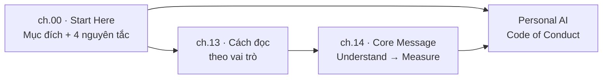
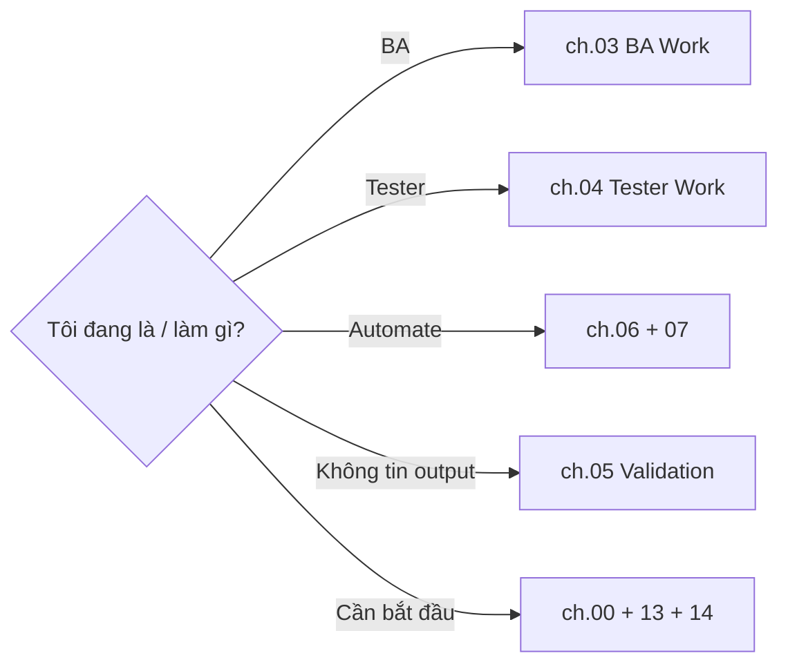

# MODULE 1 — AI Handbook & Cách đọc

> **Pha:** 0 · KHỞI ĐỘNG — định vị trước khi bước vào nền tảng
>
> **Năng lực cốt lõi:** Understand
>
> **AI Handbook:** ch.00 (Start Here) · ch.13 (Cách đọc Handbook) · ch.14 (Core Message)
>
> **Project xuyên suốt:** E-commerce Checkout
>
> **Asset xuất ra:** `/lab/personal-map.md` + Personal AI Code of Conduct
>
> **Thời lượng đề xuất:** 1 giờ

---

## Vì sao có module này

Mọi phần còn lại của khoá học đều học bằng **làm**. Nhưng trước khi bắt tay, bạn cần hai
thứ, và AI Handbook cấp cả hai: một **ngôn ngữ chung** để cả team "dùng AI" ra một kiểu, và
một **hợp đồng cá nhân** để bạn biết mình sẽ làm việc với AI theo luật nào.

Tình huống ai cũng gặp: trong team, người thì copy nguyên output AI vào Confluence, người
thì ngại AI không dính vào, người thì hỏi lung tung rồi tin hết. Chất lượng và rủi ro mỗi
người mỗi kiểu. Chương 00 của handbook đặt ra **bốn nguyên tắc** làm bộ lọc cho mọi quyết
định dùng AI suốt khoá:

| # | Nguyên tắc | Ý nghĩa thực tế |
|---|---|---|
| 1 | **AI hỗ trợ, con người quyết định** | Quyết định nghiệp vụ thuộc về bạn, không nhường AI |
| 2 | **Chỉ dùng AI khi có lý do** | Không "dùng AI" chỉ vì có thể |
| 3 | **Output AI luôn phải kiểm chứng** | Output là đề xuất, không phải sự thật |
| 4 | **Tool phục vụ công việc** | Không để công việc cong đuôi theo tool |

Bốn câu nghe hiển nhiên, nhưng chính chúng là thứ bạn quay lại mỗi khi phân vân. Thử đặt
một câu hỏi đơn giản: *"nên để AI viết toàn bộ AC rồi copy vào Confluence không?"* Đã có
nguyên tắc 3 và 1, câu trả lời rõ từ trước khi bàn thêm.



---

## Hai việc phải làm

### Việc 1 — Chốt "hợp đồng" với chính mình

Trước khi học thuật ngữ, hãy viết một **Personal AI Code of Conduct** — lời cam kết riêng:
**3 điều bạn sẽ luôn làm + 2 điều bạn sẽ không bao giờ làm** với AI, dựa trên bốn nguyên
tắc trên. Ví dụ:

- **Sẽ:** kiểm chứng mọi output trước khi dùng; chỉ dùng AI khi có lý do rõ; ghi lại nguồn
  cho mọi thứ AI sinh ra.
- **Sẽ không:** copy nguyên output vào tài liệu nghiệp vụ mà không đọc lại; giao quyết định
  nghiệp vụ cho AI làm một mình.

Cam kết này theo bạn suốt khoá, và được đem ra đối chiếu ở Capstone (Module 9) — để thấy
mình giữ lời hay đã đổi luật giữa chừng.

### Việc 2 — Biết đọc handbook đúng chỗ

AI Handbook có 14 chương — đọc từ đầu đến cuối sẽ mất thời gian và mau quên. Chương 13
dạy bạn **đọc theo vai trò và nhu cầu**: đang BA thì mở phần BA, đang Tester thì mở phần
Tester, không tin output thì mở phần Validation.

| Khi bạn muốn | Đọc chương nào |
|---|---|
| Hiểu AI | ch.01 — AI Foundation |
| Biết cách dùng AI | ch.02 — Working with AI |
| Đang làm BA | ch.03 — BA Work |
| Đang làm Tester | ch.04 — Tester Work |
| Tự động hoá | ch.06 + ch.07 |
| Không tin output | ch.05 — Validation |
| Gặp vấn đề cụ thể | ch.12 — Playbooks |



**Thực hành:** liệt kê **5 việc thật** bạn làm hằng ngày với tư cách BA/Tester (ví dụ: viết
test case cho payment timeout), và với mỗi việc, chọn chương handbook bạn sẽ mở khi cần xử
lý nó. Gom hết vào một **bảng cá nhân** — về cuối khoá, bạn sẽ thấy nó trùng khớp với
Playbook ở Module 4 và Workflow ở Module 9, dấu hiệu hệ thống đã "khớp" chung một luồng.

---

## Thông điệp cốt lõi

Chương 14 tóm cả handbook bằng một chuỗi bảy bước:

```text
Understand → Decide → Use AI → Control → Verify → Automate → Measure
```

Đây chính là khung bạn sẽ lần theo từng module của khoá: hiểu trước, quyết định sau, rồi
mới giao việc cho AI, kiểm soát, kiểm chứng, tự động hoá, và cuối cùng đo lường. Mọi thứ
gói vào một câu châm ngôn xuyên suốt toàn khoá:

> **Do not delegate thinking. Delegate work.**
>
> Bạn giữ việc nghĩ — quyết định và đánh giá. AI nhận phần việc — chạy và dọn tầng.

---

## Di sản của bạn sau Module 1

1. **Personal AI Code of Conduct** — lời cam kết làm việc với AI, đối chiếu lại ở Capstone.
2. **`/lab/personal-map.md`** — bản đồ "việc của tôi → chương handbook → module liên quan".
3. **Ngôn ngữ chung** — bốn nguyên tắc + cách định hướng + core message.

Giờ bạn đã thống nhất *chơi theo luật nào*. Chương tiếp bắt đầu lột xác thứ bạn đang dùng
mỗi ngày: **AI thật sự là gì, và nó sai ở đâu** — nền cho mọi quyết định sau này.