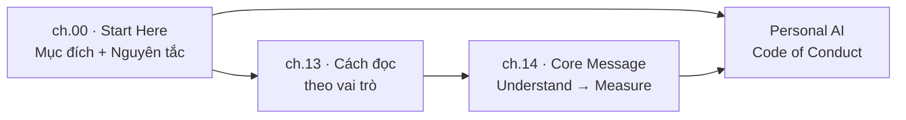
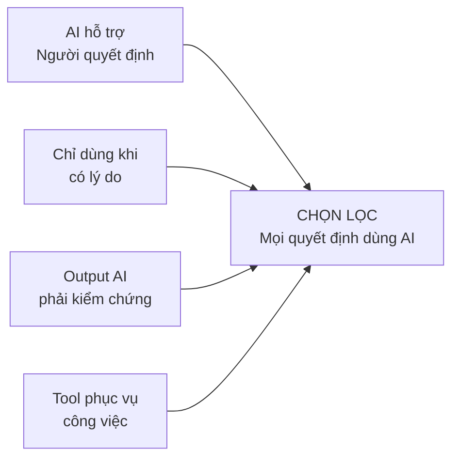
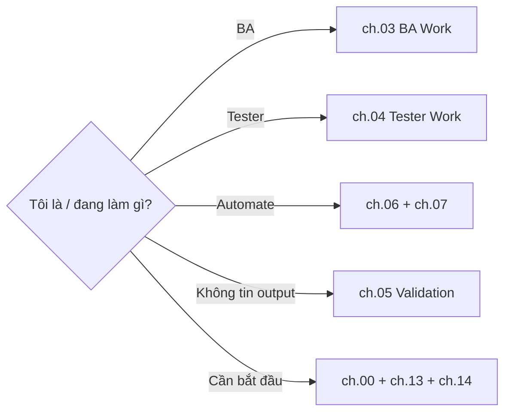

# MODULE 1 — AI Handbook & Cách đọc

> **Pha:** 0 · KHỞI ĐỘNG — Trước khi bước vào nền tảng
>
> **Năng lực cốt lõi:** Understand
>
> **AI Handbook:** ch.00 (Start Here) · ch.13 (Cách đọc Handbook) · ch.14 (Core Message)
>
> **Project xuyên suốt:** E-commerce Checkout · **Công cụ:** — (không có AI chính)
>
> **Asset xuất ra:** `/lab/personal-map.md` + Personal AI Code of Conduct
>
> **Thời lượng đề xuất:** 1 giờ

---

## Vì sao module này nằm ở đó

Mọi module khác trong khoá đều học bằng **thực hành**. Nhưng trước khi thực hành,
bạn cần một **ngôn ngữ chung** và một **hợp đồng cá nhân** với cách bạn sẽ làm việc
với AI. AI Handbook cung cấp hai thứ đó:

1. **Nguyên tắc** (ch.00): AI hỗ trợ, con người quyết định. Không dùng AI chỉ vì có
   thể. Output AI luôn phải kiểm chứng. Tool phục vụ công việc, không phải ngược lại.
2. **Cách định hướng** (ch.13): không cần đọc handbook từ đầu đến cuối — vào theo
   vai trò và nhu cầu.
3. **Thông điệp cốt lõi** (ch.14): `Understand → Decide → Use AI → Control → Verify →
   Automate → Measure`.

Module này dành thời gian để bạn **chốt thỏa thuận ban đầu** — để các module sau có
một điểm tựa chung thay vì mỗi người mỗi kiểu.

---

## LESSON 1.1 — Mục đích & nguyên tắc

### 1. Vấn đề

Trong team, mỗi người "dùng AI" mỗi kiểu: người thì copy nguyên output vào Confluence,
người thì ngại AI, người thì hỏi lung tung rồi tin hết. Không có nguyên tắc chung → chất
lượng và rủi ro khó lường.

### 2. Vì sao quan trọng

Bốn nguyên tắc của chương 00 là **bộ lọc** cho mọi quyết định xuyên suốt khoá.

### 3. Kiến thức tối thiểu (ch.00)

Bốn nguyên tắc:

- **AI hỗ trợ, con người quyết định.**
- **Không dùng AI chỉ vì có thể dùng.**
- **Output AI luôn phải được kiểm chứng.**
- **Tool phục vụ công việc, không phải công việc phục vụ tool.**

### 4. Sơ đồ tư duy

### 5. Demo thực chiến

Trainer đưa 4 tình huống thật, học viên áp 4 nguyên tắc để hoặc chấp nhận hoặc từ chối
việc dùng AI — ví dụ: "nên để AI viết toàn bộ AC rồi copy vào Confluence không?"

### 6. Thực hành có hướng dẫn

Viết **Personal AI Code of Conduct** — bản cam kết 3 điều bạn sẽ luôn làm và 2 điều
bạn sẽ không bao giờ làm với AI (dựa trên 4 nguyên tắc).

### 7. Nhiệm vụ thật

Lưu cam kết cá nhân (trong `/lab/personal-map.md` hoặc file riêng). Đây là tài liệu
get đối chiếu lại ở Capstone (M9).

### 8. Kiểm chứng

- [ ] Nêu đúng 4 nguyên tắc bằng lời của bạn.
- [ ] Cam kết có ít nhất 3 "sẽ làm" và 2 "sẽ không".

### 9. Đo lường

Số nguyên tắc phát biểu lại đúng khi trainer hỏi lại 1 tuần sau (giữ ở Capstone).

### 10. Ghi chép & tái sử dụng

Code of Conduct này theo bạn suốt các module sau như một lời nhắc, và được kiểm tra
lại ở M9.4 (retrospective).

---

## LESSON 1.2 — Cách đọc & map công việc

### 1. Vấn đề

Handbook 14 chương. Đọc từ đầu đến cuối sẽ mất thời gian và mau quên. Thực tế, bạn chỉ
cần đọc đúng chương cho hoàn cảnh hiện tại.

### 2. Vì sao quan trọng

Biết **đọc gì khi nào** giúp bạn dùng handbook đúng lúc thay vì lạc trong lý thuyết.

### 3. Kiến thức tối thiểu (ch.13)

| Khi bạn muốn | Đọc |
|---|---|
| Hiểu AI | ch.01 AI Foundation |
| Biết cách dùng AI | ch.02 Working with AI |
| Đang làm BA | ch.03 BA Work |
| Đang làm Tester | ch.04 Tester Work |
| Tự động hoá | ch.06 Automation |
| Gặp vấn đề cụ thể | ch.12 Playbooks |
| Không tin output | ch.05 Validation |

### 4. Sơ đồ tư duy

### 5. Demo thực chiến

Trainer lấy một tình huống ("sáng mai tôi phải viết test case cho payment timeout") →
học viên xác định đọc ch.04.3 + ch.12 → mở playbook tương ứng.

### 6. Thực hành có hướng dẫn

Liệt kê **5 việc thật** bạn làm hàng ngày với tư cách BA/Tester. Với mỗi việc, chọn
chương handbook bạn sẽ đọc khi cần xử lý nó.

### 7. Nhiệm vụ thật

**`/lab/personal-map.md`** — bảng: `việc của tôi | vai trò | chương handbook | module liên quan`.

### 8. Kiểm chứng

- [ ] Mọi việc được map vào ít nhất 1 chương handbook.
- [ ] Bảng phân biệt đường của BA và đường của Tester (nếu bạn làm cả hai, ghi rõ).

### 9. Đo lường

Thời gian tìm đúng chương cho một việc mới (mục tiêu < 1 phút nhờ bảng map).

### 10. Ghi chép & tái sử dụng

Bảng map này cập nhật theo vai trò; về cuối khoá (M9) bạn sẽ thấy nó trùng với
Playbook M4.7 và Workflow M9.2 — dấu hiệu hệ thống đã "khớp".

---

## Hết Module 1 — bạn có gì?

1. **Personal AI Code of Conduct** — lời cam kết làm việc với AI.
2. **`/lab/personal-map.md`** — bản đồ công việc → chương handbook.
3. **Hiểu ngôn ngữ chung** — bốn nguyên tắc + cách định hướng + core message.

**Cầu sang M2:** Bạn đã thống nhất "chơi theo luật nào". Giờ bắt đầu hiểu **AI thật sự
là gì và nó sai ở đâu** — nền cho mọi quyết định sau này.

> Nhớ: **Do not delegate thinking. Delegate work.** — đây là câu sắp xuyên suốt
> toàn bộ khoá học.
