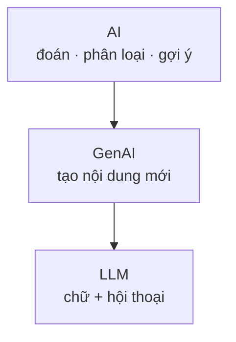
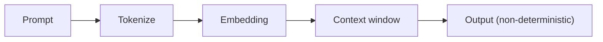
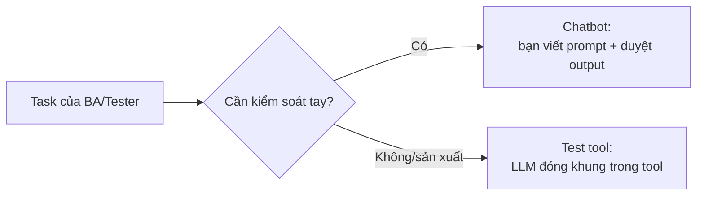

# MODULE 2 — AI Foundation

> **Pha:** 1 · UNDERSTAND — Hiểu công việc + AI là gì + AI đúng/sai ở đâu
>
> **Năng lực cốt lõi:** Understand · Analyze
>
> **AI Handbook:** ch.01 (GenAI/LLM · Limitations)
>
> **ISTQB CT-GenAI:** Chương 1 (GenAI-1.1.1 → 1.2.2) + GenAI-3.1.1 (hallucination)
>
> **Project xuyên suốt:** E-commerce Checkout · **Công cụ:** Claude/ChatGPT/Copilot (chọn 1)
>
> **Asset xuất ra:** **AI Limitation Report** + bảng phân loại AI
>
> **Thời lượng đề xuất:** 4 giờ

Sau module này bạn biết ba việc:
1. Mình đang nói chuyện với loại AI nào.
2. Vì sao hỏi đại thường ra câu trả lời "hay nhưng sai".
3. Làm sao soi được chỗ AI bịa — rồi ghi lại cho đội biết giới hạn ở đâu.

Không cần thuộc thuật ngữ. Cần **hiểu đúng để dùng đúng**.

> **Bám handbook ch.01:** "AI output là đề xuất, không phải sự thật." và
> "Càng quan trọng về nghiệp vụ, càng cần kiểm chứng."

---

## LESSON 2.1 — "AI" không phải một thứ duy nhất

### 1. Vấn đề

Trong họp, ai đó nói: "Team mình dùng AI rồi."

Nhưng mỗi người đang nói một việc khác nhau:
- Người A: web bán hàng **gợi ý sản phẩm**.
- Người B: tool **chấm điểm rủi ro gian lận** thẻ.
- Người C: mở **ChatGPT** nhờ viết test case.

Cả ba đều "AI", nhưng không cùng một nghề. **ch.01.1** dạy ta tách bạch.

### 2. Vì sao quan trọng

Nếu không phân biệt, bạn sẽ kỳ vọng sai và đánh giá sai năng lực của từng loại.

### 3. Kiến thức tối thiểu (ch.01.1 — GenAI/LLM)

Hộp lồng nhau:

- **AI (ô lớn nhất):** máy làm việc na ná người — đoán, phân loại, gợi ý, viết…
- **GenAI (ô nhỏ):** AI biết **tạo cái mới** — đoạn văn, email, test case, code.
- **LLM (ô bạn dùng hằng ngày):** GenAI chuyên **chữ và hội thoại** — ChatGPT/Claude/Copilot.

LLM phân tích, tổng hợp, tạo nội dung, biến đổi nội dung, gợi ý, tìm pattern — nhưng
**không tự biết business của bạn** nếu không được cấp.

### 4. Sơ đồ tư duy



### 5. Demo thực chiến

| Việc bạn gặp | Nhóm nào? | Vì sao |
|---|---|---|
| Gmail lọc spam | AI | Phân loại thư rác |
| TikTok/Shopee gợi ý | AI | Đoán bạn thích gì |
| ChatGPT viết mô tả bug | GenAI/LLM | Tạo chữ mới |
| Copilot gợi ý code | GenAI/LLM | Tạo nội dung mới (code) |

### 6. Thực hành có hướng dẫn

Lấy 5 tool/tính năng trong công ty bạn. Với mỗi cái viết một dòng:
"Đây là AI đoán/phân loại, hay AI tạo nội dung mới (GenAI/LLM)?"

### 7. Nhiệm vụ thật

Bảng phân loại 5 tool + lời giải thích ngắn. Lưu cùng Limitation Report (2.4).

### 8. Kiểm chứng

- [ ] 5/5 tool xếp đúng nhóm.
- [ ] Giải thích được bằng lời — không chỉ ghi tên.

### 9. Đo lường

Số tool xếp đúng / tổng (mục tiêu 5/5).

### 10. Ghi chép & tái sử dụng

Khi ai nói "dùng AI đi", bạn hỏi lại: **AI nào — đoán, phân loại, hay chatbot viết?**

---

## LESSON 2.2 — LLM làm việc như thế nào

### 1. Vấn đề

Tại sao cùng một câu hỏi, AI trả lời khác nhau mỗi lần? Tại sao nó "quên" phần đầu đoạn
dài? Hiểu cơ chế giúp bạn không ngạc nhiên và siết được độ ổn định.

### 2. Vì sao quan trọng

Token, context window, non-determinism ảnh hưởng trực tiếp chi phí và độ tin cậy — nền
cho structured output và temperature ở M3.

### 3. Kiến thức tối thiểu (ch.01 + GenAI-1.1.2, 3.1.4)

- **Token:** đơn vị nhỏ AI đọc/trả. Đếm token ≈ ước chi phí, độ dài.
- **Context window:** lượng thông tin AI "nhớ" trong một lần hỏi.
- **Non-determinism:** cùng prompt có thể trả lệch nhẹ — đừng tin "lần trước nó nói".
- **"Plausible ≠ correct"** — hợp lý không có nghĩa đúng.

### 4. Sơ đồ tư duy



### 5. Demo thực chiến

Dán một đoạn yêu cầu dài vào tokenizer để đếm token; chạy cùng prompt ở 2 mức temperature,
quan sát khác biệt.

### 6. Thực hành có hướng dẫn

1. Tách một đoạn test case thành token (dùng tool).
2. Chạy cùng prompt 2 lần, ghi khác biệt.

### 7. Nhiệm vụ thật

Bảng token + 2 output ở nhiệt độ khác nhau. Ghi chú điều cần nhớ để dùng cho M3.4.

### 8. Kiểm chứng

- [ ] Ước lượng được token count ảnh hưởng chi phí/độ dài.
- [ ] Quan sát được non-determinism (2 output lệch nhau).

### 9. Đo lường

Số token của một prompt điển hình; chênh lệch giữa 2 lần chạy.

### 10. Ghi chép & tái sử dụng

Bài này làm nền cho M3.4 (structured output + temperature) — nơi bạn "siết" non-determinism.

---

## LESSON 2.3 — Hỏi thiếu thì trả lời "hay nhưng lệch" (ch.01 / ch.02 nền)

### 1. Vấn đề

Bạn gõ "Viết test case đăng nhập giúp tôi" → AI trả về rất chuyên nghiệp nhưng nói đến
đăng nhập QR, SSO Google, khóa 5 lần sai — trong khi app của bạn chỉ có email + mật khẩu.
**Ch.02.1:** prompt thiếu context = sinh theo kiến thức chung.

### 2. Vì sao quan trọng

Đây là nguồn gốc của đa số output "đẹp nhưng sai nghiệp vụ". Biết nó, bạn sửa bằng cách
**cấp context** — chứ không đổ lỗi AI.

### 3. Kiến thức tối thiểu (ch.02.1 — Prompt)

Ba thứ trong một lần hỏi:

1. **Việc cần làm** (Task)
2. **Bối cảnh** (Context) — app/rule/thông tin thật, dán vào.
3. **Dạng trả lời** (Format) — bảng, checklist, JSON…

### 4. Sơ đồ tư duy

```text
Việc (Task) + Bối cảnh (Context) + Dạng (Format) → OUTPUT
```

### 5. Demo thực chiến

**Hỏi kém:**
```text
Viết checklist kiểm thử form đăng ký.
```
**Hỏi rõ:**
```text
Việc: Viết checklist kiểm thử form đăng ký.
Bối cảnh (chỉ dùng thông tin này):
- Có email, mật khẩu, nút Đăng ký.
- Email bắt buộc đúng định dạng.
- Mật khẩu tối thiểu 8 ký tự.
- Không có đăng ký bằng Google/Facebook.
Dạng trả lời: checklist ngắn, mỗi ý một dòng.
Không thêm tính năng ngoài danh sách trên.
```

### 6. Thực hành có hướng dẫn

Chọn một việc thật, viết 2 bản hỏi (kém / rõ), chạy cả hai, ghi 3 khác biệt.

### 7. Nhiệm vụ thật

Bảng so sánh 2 prompt + 3 khác biệt.

### 8. Kiểm chứng

- [ ] Nhận diện đủ 3 thành phần trong prompt rõ.
- [ ] Khác biệt giữa 2 bản được ghi cụ thể.

### 9. Đo lường

Số ý "bịa" trong prompt kém vs prompt rõ (kỳ vọng giảm).

### 10. Ghi chép & tái sử dụng

Đây là hạt giống của M3.1 (prompt 6 thành phần). Lưu prompt "rõ" để nâng cấp ở M3.

---

## LESSON 2.4 — Sai mà trông giống đúng (bài quan trọng nhất — ch.01.2)

### 1. Vấn đề

AI viết acceptance criteria rất mượt, có câu: *"Nếu sai mật khẩu 3 lần, khóa tài khoản
15 phút."* Nghe chuẩn best practice — nhưng tài liệu của bạn **không nói vậy**. Copy vào
Confluence = team implement rule **không tồn tại**. Rủi ro số một khi BA/Tester dùng AI.

### 2. Vì sao quan trọng

**ch.01.2** liệt kê các lỗi cần nhận diện: hallucination, tự suy diễn, thiếu context,
hiểu sai requirement, bịa business rule, output không nhất quán, bỏ sót trường hợp.
Và quy tắc: *càng quan trọng nghiệp vụ, càng cần kiểm chứng.*

### 3. Kiến thức tối thiểu (ch.01.2 — Limitations)

Ba kiểu lệch (bịa – lệch – thiên lệch):

1. **Bịa thêm** — rule/tính năng không có trong tài liệu bạn đưa.
2. **Suy luận lệch** — đọc đúng một phần rồi kết luận sai.
3. **Lệch thói quen** — chỉ viết happy path quen thuộc, bỏ case bạn cần.

### 4. Sơ đồ tư duy

```text
Output AI → từng câu hỏi: "Câu này lấy từ đâu trong tài liệu?"
   ├─ Chỉ được chỗ cụ thể → tạm chấp nhận
   ├─ Không chỉ được → BỊA → bỏ/đánh dấu hỏi lại
   └─ Chỉ được phần nhưng kết luận khác → LỆCH → sửa
```

### 5. Demo thực chiến

Tài liệu chỉ nói *"Form liên hệ có họ tên, email, nội dung, nút Gửi."* AI trả checklist có
captcha, giới hạn 500 ký tự, file đính kèm — cả ba "nghe hợp lý" và cả ba đều **bịa**.

### 6. Thực hành có hướng dẫn

Lấy một đoạn tài liệu thật → nhờ AI "liệt kê mọi quy tắc nghiệp vụ" → soi từng câu.

| Câu của AI | Có trong tài liệu gốc? | Ghi chú | Kết luận (Đúng/Bịa/Lệch) |
|---|---|---|---|

### 7. Nhiệm vụ thật

**AI Limitation Report** — báo cáo ½–1 trang: số liệu Đúng/Bịa/Lệch + chỗ AI ổn + kiểu
sai + "việc không giao AI làm một mình".

### 8. Kiểm chứng

- [ ] Mọi câu AI được phân loại Đúng/Bịa/Lệch.
- [ ] Có mục "việc không giao AI làm một mình".

### 9. Đo lường

Tổng số câu · số Đúng/Bịa/Lệch — làm baseline để đo cải thiện của Rule (M3).

### 10. Ghi chép & tái sử dụng

Limitation Report là **nguồn để viết Rulebook ở M3.3** — mỗi lỗi một rule đối ứng.

---

## LESSON 2.5 — Hai cách làm việc với AI (ch.01 + GenAI-1.2.2)

### 1. Vấn đề

Cùng một "AI", có lúc bạn chat trực tiếp, có lúc bạn dùng một tool AI nhúng sẵn. Hiểu
hai mô hình này giúp chọn cách làm việc đúng cho từng task.

### 2. Vì sao quan trọng

BIết khi nào dùng chatbot (bạn điều khiển) vs tool (tool đóng khung) ảnh hưởng mức độ
kiểm soát bạn có.

### 3. Kiến thức tối thiểu (GenAI-1.2.2)

- **AI chatbot:** bạn gõ prompt, bạn duyệt — linh hoạt, cần kỷ luật (M3).
- **LLM-powered test tool:** tool gói năng lực LLM vào luồng riêng — thuận tiện, nhưng
  khó kiểm soát hơn (nói kỹ ở M8).

### 4. Sơ đồ tư duy



### 5. Demo thực chiến

Đối chiếu một việc (vd: phác test case) làm bằng chatbot vs một tool AI test (nếu có)
— ghi khác biệt về độ kiểm soát.

### 6. Thực hành có hướng dẫn

Liệt kê 5 việc bạn làm hằng ngày, gán mỗi việc một interaction model.

### 7. Nhiệm vụ thật

**Bảng capability map:** task × interaction model × lý do.

### 8. Kiểm chứng

- [ ] Mỗi task gán đúng interaction model.
- [ ] Biết khi nào AI "không nên được dùng một mình".

### 9. Đo lường

Số task gán đúng / tổng.

### 10. Ghi chép & tái sử dụng

Bảng này từng bước nuôi quyết định "Human vs AI vs Automation" — sẽ gặp lại ở M4, M6, M8.

---

## Hết Module 2 — bạn đang có gì?

1. Cách phân biệt AI đoán / AI viết (LLM) — **ch.01.1**.
2. Cách hỏi đủ: việc – bối cảnh – dạng trả lời — **ch.02.1**.
3. **AI Limitation Report** từ tài liệu thật — **ch.01.2**.

**Module sau (Prompt + Context + Rule)** sẽ biến cách hỏi này thành bộ luật dùng lại
được — khỏi mỗi lần hỏi một kiểu, và giảm bịa ngay từ đầu.
