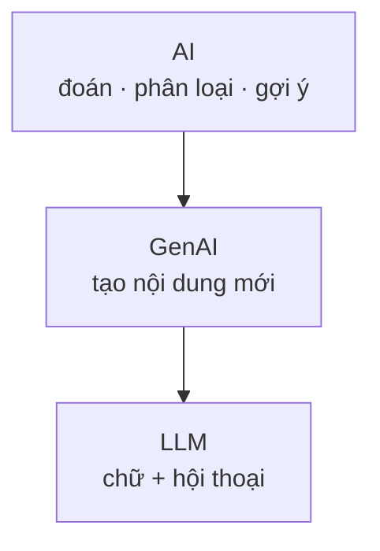
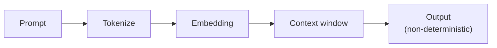
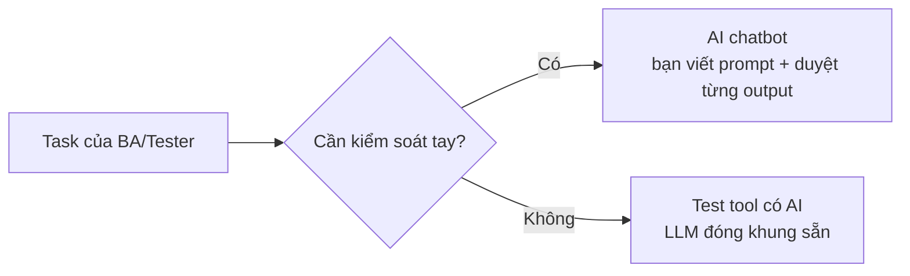

# MODULE 2 — AI Foundation

> **Pha:** 1 · UNDERSTAND — hiểu công việc + hiểu AI đúng/sai ở đâu
>
> **Năng lực cốt lõi:** Understand · Analyze
>
> **AI Handbook:** ch.01 (GenAI/LLM · Limitations)
>
> **ISTQB CT-GenAI:** Chương 1 (GenAI-1.1.1 → 1.2.2) · GenAI-3.1.1 (hallucination)
>
> **Project xuyên suốt:** E-commerce Checkout
>
> **Asset xuất ra:** **AI Limitation Report** + bảng phân loại AI
>
> **Thời lượng đề xuất:** 4 giờ

---

## Vì sao có module này

Khi một cuộc họp nào đó nói "team mình dùng AI rồi", hãy dừng lại một giây và hỏi:
**"AI nào?"** Vì chữ "AI" đang được dùng để chỉ ba thứ hoàn toàn khác nghề: hệ thống **gợi
ý sản phẩm** trên web bán hàng, tool **chấm điểm rủi ro gian lận** thẻ, và chatbot **viết
test case** hộ bạn. Cả ba đều "AI", nhưng bạn không thể kỳ vọng và đánh giá chúng theo cùng
một tiêu chuẩn.

Module này trao cho bạn ba khả năng nền: **nhận diện loại AI** mình đang nói chuyện, **hiểu
cơ chế** khiến nó trả lời "hay nhưng sai", và **soi được chỗ nó bịa** — rồi ghi lại cho cả
đội biết giới hạn ở đâu. Không cần thuộc thuật ngữ; cần hiểu đúng để dùng đúng.

---

## AI không phải một thứ duy nhất

Hãy tưởng tượng AI như một hộp các ô lồng nhau. Ô lớn nhất là **AI** — việc máy đoán, phân
loại, gợi ý (lọc email spam, nút "gợi ý cho bạn"). Bên trong là **GenAI** — AI biết **tạo ra
thứ mới**: một đoạn email, một test case, vài dòng code. Lõi nhất là **LLM** — GenAI chuyên
về chữ và hội thoại, đúng thứ bạn gõ vào ChatGPT hay Claude mỗi ngày.



Lấy **5 tool/tính năng trong công ty bạn**, với mỗi cái viết một dòng: "đây là AI đoán/phân
loại, hay AI tạo nội dung mới"? Ví dụ: Gmail lọc spam là **AI** (phân loại); ChatGPT viết
mô tả bug là **GenAI/LLM** (tạo chữ mới). Khi ai đó nói "dùng AI đi", câu hỏi lại đúng nhất
là: **AI nào — đoán, phân loại, hay chatbot viết?**

---

## LLM làm việc như thế nào

Phần lớn khoá học nói về **LLM** — cỗ máy "viết" mà bạn giao việc. Trước khi dùng, hãy nắm
vài điểm chạm cơ học:

- **Token** — đơn vị nhỏ nhất LLM đọc/trả. Đếm token chính là cách ước lượng chi phí và độ
  dài; một đoạn test case cỡ một đoạn văn dài có thể tiêu hàng chục token.
- **Context window** — lượng thông tin máy "nhớ" trong một lần hỏi. Đổ quá nhiều, phần đầu
  rơi rớt.
- **Non-determinism** — cùng một câu hỏi, nó có thể trả lệch nhẹ mỗi lần. Vì vậy đừng bao
  giờ nói "lần trước nó trả lời thế".



Hệ quả trực tiếp nhất: **hợp lý ≠ đúng** (*plausible ≠ correct*). Một câu trả lời trôi chảy,
đẹp đẽ vẫn có thể hoàn toàn sai — và đó không phải ngoại lệ, mà là chuyện thường ngày.

**Thực hành:** lấy một đoạn test case dài, đưa vào tokenizer để đếm token; chạy cùng một
prompt hai lần và ghi lại chỗ khác biệt. Bạn sẽ không còn ngạc nhiên vì sao "AI" đôi khi trả
lời khác nhau — và từ đó, biết cách siết non-determinism bằng structured output ở chương sau.

---

## Câu trả lời "hay nhưng lệch" — gốc rễ của phần lớn lỗi

Bạn gõ *"Viết test case đăng nhập giúp tôi"*, và AI trả về một checklist rất chuyên nghiệp:
test đăng nhập QR, SSO Google, khoá tài khoản sau 5 lần sai… trong khi app của bạn chỉ có
email + mật khẩu. Kết quả vô dụng không phải vì AI kém — mà vì bạn hỏi nó dựa trên **kiến
thức chung**, không phải **bối cảnh của bạn**.

Một câu hỏi tốt có ba phần: **việc cần làm** (task), **bối cảnh** (context — rule thật, app
thật, thông tin thật bạn dán vào), và **dạng trả lời** (format — bảng, checklist, JSON?).

| Hỏi kém | Hỏi rõ |
|---|---|
| "Viết checklist kiểm thử form đăng ký" | **Việc:** viết checklist kiểm thử form đăng ký.<br>**Bối cảnh (chỉ dùng thông tin này):** có email, mật khẩu, nút Đăng ký; email bắt buộc đúng định dạng; mật khẩu tối thiểu 8 ký tự; **không có** đăng ký Google/Facebook.<br>**Dạng trả lời:** checklist ngắn, mỗi ý một dòng; không thêm tính năng ngoài danh sách. |

Chạy cả hai, bạn sẽ đếm được số ý "bịa" giảm đi rõ rệt. Đây là mầm mống của Module 3 —
nơi ba thành phần này được nâng lên thành một **prompt đầy đủ và có kiểm soát**.

---

## Sai mà trông giống đúng — bài học quan trọng nhất

Đây là rủi ro số một khi BA/Tester dùng AI, và nó tinh vi ở chỗ **output không sai ngoài
mặt**. AI viết acceptance criteria rất mượt, kèm câu *"Nếu sai mật khẩu 3 lần, khoá tài
khoản 15 phút"* — nghe như best practice đáng tin. Nhưng tài liệu của bạn **không nói điều
đó**. Bạn copy vào Confluence, và cả team đi implement một rule không tồn tại.

Học cách nhận diện **ba kiểu lệch**:

| Kiểu | Bản chất | Ví dụ |
|---|---|---|
| **Bịa thêm** | Rule/tính năng không hề có trong tài liệu | Captcha, giới hạn 500 ký tự, file đính kèm |
| **Suy luận lệch** | Đọc đúng một phần, kết luận sai phần còn lại | "3 lần sai → khoá 15 phút" từ tài liệu im lặng |
| **Lệch thói quen** | Chỉ viết happy path quen thuộc, bỏ case biên | Không có test for timeout/out-of-stock |

Kỹ thuật soi từng câu AI trả ra chỉ còn một câu hỏi: **"Câu này lấy từ đâu trong tài liệu
của tôi?"**

```text
Output AI → từng câu: "Câu này lấy từ đâu?"
   ├─ Chỉ được chỗ cụ thể → tạm chấp nhận
   ├─ Không chỉ được       → BỊA → bỏ / đánh dấu hỏi lại
   └─ Chỉ được phần, kết luận khác → LỆCH → sửa
```

**Thực hành (AI Challenge):** lấy một đoạn tài liệu thật, nhờ AI "liệt kê mọi quy tắc nghiệp
vụ", rồi soi từng câu vào bảng **Đúng / Bịa / Lệch**. Cuối bài, bạn viết **AI Limitation
Report** — nửa trang đến một trang: số liệu Đúng/Bịa/Lệch, chỗ AI ổn, kiểu sai phổ biến, và
danh mục **"việc không giao AI làm một mình"**. Báo cáo này là tài liệu quan trọng nhất của
module: mỗi lỗi ghi ở đây là nguồn để viết **rulebook** ở Module 3 — mỗi lỗi, một rule đối
ứng.

---

## Hai cách làm việc với AI

Cùng một "AI", có lúc bạn chat trực tiếp, có lúc bạn dùng một tool AI nhúng sẵn. Hai mô
hình làm việc, hai mức kiểm soát:



Khi bạn dùng **chatbot** (Claude, ChatGPT), bạn gõ prompt và tay bạn duyệt từng output —
linh hoạt, nhưng cần kỷ luật vì mọi thứ do bạn điều khiển. Khi dùng **test tool có nhúng
AI** (mabl, Testim — nói kỹ ở Module 8), tool đóng khung năng lực LLM vào luồng riêng —
tiện, nhưng bạn kiểm soát ít hơn, và "cái tool tự sửa" đôi khi là ô đen với bạn.

**Thực hành:** liệt kê 5 việc bạn làm hằng ngày, gán mỗi việc một mô hình (chatbot hay tool),
kèm lý do. Bảng này từng bước nuôi quyết định "Human vs AI vs Automation" — gặp lại ở M4,
M6, M8.

---

## Di sản của bạn sau Module 2

1. Cách phân biệt **AI đoán / AI viết (LLM)** — và biết mình đang nói chuyện với loại nào.
2. Cách hỏi đủ: **việc – bối cảnh – dạng trả lời**.
3. **AI Limitation Report** từ tài liệu thật — nền móng cho rulebook ở Module 3.
4. Khả năng soi từng câu AI theo áng **Đúng / Bịa / Lệch**.

Giờ bạn đã hiểu AI là gì, vì sao nó nói sai, và cách nhận diện chỗ sai. Module 3 biến cách
hỏi ở trên thành một bộ **prompt chuẩn + context + rule dùng lại được** — để khỏi mỗi lần
hỏi một kiểu, và giảm bịa ngay từ cửa ngõ.

> Nhớ: **Do not delegate thinking. Delegate work.** — bạn giữ quyết định, AI làm phần việc.