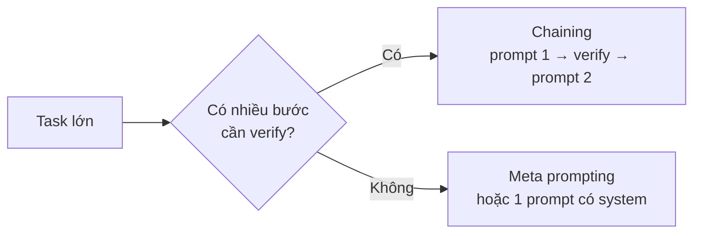

# MODULE 3 — Working with AI: Prompt + Context + Rule

> **Pha:** 2 · AUGMENT — Đưa AI vào công việc hàng ngày, có kiểm soát
>
> **Năng lực cốt lõi:** Prompt · Context · Control
>
> **AI Handbook:** ch.02 (Working with AI — Prompt · Context · Rule · Output)
>
> **ISTQB CT-GenAI:** Chương 2 (GenAI-2.1.1 → 2.1.3, 2.3.2) + GenAI-3.1.4, 3.2.3
>
> **Project xuyên suốt:** E-commerce Checkout · **Tool:** Claude
>
> **Asset xuất ra:** `/prompt` `/context` `/rules` `/output` (structured)
>
> **Thời lượng đề xuất:** 5 giờ

- **Mục tiêu module:** Biến Prompt/Context từ "biết dùng" thành **bộ AI working assets**
  (`/prompt` `/context` `/rules`) có structured output — tái dùng được.
- **Bám handbook ch.02:** *Prompt nói phải làm gì. Context nói dựa vào thông tin nào.
  Rules chống tự suy diễn. Output format quyết định có xử lý tiếp được hay không.*
- **Vì sao cần:** M2 thấy AI bịa khi thiếu context. M3 siết chuỗi Prompt + Context +
  Rule theo đúng lỗ hổng trong Limitation Report.
- **Spiral:** Prompt/Context từ **Cơ bản → Có kiểm soát** (+ Example + Rule).

---

## LESSON 3.1 — Prompt (6 thành phần + few-shot)

### 1. PROBLEM
Prompt M2 vẫn cho output lệch format hoặc thiếu edge payment timeout. Bạn sửa tay từng
lần — không có "prompt chuẩn" cho Checkout.

### 2. WHY IT MATTERS
Không có prompt chuẩn → mỗi người một kiểu → không đo được cải thiện, không bàn giao.

### 3. MINIMUM THEORY
**Spiral:** M2 học mức Task/Context/Constraint/Format (ch.02.1). **Mức mới (ch.02.1
nâng cấp + ch.02.4):** thêm **Example** (few-shot) + tách **Role** rõ (BA vs Tester).

```text
Role → Task → Context → Constraint → Example → Format
```

### 4. DIAGRAM

```text
ROLE (BA | Tester)
   ↓
TASK (một việc / một lần)
   ↓
CONTEXT (pointer tới /context)
   ↓
CONSTRAINT + RULE (pointer tới /rules)
   ↓
EXAMPLE (1 mẫu đúng)
   ↓
FORMAT (bảng | JSON)
   ↓
OUTPUT
```

### 5. LIVE DEMO
Prompt không Example vs có 1 dòng mẫu test condition → so độ ổn định format.

### 6. GUIDED PRACTICE
Viết prompt "sinh Test Conditions Checkout" đủ 6 phần. Chạy 2 lần, so lệch.

### 7. REAL TASK
**`/prompt/checkout-test-conditions.md`** — version v1 có Example.

### 8. VALIDATE
- [ ] Đủ 6 phần · [ ] Role rõ · [ ] 2 lần chạy cùng format

### 9. MEASURE
| | Không Example | Có Example |
|---|---|---|
| Lần sửa format | ___ | ___ |
| Thời gian đến bản ổn | ___ | ___ |

### 10. DOCUMENT & REUSE
`/prompt/checkout-test-conditions.md` → dùng lại 3.4, M4.

**Hạng mục:** Role · Task · Example · Versioning prompt

---

## LESSON 3.2 — Context pack (ch.02.2)

### 1. PROBLEM
Mỗi lần bạn paste lại cả req vào Claude — sót rule tồn kho — AI lại bịa voucher như M2.

### 2. WHY IT MATTERS
**Ch.02.2:** *Context nói dựa vào thông tin nào để làm.* Context rời rạc = hallucination
lặp lại. Cần **context pack** cố định.

### 3. MINIMUM THEORY
**Context pack** = bộ tài liệu gắn kèm prompt: Requirement, Spec/BR, AC, Existing tests,
Bug history (nếu có).

**Spiral Context:** M2 = "đưa thêm thông tin". M3 = **đóng gói + đặt tên file + checklist
thiếu gì**.

### 4. DIAGRAM

```text
/context/checkout/
  ├── requirement.md
  ├── business-rules.md
  ├── acceptance-criteria.md
  ├── existing-tests.md      (có thể trống ở đầu khoá)
  └── bug-history.md         (optional)
```

### 5. LIVE DEMO
Cùng prompt; lần 1 không BR; lần 2 có `/context/business-rules.md` → đếm hallucination.

### 6. GUIDED PRACTICE
Tạo 3 file: requirement, business-rules, AC (tối thiểu) cho Checkout.

### 7. REAL TASK
Hoàn thiện folder `/context/checkout/` — ghi README liệt kê nguồn (ai viết, ngày).

### 8. VALIDATE
- [ ] Mỗi file ≤ phạm vi Checkout · [ ] BR không chứa giả định chưa confirm · [ ] README có nguồn

### 9. MEASURE
Hallucination / 10 dòng output: trước pack ___ · sau pack ___

### 10. DOCUMENT & REUSE
`/context/checkout/**` → mọi lesson sau chỉ reference, không paste lung tung.

**Hạng mục:** Context pack · Source of truth · Scope context

---

## LESSON 3.3 — Rules (chống bịa) (ch.02.3)

### 1. PROBLEM
Limitation Report mục 8: AI hay bịa voucher & refund. Chưa có rule cứng để Claude tuân.

### 2. WHY IT MATTERS
**Ch.02.3:** *Rules dùng khi không muốn AI tự suy diễn.* Rule là lớp kiểm soát rẻ nhất
trước khi vào Validation (M5).

### 3. MINIMUM THEORY
**Rule** = ràng buộc bắt buộc với AI (và người review). Ví dụ:
- Không invent business rules.
- Mọi test case phải reference requirement ID.
- Chỉ payment methods có trong context.
- Nếu thiếu thông tin → liệt kê **Open Questions**, không đoán.

**Spiral Rule:** lần đầu xuất hiện (M3).

### 4. DIAGRAM

```text
PROMPT + CONTEXT
        ↓
      RULES  ──→ AI phải tuân
        ↓
     OUTPUT
        ↓
  Rule check (Pass/Fail thủ công ở M3; tư duy hoá ở M5)
```

### 5. LIVE DEMO
Chạy cùng prompt: không rule vs có rule "không invent; thiếu thì Open Questions".

### 6. GUIDED PRACTICE
Viết ≥8 rules cho Checkout (BA + Tester). Phân loại: Content / Traceability / Format / Safety.

### 7. REAL TASK
**`/rules/checkout-ai-rules.md`** v1 — gắn link từ Limitation Report (rule nào vá
hallucination nào). Mỗi lỗi M2 có ≥1 rule đối ứng.

### 8. VALIDATE
- [ ] ≥1 rule chống invent · [ ] ≥1 rule traceability · [ ] ≥1 rule "hỏi thay vì đoán"
· [ ] Map được sang hallucination log M2

### 9. MEASURE
Số hallucination trên cùng bài 8 test case: trước rule ___ · sau rule ___

### 10. DOCUMENT & REUSE
`/rules/checkout-ai-rules.md` → M4, M5, M7.

**Hạng mục:** AI Rules · Traceability · Open Questions

---

## LESSON 3.4 — Structured output (ch.02.4)

### 1. PROBLEM
Claude trả đoạn văn — khó so sánh, khó đưa vào test management / Excel / JSON pipeline.

### 2. WHY IT MATTERS
**Ch.02.4:** *Output format dùng khi output sẽ được tiếp tục xử lý hoặc đưa sang tool
khác.* Structured output = điều kiện để Measure & Validation đếm được.

### 3. MINIMUM THEORY
Ưu tiên: **Table** (review người) và **JSON** (máy/parse). Schema phải nằm trong prompt.

**Spiral Structured Output:** lần đầu (M3).

### 4. DIAGRAM

| Manual (ghi note tự do) | AI text dài | AI structured |
|---|---|---|
| Khó aggregate | Khó diff | Diff/count được |

### 5. LIVE DEMO
Schema test case JSON: `id, req_id, title, preconditions, steps[], expected, priority`.

### 6. GUIDED PRACTICE
Ép Claude trả đúng schema; nếu sai field → sửa prompt Format, không sửa tay từng field.

### 7. REAL TASK
**`/prompt/checkout-testcases-json.md`** + sample `/output/checkout-tc-sample.json`.

### 8. VALIDATE
- [ ] Parse được JSON · [ ] Mọi TC có `req_id` · [ ] Không field ngoài schema

### 9. MEASURE
Thời gian đưa vào sheet/tool: text tự do ___ · JSON ___

### 10. DOCUMENT & REUSE
Prompt JSON + sample → M4 (AI for Tester), M6 (map sang Playwright).

---

## LESSON 3.5 — Chaining + Meta prompting + System/User

### 1. PROBLEM
Một việc lớn giao một prompt duy nhất → quá tải context, kết quả dở. Chưa biết tách hay
gộp prompt.

### 2. WHY IT MATTERS
**ch.02 + GenAI-2.1.2, 2.1.3:** ba kỹ thuật lõi — chaining (tách bước), meta prompting
(prompt viết prompt), system vs user prompt (vai trò + dữ liệu). Chọn đúng kỹ thuật =
output ổn định và tái dùng được.

### 3. MINIMUM THEORY
- **Chaining:** chia task lớn thành chuỗi bước, mỗi bước output là input bước sau — có
  human verify giữa các bước.
- **Meta prompting:** dạy AI cách xây prompt cho một việc — hữu khi muốn chuẩn hoá.
- **System vs User:** system = vai trò + luật bất biến; user = dữ liệu/dấu hiệu từng lần.

### 4. DIAGRAM



### 5. LIVE DEMO
Giải "sinh test case có source" bằng chaining: bước 1 extract rule → verify → bước 2
sinh TC → verify.

### 6. GUIDED PRACTICE
1 việc giải bằng chaining; viết 1 system prompt cho vai "BA review requirement".

### 7. REAL TASK
1 prompt chaining + 1 system prompt (lưu `/prompt/`).

### 8. VALIDATE
- [ ] Chọn đúng kỹ thuật cho task.
- [ ] Chaining có điểm verify giữa bước.

### 9. MEASURE
Thời gian và số vòng sửa: 1 prompt dài vs chaining.

### 10. DOCUMENT & REUSE
Kỹ thuật này quyết định cách M4 chia việc BA/Tester thành các bước.

---

## TỔNG KẾT MODULE 3

### Output
| Asset | Path |
|---|---|
| Prompt TC conditions | `/prompt/checkout-test-conditions.md` |
| Prompt TC JSON | `/prompt/checkout-testcases-json.md` |
| Context pack | `/context/checkout/` |
| AI Rules | `/rules/checkout-ai-rules.md` |
| Sample JSON | `/output/checkout-tc-sample.json` |
| Chaining + system prompt | `/prompt/` |

### Dùng lại M4
Playbook BA/Tester chỉ **gọi** các asset trên — không viết prompt ad-hoc.

### Spiral sau M3
| Khái niệm | Mức |
|---|---|
| Prompt | **Có kiểm soát** (Role+Example+version) |
| Context | **Pack có cấu trúc** |
| Rule | **Cơ bản** (v1 file rules) |
| Structured Output | **Cơ bản** (JSON/Table) |
| Hallucination | vẫn Cơ bản — giảm bằng Rule (chưa Validation formal) |
