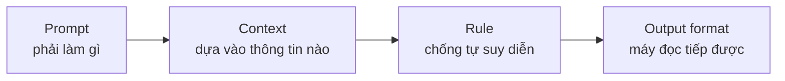
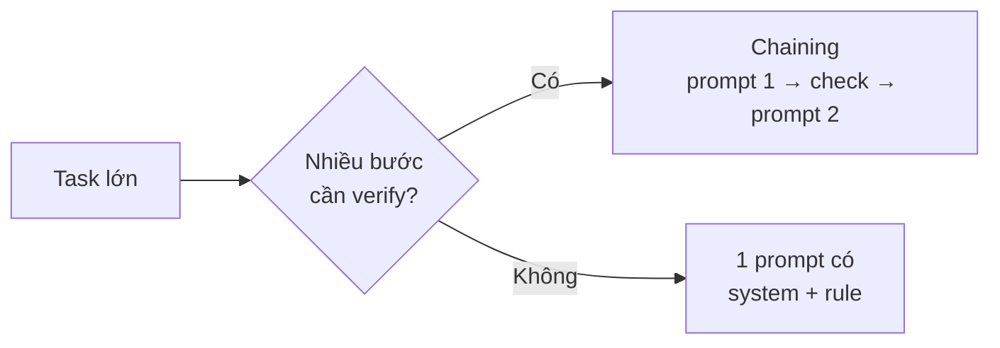
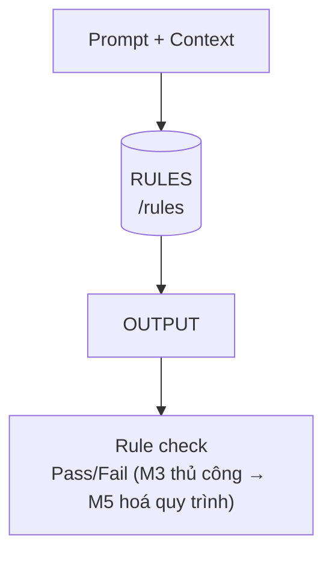
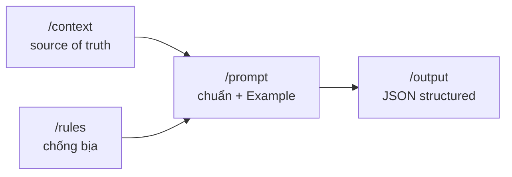

# MODULE 3 — Working with AI: Prompt + Context + Rule

> **Pha:** 2 · AUGMENT — đưa AI vào công việc hàng ngày, có kiểm soát
>
> **Năng lực cốt lõi:** Prompt · Context · Control
>
> **AI Handbook:** ch.02 (Working with AI — Prompt · Context · Rule · Output)
>
> **ISTQB CT-GenAI:** Chương 2 (GenAI-2.1.1 → 2.1.3, 2.3.2) · GenAI-3.1.4, 3.2.3
>
> **Project xuyên suốt:** E-commerce Checkout
>
> **Asset xuất ra:** `/prompt` `/context` `/rules` `/output`
>
> **Thời lượng đề xuất:** 5 giờ

---

## Vì sao có module này

Sau Module 2, bạn biết cách hỏi một lần cho tử tế — thêm bối cảnh, yêu cầu format, soi
output theo "Đúng / Bịa / Lệch". Nhưng làm từng lần như vậy chưa đủ: **mỗi lần bạn lại hỏi
một kiểu**, không đo được cải thiện, và không ai bàn giao được. Module này biến cách hỏi ấy
thành **một bộ tài sản AI tái dùng được** — và đó là thứ bạn mang theo suốt phần còn lại
của khoá.

Tư tưởng xuyên suốt rất gọn, chỉ bốn vai trong một lần làm việc với AI:

| Vai | Trả lời câu hỏi |
|---|---|
| **Prompt** | Phải làm gì? |
| **Context** | Dựa vào thông tin nào? |
| **Rule** | Ngăn AI tự suy diễn thế nào? |
| **Output format** | Kết quả có dùng tiếp được không? |



---

## Prompt — giao việc theo một khuôn sáu phần

Một câu "chỉ bảo làm gì" thường chưa đủ. Khi cần đầu ra **ổn định và bàn giao được** —
đặc biệt trong công việc BA/Tester — hãy sắp theo khuôn sáu vị trí:

```text
ROLE          → bạn là ai với AI (BA hay Tester)
TASK          → một việc, một lần, rõ ràng
CONTEXT       → trỏ tới /context (không paste lung tung)
CONSTRAINT    → ràng buộc bắt buộc
RULE          → trỏ tới /rules
EXAMPLE       → một mẫu ĐÚNG để AI bắt chước (few-shot)
FORMAT        → bảng | JSON
```

Cái khiến nhiều prompt "lệch format" nhất chính là thiếu **Example**: chỉ cần một dòng mẫu
test condition, AI theo đúng cấu trúc đó thay vì bịa ra một kiểu trình bày riêng. Và **Role**
quan trọng vì cùng một công việc — "sinh test condition" — BA và Tester sẽ nhìn khác nhau.

Ngoài khuôn sáu phần, có **ba kỹ thuật nâng tầm** giúp prompt của bạn lên cấp vận hành:

| Kỹ thuật | Cơ chế | Dùng khi |
|---|---|---|
| **Chaining** | Chia việc lớn thành chuỗi bước, mỗi bước nhận output bước trước, có điểm check của người giữa các bước | Việc nhiều bước cần xác nhận giữa chừng |
| **Meta prompting** | Dạy AI *cách viết prompt* cho một việc | Muốn chuẩn hoá một loạt task giống nhau |
| **System vs User** | Tách vai trò + luật bất biến (system) khỏi dữ liệu từng lần (user) | Prompt dùng lặp lại, muốn ổn định |



**Thực hành:** viết prompt "sinh test conditions Checkout" đủ sáu phần, chạy hai lần và so
độ lệch format. Hai kỹ thuật chaining và split system/user chính là nền để Module 4 chia
công việc BA/Tester thành những bước AI xử lý tốt.

---

## Context — đóng gói "nguyên liệu" đúng

Thiếu context thì AI "bịa theo kiến thức chung" — bạn đã thấy ở Module 2. Nhưng cách sửa
qua loa, pasting cả đoạn yêu cầu vào mỗi lần hỏi, cũng dở không kém: **bạn sót một rule tồn
kho**, và AI lại tái tạo lỗi cũ.

Giải pháp là một **context pack** — thư mục cố định gắn kèm mọi prompt liên quan đến một
nghiệp vụ:

```text
/context/checkout/
  ├── requirement.md
  ├── business-rules.md
  ├── acceptance-criteria.md
  ├── existing-tests.md      (có thể trống ở đầu khoá)
  └── bug-history.md         (tuỳ chọn)
```

Quy tắc vàng: **context là nguồn chân lý (source of truth)**. Bạn không paste lung tung nữa —
bạn trỏ tới file, và mọi thứ ngoài pack đều "không có trong bối cảnh".

**Demo trực tiếp:** cùng một prompt, lần một **không** có `business-rules.md`, lần hai **có**;
đếm số hallucination giảm đi. Đó là bằng chứng bạn cần để từ nay "chỉ reference, không paste".
Lưu ý nhỏ về phạm vi: mỗi file trong pack phải nằm trong phạm vi Checkout, và business-rules
không chứa giả định chưa được xác nhận.

---

## Rule — chống AI bịa bằng quy tắc cứng

Limitation Report ở Module 2 để lại cho bạn một danh sách chỗ AI hay bịa — ví dụ *"voucher
đổi trả"* chui vào dù tài liệu không nói. Đây là nơi danh sách đó thành **rule**: một ràng
buộc bắt buộc, có giá trị với cả AI lẫn người review. Vài ví dụ cho Checkout:

- Không **invent** business rule nào ngoài context.
- Mọi test case phải kèm `req_id`/`ac_id`.
- Chỉ dùng payment method có trong context.
- Nếu thiếu thông tin → liệt kê **Open Questions**, không đoán.



Viết đủ ít nhất **8 rule** cho Checkout, phân loại theo mục đích:

| Loại | Ý nghĩa | Ví dụ |
|---|---|---|
| **Content** | Không thêm nội dung ngoài pack | Không thêm payment method mới |
| **Traceability** | Mọi thứ phải có nguồn | TC kèm req_id/ac_id |
| **Format** | Đúng cấu trúc trả về | JSON theo schema |
| **Safety** | Không PII, không giả định rủi ro | Không dùng email thật |

Rồi **map từng rule vào một lỗi trong Limitation Report** — mỗi lỗi M2 phải có ít nhất một
rule đối ứng. Rule nào không vá được một lỗi thật thì đừng giữ: rulebook là công cụ, không
phải trưng bày. Rule là lớp kiểm soát **rẻ nhất** bạn có trước Validation (Module 5): nó
chặn lỗi từ cửa ngõ, thay vì chờ người review ở cuối dây chuyền.

---

## Output format — trả về thứ máy đọc được

Để AI trả một đoạn văn dài, bạn lấy gì mà **so sánh**, lấy gì mà **đếm**? Output văn tự do
là kẻ thù của mọi thứ đo lường và của mọi pipeline (test management, Excel, JSON).

Nguyên tắc: **format do bạn quyết định ngay trong prompt**, ưu tiên hai dạng — **Table** (khi
người review) và **JSON** (khi máy parse tiếp). Ví dụ schema cho test case Checkout:

```json
{ "id", "req_id", "title", "preconditions", "steps[]", "expected", "priority" }
```

| Ghi note tự do | AI text dài | AI structured |
|---|---|---|
| Khó tổng hợp | Khó so sánh/diff | Diff, đếm, parse được |

Mấu chốt của structured output: **không sửa tay từng field**. Nếu AI trả field lạ hoặc sai
dạng, bạn sửa **Prompt Format** (gõ lại schema/điều kiện) rồi chạy lại — sửa prompt một lần
giữ được cấu trúc hàng trăm output sau đó, còn sửa tay thì phải sửa mãi mãi.

---

## Gộp lại — một chuỗi dùng lại được

Cuối module, bạn có bốn mảnh ghép khớp nhau thành một chuỗi tái dùng được cho Checkout:

```text
/context/checkout/              ← nguyên liệu (source of truth)
/rules/checkout-ai-rules.md     ← quy tắc chống bịa
/prompt/checkout-*.md           ← prompt chuẩn, có Example + Format
/output/checkout-*.json         ← output structured để máy đọc tiếp
```



Module 4 sẽ **gọi** những asset này chứ không viết prompt ad-hoc nữa; Module 5 tái dùng
/rules + /output để dựng **cổng validation có số liệu**. Đây là khoảnh khắc hệ thống bắt
đầu "đứng dậy": bạn không còn phụ thuộc tài năng từng người, mà vào một bộ tài sản có cấu
trúc, ai cũng chạy lại được.

---

## Di sản của bạn sau Module 3

| Asset | Nội dung |
|---|---|
| `/prompt/checkout-test-conditions.md` | Prompt TC conditions có Example + version |
| `/prompt/checkout-testcases-json.md` | Prompt TC JSON theo schema |
| `/context/checkout/` | Context pack: requirement, business-rules, AC |
| `/rules/checkout-ai-rules.md` | Rulebook ≥8 rule, map sang từng lỗi M2 |
| `/output/checkout-tc-sample.json` | Sample JSON chuẩn schema, parse được |
| Chaining + system prompt | 1 chuỗi prompt + 1 system prompt dùng lại |

> Một prompt đẹp thiếu context chỉ là kiến thức chung gói gọn đẹp.
> Một context thiếu rule để AI biến nó thành quyết định đúng thì vẫn là bãi nguyên liệu.
> Cả bốn mảnh chắp vào nhau mới thành "cách làm việc với AI".