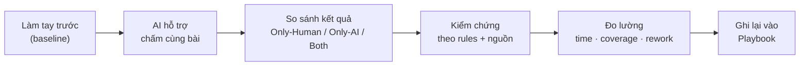
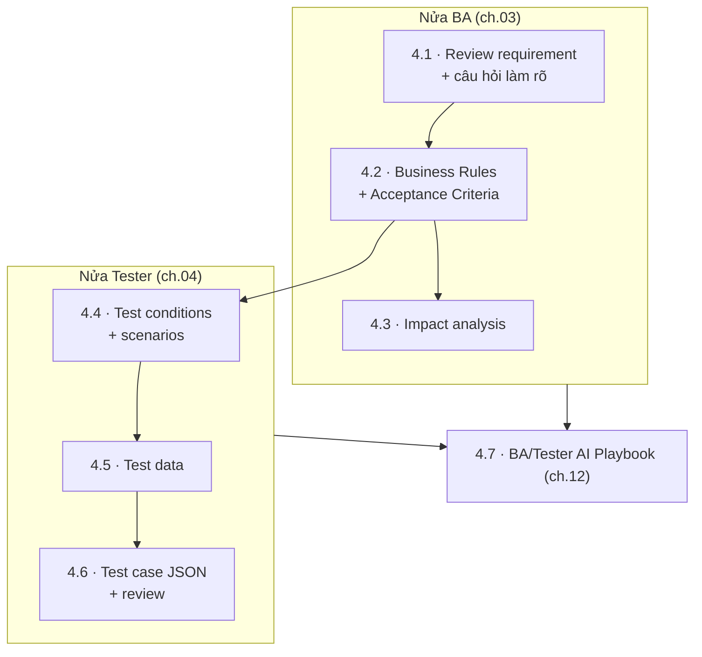
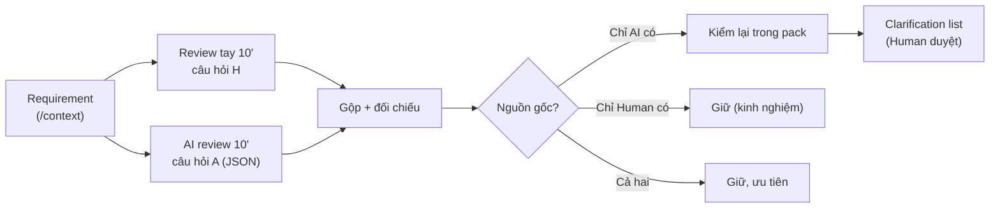
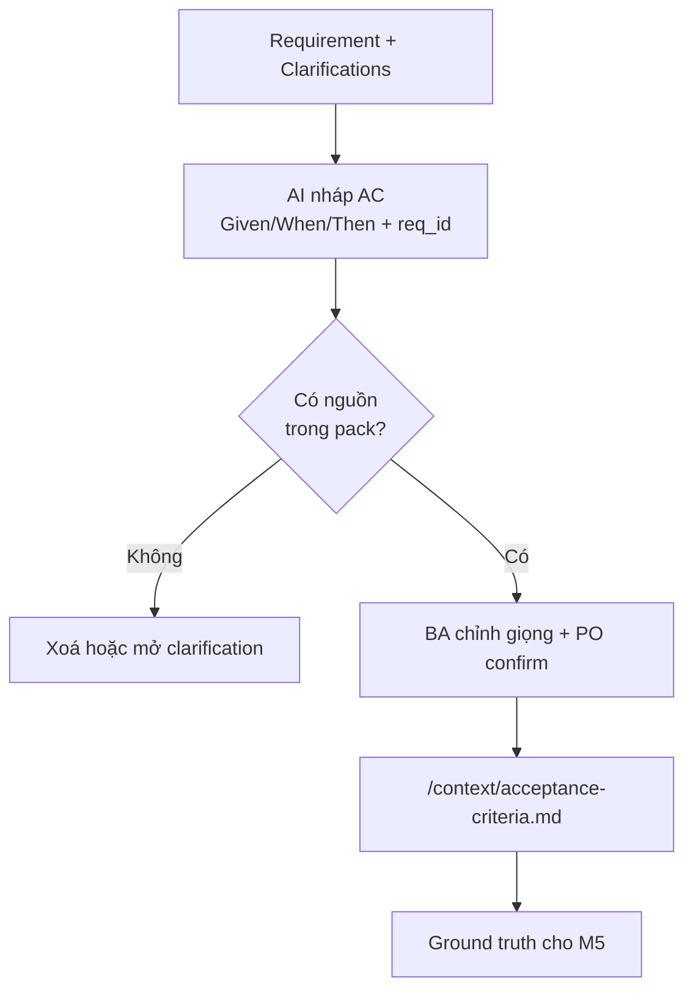
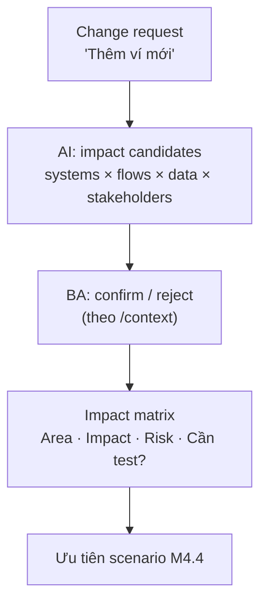
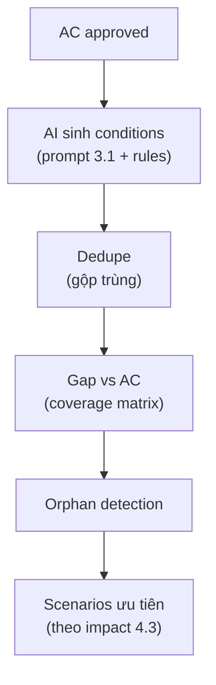
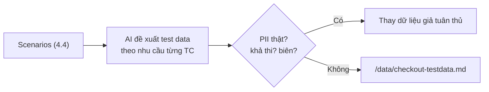
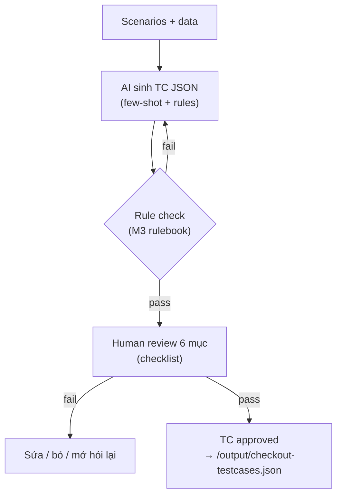
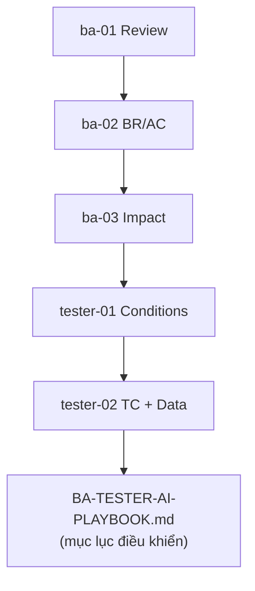

# MODULE 4 — AI cho BA & Tester

> **Pha:** 2 · AUGMENT — Đưa AI vào công việc hàng ngày
>
> **Năng lực cốt lõi:** Prompt → Work · Validate
>
> **AI Handbook:** ch.03 (BA Work) · ch.04 (Tester Work) · ch.11 (Workflow) · ch.12 (Playbooks)
>
> **ISTQB CT-GenAI:** Chương 2 (GenAI-2.2.1 → 2.2.5, 2.3.2) · HO-2.2.1b, HO-2.2.2a/b
>
> **Project xuyên suốt:** E-commerce Checkout · **Công cụ:** Claude
>
> **Asset xuất ra:** `/playbook/BA-TESTER-AI-PLAYBOOK.md` + `/output` + `/context` cập nhật
>
> **Thời lượng đề xuất:** 8 giờ

---

## Vì sao module này nằm ở đó

M3 đã xây vũ khí: prompt chuẩn, context pack, rulebook, structured output.
Nhưng vũ khí trong kho không thay đổi trận đánh. **Trận đánh nằm ở công việc hàng ngày.**

Giờ bạn sẽ gắn AI vào từng bước luồng công việc thật của BA và Tester — không học "tính
năng AI", mà học cách giải một chuỗi việc bằng một công thức lặp:



**Công thức 5 bước — "Manual → AI → Compare → Validate → Measure"** — lặp lại trong mọi
lesson. Vì nó giết chết hai cạm bẫy: *tin AI ngay* (bạn sẽ validate) và *không tin AI lúc
nào cũng dùng tay* (baseline chứng minh AI thua gì, thắng gì).

> **Bám handbook ch.11 (Workflow):** Requirement → AI Analysis → Rules → Test Conditions →
> Test Cases → Human Review. Module này chính là nơi chạy workflow đó theo ch.12 (Playbooks).

---

## Bản đồ module



---

## LESSON 4.1 — BA: Review requirement + câu hỏi làm rõ (ch.03.1)

### 1. Vấn đề

Requirement Checkout có câu: *"hết hàng giữa chừng thì báo lỗi."*

Báo lỗi lúc nào? Trước khi chốt giỏ? Sau khi chọn ngày giao? Giữ hàng bao lâu?
Đây là **ambiguity** — chỗ nhiều cách hiểu. Bỏ sót nó = AC sai rồi test sai hàng loạt.

### 2. Vì sao quan trọng

**ch.03.1 Review Requirement:** AI đọc không mệt, quét nhiều hướng (logic, business, UX,
error handling) — miễn bạn ra lệnh đúng (GenAI-2.2.1). Người lọc, AI mở rộng.

### 3. Kiến thức tối thiểu

**Ambiguity** = chỗ văn bản có thể hiểu nhiều cách. BA dùng AI để **mở rộng danh sách câu
hỏi**, không để AI **chốt rule** — chốt rule là quyết định nghiệp vụ (thinking, không delegate).

Prompt review mẫu:

```text
Role: Bạn là BA 10 năm kinh nghiệm review requirement thương mại điện tử.
Context: Đọc /context/checkout.
Instruction: Liệt kê mọi ambiguity theo nhóm Payment / Inventory / UX / Error handling.
Constraint: Chỉ dựa vào pack. Không đoán ý đồ. Thiếu → Open Questions.
Output format: JSON, mỗi item: { id, group, quote, question, why_ambiguous }
```

### 4. Sơ đồ tư duy



### 5. Demo thực chiến

Chạy prompt review lên một đoạn requirement mẫu. Quan sát: AI liệt kê ambiguity nhanh,
nhưng **có câu hỏi bịa** (gợi ý "voucher đổi trả" không có trong pack). Điểm mấu chốt:
*AI mở rộng, con người lọc nguồn.*

### 6. Thực hành có hướng dẫn

- Manual 10 phút: tự đọc requirement, ghi câu hỏi.
- AI 10 phút: prompt review, ghi output.
- Bảng compare: *Only-Human / Only-AI / Both* — đánh dấu câu "AI bịa" theo lesson 2.4.

### 7. Nhiệm vụ thật

**`/playbook/ba-01-review-questions.md`** + **`/output/checkout-clarifications.md`**
(chỉ giữ câu hỏi Human đã duyệt, có map vào đoạn requirement).

### 8. Kiểm chứng

- [ ] Mọi câu hỏi map được đoạn requirement.
- [ ] 0 câu hỏi giả định (vd voucher) không có trong pack.
- [ ] BA sign-off trên danh sách cuối.

### 9. Đo lường

| | Manual | AI-assisted |
|---|---|---|
| Thời gian review | | |
| Số ambiguity giữ lại | | |
| Số câu AI bị loại vì bịa | — | |

### 10. Ghi chép & tái sử dụng

Clarification sau khi PO trả lời sẽ **cập nhật `/context/business-rules.md`** — context
mới → review tốt hơn. **ch.12 Playbook:** bước này thành `ba-01` trong playbook.

---

## LESSON 4.2 — BA: Business Rules + Acceptance Criteria (ch.03.2, ch.03.3)

### 1. Vấn đề

Bạn cần AC cho Checkout: thẻ, ví, hết hàng, payment timeout. Viết tay chậm. AI viết
nhanh — nhưng hay **thêm rule** (nhớ M2: "sai mật khẩu 3 lần khóa tài khoản").

### 2. Vì sao quan trọng

**AC là contract.** Sai AC = sai toàn bộ test + automation phía sau. **ch.03.2:** AI chỉ
extract rule đã tồn tại, **không để AI invent rule mới**. **ch.03.3:** AC phải có test
được, rõ, đủ điều kiện, không mâu thuẫn.

### 3. Kiến thức tối thiểu

- **Business Rule** = ràng buộc nghiệp vụ (vd: *"Payment timeout > 90s → huỷ đơn"*).
- **AC** = điều kiện chấp nhận **có thể kiểm chứng** (Given/When/Then).

Rule quan trọng nhất: **mọi BR/AC phải có nguồn** (req_id hoặc clarification ID).

```text
Req + Clarifications
        ↓
AI nháp BR/AC (Given/When/Then + req_id)
        ↓
Rule check: no invent + traceability
        ↓
BA chỉnh + PO confirm
        ↓
/context/acceptance-criteria.md  (source of truth)
```

### 4. Sơ đồ tư duy



### 5. Demo thực chiến

Nháp 3 AC payment: success / fail / timeout. Quan sát AI **không tự biên** câu "max N lần
retry" nếu pack không nói — nếu nó biên, rulebook còn thiếu một rule, thêm vào `/rules`.

### 6. Thực hành có hướng dẫn

Given/When/Then cho thẻ thành công / sai CVV / timeout — **Manual 1, AI 1, merge**.

### 7. Nhiệm vụ thật

Cập nhật **`/context/checkout/acceptance-criteria.md`** + **`/context/checkout/business-rules.md`**.
Ghi **`/playbook/ba-02-br-ac.md`**.

### 8. Kiểm chứng

- [ ] 100% AC có nguồn.
- [ ] 0 AC ngoài scope Checkout.
- [ ] PO/BA tick approve theo checklist.

### 9. Đo lường

- Số vòng rework đến bản approve.
- % AC bị xoá vì invent.
- Thời gian đến bản approve.

### 10. Ghi chép & tái sử dụng

AC approved = **ground truth sơ bộ** — đầu vào cho M5 và nguồn cho toàn bộ phần Tester.

---

## LESSON 4.3 — BA: Impact analysis (ch.03.5)

### 1. Vấn đề

PO thông báo: *"Checkout sẽ thêm ví mới."*

Không phải một cái nút. Nó chạm vào: cart, payment, email, admin kho, báo cáo, luồng ưu
đãi… Nếu impact bị sót, **regression lỗ ở đúng chỗ bạn quên nhìn**.

### 2. Vì sao quan trọng

Impact analysis bằng trí nhớ có trần. AI giúp **liệt kê toàn diện**; BA chịu trách
nhiệm danh sách cuối (**ch.03.5:** AI đưa candidate impact, BA xác nhận). Kỹ năng này tái
dùng ở M7.3 cho impact trên locator/flow của Playwright.

### 3. Kiến thức tối thiểu

**Impact analysis** = hệ quả của một thay đổi lên: **module** (cart, payment…) × **luồng**
(checkout, hoàn tiền…) × **dữ liệu** (số dư…) × **stakeholder** (user, admin, finance…).

### 4. Sơ đồ tư duy



### 5. Demo thực chiến

CR "thêm COD". AI liệt kê impact — bao gồm "đổi trả COD" mà Checkout không có. Human loại
theo scope thực tế. Khoảnh khắc "loại" chính là kiểm soát.

### 6. Thực hành có hướng dẫn

Impact matrix bảng:

| Area | Impact | Risk (H/M/L) | Cần test? |
|---|---|---|---|

### 7. Nhiệm vụ thật

CR Checkout thật → **`/output/checkout-impact.md`**.

### 8. Kiểm chứng

- [ ] Mỗi impact có lý do (map vào module/luồng có thật).
- [ ] 0 area bịa.
- [ ] Có cột "cần test" đã điền.

### 9. Đo lường

Số area sót (peer rà) — mục tiêu 0 · thời gian làm.

### 10. Ghi chép & tái sử dụng

Impact matrix cấp đầu vào cho 4.4. Kỹ năng này trở lại ở M7.3 trong thế giới automation.

---

## LESSON 4.4 — Tester: Test conditions + scenarios (ch.04.1, ch.04.2)

### 1. Vấn đề

Từ AC Checkout approve, bạn cần test conditions/scenarios. Hai bệnh khi AI sinh ồ ạt:
**trùng lặp** (30 condition giống nhau) và **thiếu** (không có condition cho timeout).

### 2. Vì sao quan trọng

**ch.04.1:** AI dùng để mở rộng test ideas, **tester quyết định scope**. Thiếu condition =
lỗ coverage; trùng = phí công. Cùng gốc: thiếu gap analysis.

### 3. Kiến thức tối thiểu

- **Test condition** = điều kiện có thể kiểm được (có nguồn từ test basis).
- **Scenario** = luồng gắn các điều kiện lại (vd: *lỗi mạng giữa bước chọn thẻ và xác nhận*).

Gap analysis: **AC → conditions → coverage matrix**:

| AC_ID | Condition cover | Trạng thái |
|---|---|---|
| AC-07 | COND-07.1, COND-07.2 | ✔ |
| AC-08 | — | **GAP** |

- **GAP** = AC thiếu condition → bổ sung.
- **Orphan** = condition không có nguồn AC → nghi bịa → kiểm tra.

### 4. Sơ đồ tư duy



### 5. Demo thực chiến

Map AC → conditions một lô 5 AC. Chỉ ra AC nào thiếu (GAP), condition nào lạc loài
(orphan → bịa). Đây là định nghĩa vận hành của "coverage".

### 6. Thực hành có hướng dẫn

Dựng **coverage matrix** AC_ID × Condition_ID, đánh dấu GAP/Orphan. Ưu tiên High cho
payment/inventory (nối impact 4.3).

### 7. Nhiệm vụ thật

**`/output/checkout-conditions.md`** + **`/output/checkout-scenarios.md`** + playbook
`tester-01`.

### 8. Kiểm chứng

- [ ] Mọi AC có ≥1 condition (0 GAP).
- [ ] 0 orphan không có lý do.
- [ ] Có ưu tiên H gắn payment/inventory.

### 9. Đo lường

Coverage % AC · số condition trùng gộp · thời gian.

### 10. Ghi chép & tái sử dụng

Scenarios → 4.5, 4.6 và "sàn đấu" của M5 khi đo coverage cuối.

---

## LESSON 4.5 — Tester: Test data (ch.04.5)

### 1. Vấn đề

Test case chỉ đúng khi có **dữ liệu thật khả thi**: thẻ thành công, thẻ hết tiền, user
giỏ out-of-stock. Dữ liệu đính cứng trong từng TC = không dùng lại, không sửa một chỗ.

### 2. Vì sao quan trọng

Tách test data khỏi TC (GenAI-2.2.2: test data synthesis) để M6 map data vào code và M5
diff theo từng case. Cùng lúc giữ lời hứa an toàn (GenAI-3.2.3): **không PII thật**.

### 3. Kiến thức tối thiểu

Test data sinh theo **nhu cầu test case**, không theo "theme" của AI. Mỗi case cần: loại
dữ liệu · giá trị biên · trạng thái hệ thống.

| Case | Thẻ | Hệ thống | Kết quả mong muốn |
|---|---|---|---|
| Success | 4111 1111 1111 1111 | gateway online | success |
| Insufficient | 4222 2222 2222 2222 | gateway online | fail + message |
| Timeout | 4333 ... | gateway chậm > 90s | huỷ + rollback giỏ |

### 4. Sơ đồ tư duy



### 5. Demo thực chiến

Nhờ AI sinh test data payment. Quan sát nó "bịa" số thẻ hoặc đề xuất dữ liệu PII (email
thật). Dạy lại: "chỉ dùng dữ liệu synthetic, form đúng".

### 6. Thực hành có hướng dẫn

Tự định nghĩa 3 data case trước, rồi để AI bổ sung. Checklist: *PII? checksum? biên?
phụ thuộc trạng thái?*

### 7. Nhiệm vụ thật

**`/data/checkout-testdata.md`** — đủ payment + out-of-stock + timeout.

### 8. Kiểm chứng

- [ ] Không chứa PII thật.
- [ ] Mọi data case map được vào test case.
- [ ] Giá trị biên rõ (min/max/boundary).

### 9. Đo lường

Số case dùng lại được cho nhiều TC · thời gian sinh data.

### 10. Ghi chép & tái sử dụng

Data file đi thẳng vào M6 (map dữ liệu) và M7 (AI giữ data làm nguồn sinh code).

---

## LESSON 4.6 — Tester: Test case JSON + review (ch.04.3, ch.04.4, ch.04.6)

### 1. Vấn đề

Khi AI sinh test case, nó có thể "viết steps ảo": *"bấm nút Thanh toán nhanh"* — nút không
tồn tại. **Review ở đây rẻ hơn debug ở Playwright.**

### 2. Vì sao quan trọng

**ch.04.3/04.4:** AI generate candidate TC, tester Accept/Modify/Reject/Add — **AI không
phải người phê duyệt.** Một lỗi review lúc này 5 phút; để lọt tới Playwright vài giờ gỡ.

### 3. Kiến thức tối thiểu

Tái sử dụng schema JSON M3.4 + review checklist 6 mục (**ch.04.6 Test Review**):

1. **Traceability** — có req_id/ac_id hợp lệ?
2. **UI feasibility** — mỗi bước trỏ được element/cửa sổ có thật?
3. **Expected rõ** — trạng thái sau bước đo được?
4. **Data khả thi** — dùng đúng test data từ 4.5?
5. **Không thừa/bớt** — đúng scope AC?
6. **Syntax** — JSON parse được, schema chuẩn?

### 4. Sơ đồ tư duy



### 5. Demo thực chiến

1 scenario payment timeout → AI sinh TC → review 6 mục. Chỉ ra "click Quên mật khẩu"
ngoài luồng thanh toán — **steps ảo**.

### 6. Thực hành có hướng dẫn

Review 5 TC AI theo bảng 6 mục (pass/fail mỗi mục). Phân loại lỗi: bịa locator? expected
mơ hồ? data không khả thi?

### 7. Nhiệm vụ thật

**`/output/checkout-testcases.json`** (đã review, approved) + **`/playbook/tester-02-tc-data-review.md`**.

### 8. Kiểm chứng

- [ ] JSON parse 100%.
- [ ] Mọi TC có req_id/ac_id.
- [ ] Data không PII (đối chiếu 4.5).
- [ ] Review sign-off ghi tên/ngày.

### 9. Đo lường

| | Manual | AI-assisted |
|---|---|---|
| Thời gian draft TC | | |
| % TC pass review lần 1 | | |
| Rework rounds | | |

### 10. Ghi chép & tái sử dụng

TC approved là **đầu vào duy nhất** được phép đưa sang M5 validation và M6 automation.
"Chỉ automate cái đã approved" — chốt lại ở M6.1.

---

## LESSON 4.7 — Compile BA/Tester AI Playbook (ch.12)

### 1. Vấn đề

6 bước công việc bằng AI để lại prompt + kết quả, nhưng còn rời rạc. *"Tuần sau đồng
nghiệp làm việc này thì đọc file nào?"*

### 2. Vì sao quan trọng

**ch.12 Playbooks** là phần **được sử dụng hàng ngày**. Chúng biến kinh nghiệm cá nhân
thành tài sản đội ngũ (GenAI-2.3.2: sharing prompt libraries). Không có playbook, cải
thiện ở M5/M7/M9 không có nhà để ở.

### 3. Kiến thức tối thiểu

Playbook mỗi bước có: **WHEN** (dùng khi nào) · **INPUT** (nhập gì) · **PROMPT** · **CONTEXT** ·
**RULES** · **OUTPUT** · **CHECK** — theo đúng khung playbook trong ch.12.

### 4. Sơ đồ tư duy



### 5. Demo thực chiến

Mở playbook mẫu trainer: cách mỗi mắt xích trỏ tới prompt/rule/validate — và một người mới
đọc playbook có thể chạy lại chuỗi mà không hỏi ai.

### 6. Thực hành có hướng dẫn

Đối chiếu danh sách việc trong playbook với capability map M2.5: việc nào cover, việc nào
còn "không giao AI".

### 7. Nhiệm vụ thật

Tổng hợp **`/playbook/BA-TESTER-AI-PLAYBOOK.md`** — mục lục nối toàn bộ `ba-*/tester-*`
đã viết, kèm link asset.

### 8. Kiểm chứng

- [ ] Đủ 4 mắt xích BA + 3 mắt xích Tester (theo ch.03 + ch.04).
- [ ] Mọi link trỏ file tồn tại.
- [ ] Có mục "việc không giao AI".

### 9. Đo lường

Thời gian "người mới" chạy lại một bước nhờ playbook (vs hỏi trực tiếp).

### 10. Ghi chép & tái sử dụng

Playbook là tài liệu sống: M5 thêm phần validate, M7 thêm phần automation, M9 dùng cả
chuỗi để kể câu chuyện Capstone.

---

## Đọc thêm

- **AI Handbook** — ch.03 (BA Work), ch.04 (Tester Work), ch.11 (Workflow), ch.12 (Playbooks).
- **ISTQB CT-GenAI Syllabus v1.1** — Chương 2 toàn phần (GenAI-2.2.1 → 2.2.5), HO-2.2.1b,
  HO-2.2.2a/b.
- **Winteringham, M., *Software Testing with Generative AI*, Manning, 2024** — phần "AI trong
  test analysis/design".
- **ISTQB Glossary** — https://glossary.istqb.org/ — acceptance criteria, test condition,
  test design, oracle.

---

## Hết Module 4 — bạn có gì?

1. **Playbook**: 7 bước công việc BA/Tester có WHEN/INPUT/PROMPT/RULES/OUTPUT/CHECK — dùng lại.
2. **Context pack** đã cập nhật: BR/AC approved, clarifications có nguồn.
3. **TC JSON approved** + **test data** không PII — nền cho phần còn lại.
4. **Baseline số liệu** manual vs AI-assisted từ mọi lesson.

**Cầu sang M5:** Bạn đang có rất nhiều output AI "đã approve theo cảm giác". Chưa có cơ chế
chứng minh "làm đúng". M5 xây **AI-VALIDATION-PROTOCOL** (ch.05) — biến "cảm giác đúng"
thành cổng kiểm tra có số liệu.

> Một người viết AC tốt… vẫn có thể để sót một rule out-of-stock.
> M5 là nơi ta ngừng tin *người viết*, và bắt đầu tin *quy trình kiểm soát*.
