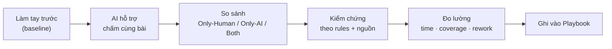
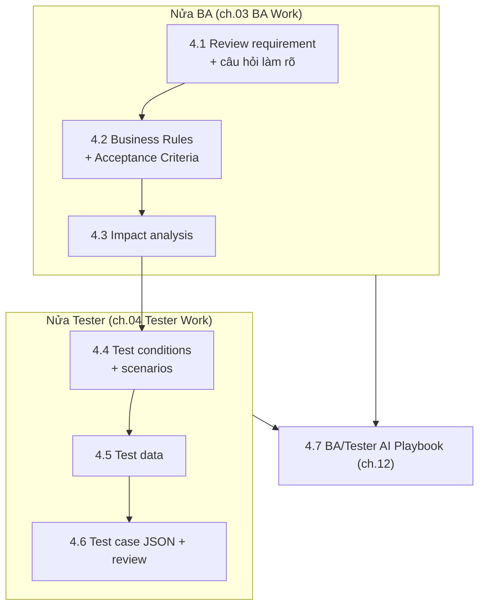
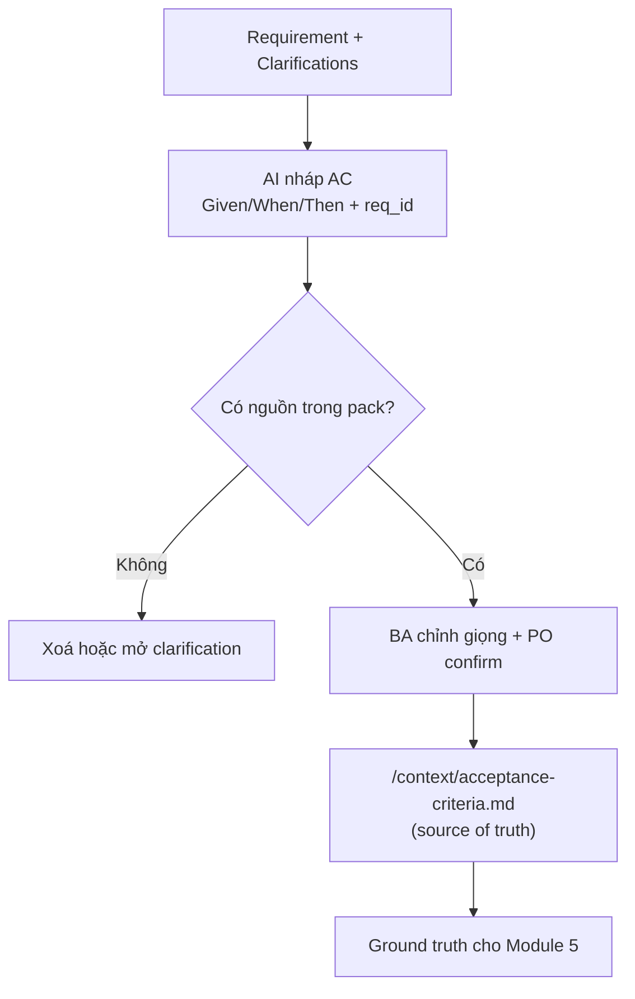
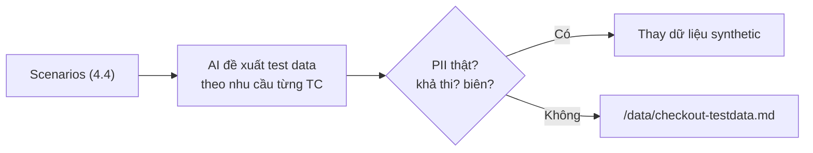
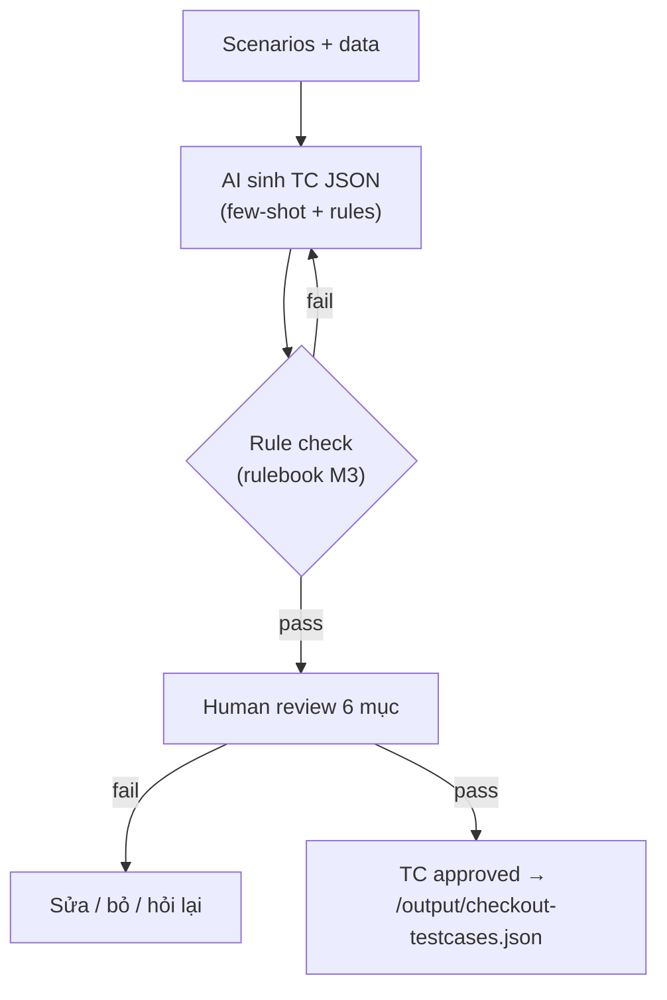
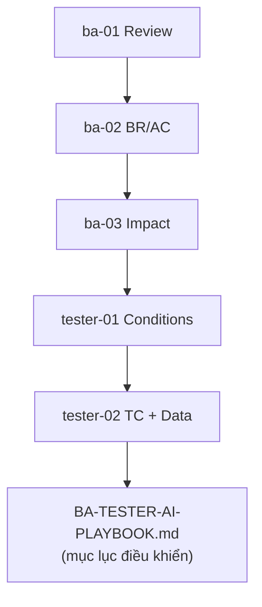

# MODULE 4 — AI cho BA & Tester

> **Pha:** 2 · AUGMENT — đưa AI vào công việc hàng ngày
>
> **Năng lực cốt lõi:** Prompt → Work · Validate
>
> **AI Handbook:** ch.03 (BA Work) · ch.04 (Tester Work) · ch.11 (Workflow) · ch.12 (Playbooks)
>
> **ISTQB CT-GenAI:** Chương 2 (GenAI-2.2.1 → 2.2.5, 2.3.2) · HO-2.2.1b, HO-2.2.2a/b
>
> **Project xuyên suốt:** E-commerce Checkout
>
> **Asset xuất ra:** `/playbook/BA-TESTER-AI-PLAYBOOK.md` + `/output` + `/context` cập nhật
>
> **Thời lượng đề xuất:** 8 giờ

---

## Vì sao có module này

Module 3 đã cho bạn **vũ khí**: prompt chuẩn, context pack, rulebook, structured output.
Nhưng vũ khí nằm trong kho không thay đổi trận đánh — **trận đánh nằm ở công việc hàng ngày**
của BA và Tester. Module này gắn AI vào từng bước luồng công việc thật, không học "tính năng
AI" mà học một **công thức lặp** áp được cho mọi việc:

Công thức **Manual → AI → Compare → Validate → Measure** giết chết hai cạm bẫy: *tin AI ngay*
(bạn sẽ validate) và *không tin AI thì cứ làm tay* (baseline chứng minh AI thua gì, thắng gì).
Khi chạy trên nghiệp vụ Checkout, nó trở thành luồng: *Requirement → AI Analysis → Rules →
Test Conditions → Test Cases → Human Review*.

Bản đồ của module — nửa BA, nửa Tester, gộp thành một playbook:

---

## Nửa BA — biến yêu cầu mơ hồ thành thứ kiểm chứng được

### 4.1 Đọc requirement và đặt câu hỏi làm rõ

Requirement Checkout có câu *"hết hàng giữa chừng thì báo lỗi"*. Báo lỗi lúc nào — trước khi
chốt giỏ hay sau khi chọn ngày giao? Giữ hàng bao lâu? Đây là **ambiguity**: chỗ văn bản có
thể hiểu nhiều cách. Bỏ sót nó, bạn mang sai sót vào AC rồi test cả dây chuyền.

AI đọc không biết mệt và quét được nhiều hướng (logic, business, UX, error handling) — miễn
bạn ra lệnh đúng. Prompt review mẫu: Role là BA 10 năm review thương mại điện tử, Context
trỏ tới `/context/checkout`, yêu cầu liệt kê ambiguity theo nhóm, **chỉ dựa vào pack**, và
Output là JSON với `{ id, group, quote, question }`.

Nhưng giữ một nguyên tắc: **AI dùng để mở rộng danh sách câu hỏi, không để chốt rule.**
AI sẽ liệt kê nhanh — và sẽ **bịa** một vài câu (gợi ý "voucher đổi trả" dù pack không nói).
Điểm mấu chốt: *AI mở rộng, con người lọc nguồn.*

| Cột so sánh | Nghĩa |
|---|---|
| **Only-Human** | Câu hỏi chỉ có người nghĩ ra — kinh nghiệm, giữ |
| **Only-AI** | Chỉ AI có — kiểm lại trong pack, loại nếu bịa |
| **Both** | Cả hai — giữ, ưu tiên |

Làm tay 10 phút tự đọc, rồi AI 10 phút, gộp lại theo ba cột trên. Danh sách câu hỏi làm rõ
cuối phải do **con người duyệt và ký tên** — và khi PO trả lời, các câu trả lời quay lại cập
nhật `/context/business-rules.md`, khiến lần review sau tốt hơn.

### 4.2 Viết Business Rules + Acceptance Criteria

Bạn cần AC cho thẻ, ví, hết hàng, payment timeout. Viết tay chậm; AI viết nhanh nhưng hay
**thêm rule** (nhớ chương trước: "sai mật khẩu 3 lần khoá tài khoản" bịa từ không khí).

Phân biệt hai loại: **Business Rule** là ràng buộc nghiệp vụ (vd *"payment timeout > 90s →
huỷ đơn"*); **Acceptance Criterion** là điều kiện chấp nhận **có thể kiểm chứng**
(Given/When/Then). Rule bất biến: **mọi BR/AC phải có nguồn** — gắn `req_id` hoặc ID
clarification.

Khi nháp 3 AC payment (success / fail / timeout), quan sát xem AI có tự biên câu "max N lần
retry" không — nếu nó biên, rulebook còn thiếu một rule, **thêm vào /rules** chứ đừng sửa tay
từng cái. AC approved là hợp đồng cho toàn bộ phần Tester và Automation sau này — **sai AC là
sai tất cả** những gì đứng sau.

### 4.3 Impact analysis

PO thông báo *"Checkout sẽ thêm ví mới"*. Không phải một cái nút — nó chạm vào cart,
payment, email, admin kho, báo cáo, luồng ưu đãi… Nếu impact bị sót, **regression lỗ ở đúng
chỗ bạn quên nhìn**.

AI giúp liệt kê toàn diện hệ quả theo nhiều chiều: **module × luồng × dữ liệu × stakeholder**
(danh sách hệ quả ứng viên — BA là người xác nhận cuối).

| Area | Impact | Risk (H/M/L) | Cần test? |
|---|---|---|---|
| Cart | Thêm ví mới → logic giỏ thay đổi | H | Có |
| Payment | Luồng thanh toán mới | H | Có |
| … | … | … | … |

Ví dụ CR "thêm COD": AI liệt kê cả "đổi trả COD" dù Checkout không có — con người loại theo
scope thực tế. **Khoảnh khắc "loại" chính là kiểm soát.** Kỹ năng này trở lại ở Module 7,
khi bạn hỏi *thay đổi chạm vào locator/luồng Playwright nào*.

---

## Nửa Tester — biến AC thành test case sạch

### 4.4 Test conditions + scenarios

Từ AC Checkout approved, AI sinh conditions ồ ạt gây hai bệnh: **trùng lặp** (30 condition
giống nhau) và **thiếu** (không có condition cho timeout).

**Test condition** là điều kiện có thể kiểm, có nguồn từ test basis; **scenario** là luồng
gắn các điều kiện lại (vd *lỗi mạng giữa bước chọn thẻ và xác nhận*). Công cụ cốt lõi là
**coverage matrix** — bảng `AC_ID × Condition_ID`:

| AC_ID | Condition cover | Trạng thái |
|---|---|---|
| AC-07 | COND-07.1, COND-07.2 | Đủ |
| AC-08 | — | **GAP — thiếu** |
| COND-42 | (không có AC nguồn) | **Orphan — nghi bịa** |

Hai trạng thái phải săn: **GAP** (AC chưa có condition nào bao → thêm) và **Orphan**
(condition không có nguồn AC → nghi bịa, kiểm tra lại). AI giúp mở rộng ý tưởng; **tester
quyết định scope**. Sinh → dedupe → đối chiếu gap → bắt orphan → sắp scenario ưu tiên theo
impact matrix 4.3 (High cho payment/inventory). Đây mới là định nghĩa vận hành của "coverage":
*mỗi AC ít nhất một condition, không condition nào vô nguồn*.

### 4.5 Test data

Test case chỉ đúng khi có **dữ liệu thật khả thi**: thẻ thành công, thẻ hết tiền, user giỏ
out-of-stock. Dinh data cứng vào từng TC = không tái dùng được, không sửa một chỗ được.

Tách test data khỏi case, sinh data **theo nhu cầu test case** — không theo "theme" AI thích:

| Case | Thẻ | Hệ thống | Kết quả mong muốn |
|---|---|---|---|
| Success | 4111…1111 | gateway online | success |
| Insufficient | 4222…2222 | gateway online | fail + message |
| Timeout | 4333…3333 | gateway chậm > 90s | huỷ + rollback giỏ |

Khi nhờ AI sinh data payment, quan sát nó **"bịa" số thẻ** hoặc đề xuất **PII thật** (email
thật). Nguyên tắc: dữ liệu **synthetic, đúng định dạng, không PII thật**. Bạn tự định nghĩa
3 data case trước, rồi để AI bổ sung; kèm checklist *PII? checksum? giá trị biên? phụ thuộc
trạng thái?* File data này đi thẳng vào Module 6 (map vào Playwright) và Module 7 (AI giữ data
làm nguồn sinh code).

### 4.6 Test case JSON + review

Khi AI sinh test case, nó có thể "viết steps ảo": *"bấm nút Thanh toán nhanh"* — nút không
tồn tại. **Review ở đây rẻ hơn debug ở Playwright gấp nhiều lần**: một lỗi review lúc này 5
phút, để lọt tới Playwright mất vài giờ gỡ.

AI chỉ là nguồn tạo **candidate TC**; **human là người phê duyệt** — Accept / Modify / Reject
/ Add. Tái sử dụng schema JSON (Module 3), rồi review theo **6 mục**:

1. **Traceability** — có `req_id`/`ac_id` hợp lệ?
2. **UI feasibility** — mỗi bước trỏ được element/cửa sổ có thật?
3. **Expected rõ** — trạng thái sau bước đo được?
4. **Data khả thi** — dùng đúng test data từ 4.5?
5. **Không thừa/bớt** — đúng scope AC?
6. **Syntax** — JSON parse được, đúng schema?

Chỉ test case nào qua review mới được đưa sang Validation (Module 5) và Automation (Module 6).

---

## Gộp thành Playbook

Sáu bước công việc bằng AI để lại đầy prompt và kết quả, nhưng còn rời rạc. *"Tuần sau đồng
nghiệp làm việc này thì đọc file nào?"* Đây là lúc gom thành một **Playbook**.

Mỗi mắt xích trong playbook chứa đủ nhãn: **WHEN** (dùng khi nào) · **INPUT** (nhập gì) ·
**PROMPT** · **CONTEXT** · **RULES** · **OUTPUT** · **CHECK**.

Đủ 4 mắt xích BA (review, AC/BR, impact) + 3 mắt xích Tester (conditions, TC + data, review),
mỗi mắt xích trỏ tới file thật, và một người mới đọc playbook **chạy lại chuỗi được mà không
cần hỏi ai**. Đây là *tài sản đội ngũ* chứ không phải kinh nghiệm cá nhân — và là tài liệu
sống: Module 5 thêm phần validate, Module 7 thêm phần automation, Module 9 dùng cả chuỗi để
kể câu chuyện Capstone.

---

## Di sản của bạn sau Module 4

1. **Playbook** — 7 bước BA/Tester có đủ WHEN/INPUT/PROMPT/RULES/OUTPUT/CHECK, dùng lại được.
2. **Context pack** đã cập nhật — BR/AC approved, clarifications có nguồn.
3. **TC JSON approved** + **test data** không PII — nền cho phần còn lại.
4. **Baseline số liệu** manual vs AI-assisted từ mọi bước.

Nhưng bạn đang có rất nhiều output AI "đã approve theo cảm giác" — chưa có cơ chế chứng minh
*làm đúng*. Module 5 xây một **cổng kiểm soát có số liệu** (khung 4 lớp), biến "cảm giác
đúng" thành thứ đo được — trước khi bạn tự động hoá bất cứ thứ gì.

> Một người viết AC giỏi vẫn có thể sót một rule out-of-stock.
> Module 5 là nơi ta ngừng tin *người viết* và bắt đầu tin *quy trình kiểm soát*.