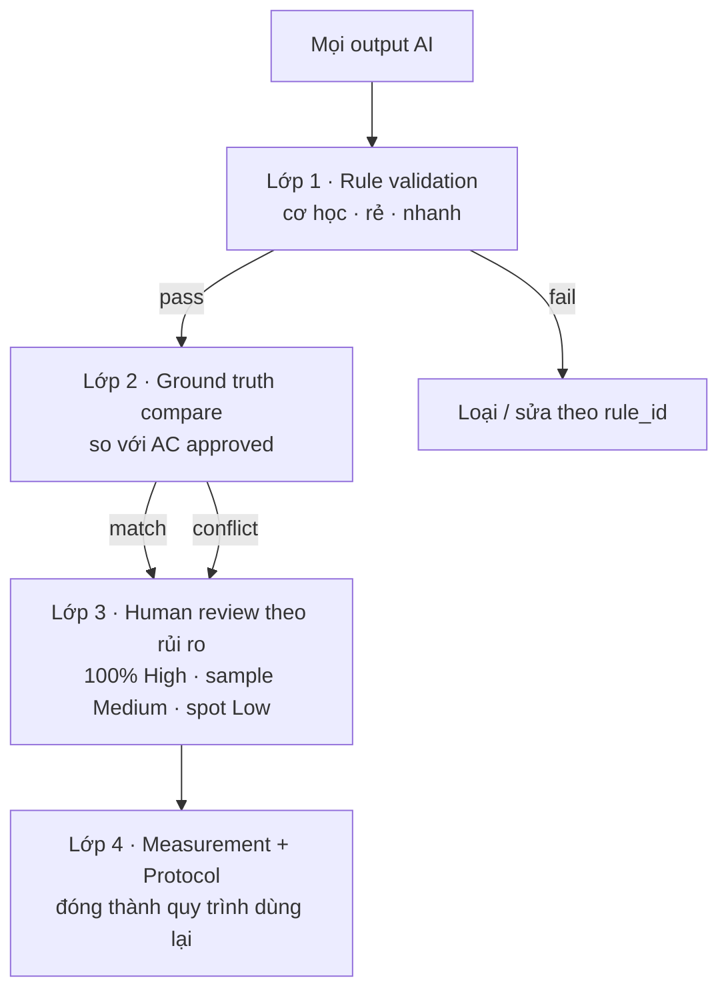
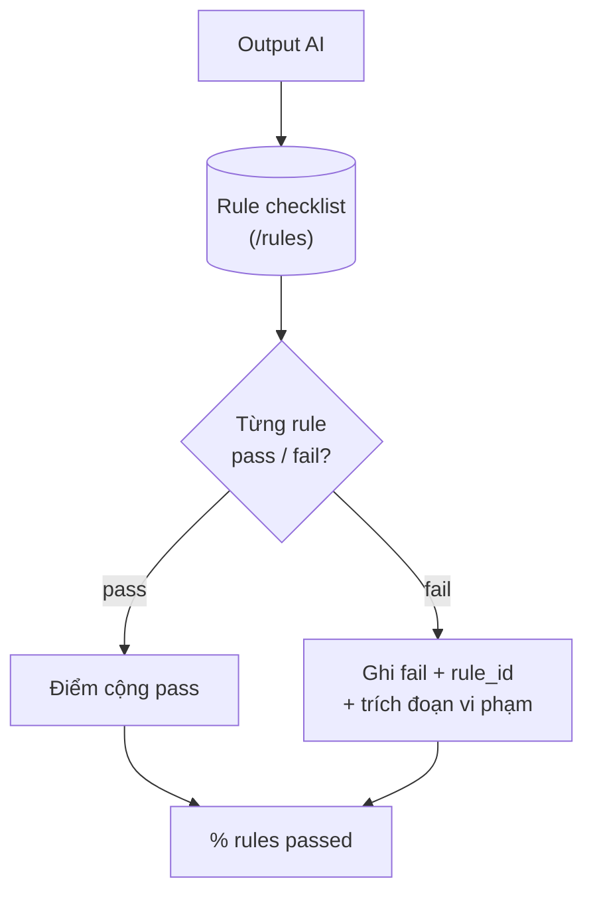
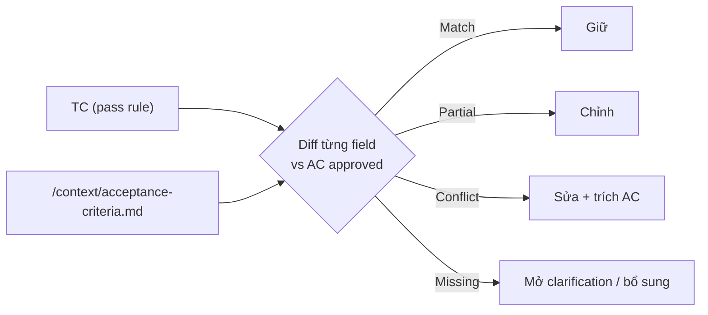
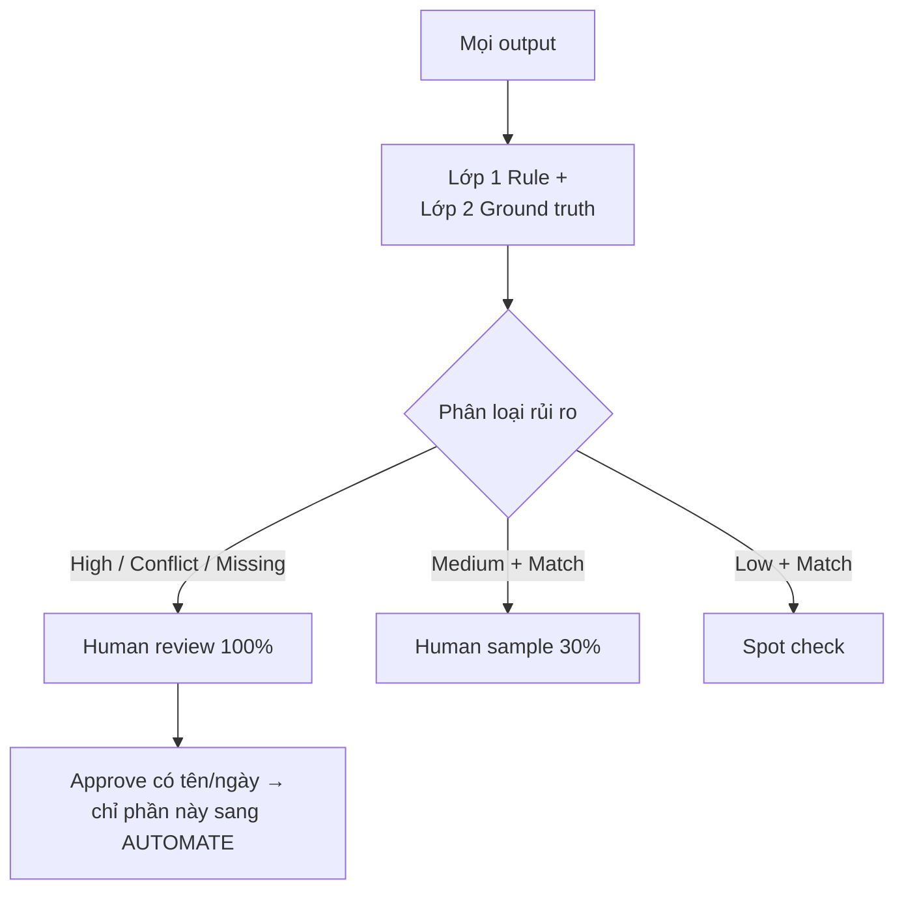
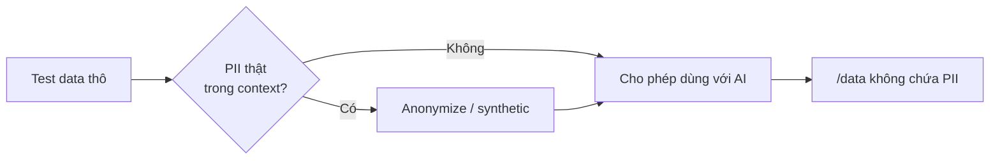
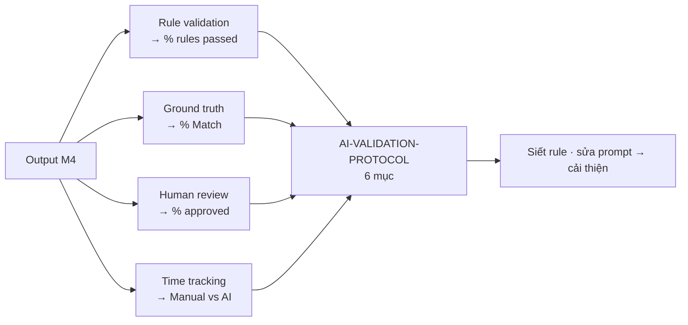

# MODULE 5 — AI Validation

> **Pha:** 2 · AUGMENT — **cổng kiểm soát trước khi AUTOMATE**
>
> **Năng lực cốt lõi:** Validate · Measure · Control
>
> **AI Handbook:** ch.05 (Validation)
>
> **ISTQB CT-GenAI:** Chương 2 (GenAI-2.3.1) · Chương 3 (GenAI-3.1.2 → 3.2.3)
>
> **Project xuyên suốt:** E-commerce Checkout · Đầu vào: `/output`, `/rules`, `/context`
>
> **Asset xuất ra:** **`/validation/AI-VALIDATION-PROTOCOL.md`** + metrics + logs
>
> **Thời lượng đề xuất:** 4 giờ

---

## Vì sao có module này

Từ Module 2 đến Module 4, hình mẫu ngầm là *AI sinh → con người duyệt*. Cách đó còn hai lỗ
hổng nghiêm trọng:

1. **Con người không scale.** 30 test case đọc được; 300 test case thì không ai đọc khơi khơi.
2. **Con người không ổn định.** Cuối giờ chiều và đầu giờ sáng, mức soi khác nhau.

Module này dạy bạn kiểm soát output AI bằng một **quy trình lặp lại được** — gọi là **khung
4 lớp**: độ tinh vi và chi phí tăng dần, và **lớp rẻ chạy trước để lọc bớt, lớp đắt chỉ chạy
trên phần thực sự cần**. Kết quả là một `AI-VALIDATION-PROTOCOL` mà đội chạy lại mọi lần,
thay vì dựa vào cảm giác của từng người.

Nguyên tắc gốc của handbook về validation rất ngắn: **không đánh giá output bằng "trông có
vẻ đúng"; đánh giá bằng việc nó đi qua nguồn → rule → expected → AI output, rồi đem so với
một chuẩn vàng (ground truth).**

---

## Khung 4 lớp

| Lớp | Cơ chế | Bắt chính xác nhất | Chi phí |
|---|---|---|---|
| **1. Rule validation** | Pass/fail theo rulebook Module 3 | Lỗi format, thiếu nguồn, invent thô | Rẻ nhất |
| **2. Ground truth compare** | Diff từng trường vs AC approved | Sai logic nghiệp vụ | Trung bình |
| **3. Human review** | Người soi theo mức rủi ro | Lỗi tinh vi, theo ngữ cảnh | Đắt |
| **4. Measurement** | Bộ số liệu xuyên suốt | Cải tiến prompt/rule qua thời gian | Đầu tư định kỳ |

Thứ tự chính là quy tắc *rẻ trước, đắt sau — chỉ phần sót loại mới tốn tiền*:



---

## Lớp 1 — Rule validation: máy chấm điểm

Bạn có 30 test case AI; đọc hết mới phát hiện một cái thiếu `req_id`, hoặc đề xuất payment
method không có trong pack — **đọc hết để tìm lỗi format là đốt giờ**. Rule validation áp
rulebook Module 3 như một checklist cơ học chạy trên toàn bộ output, pass/fail kèm lý do:

```text
Output
  ├─ Traceability : mọi TC có req_id/ac_id hợp lệ?
  ├─ No-invent    : không payment method / bước / rule nào ngoài pack?
  ├─ Format       : JSON parse được? đúng schema? 0 field lạ?
  └─ Safety       : 0 PII thật? dữ liệu synthetic đúng chuẩn?
```



Đây là lớp **duy nhất tự động hoá hoàn toàn được** và rẻ nhất — nên nó chạy trước, loại ngay
20–30% output (thiếu req_id, phạm no-invent) mà không tốn một giờ người. Mọi fail phải có
`rule_id` trỏ về `/rules` — **không có fail "theo cảm tính"**.

**Thực hành:** chấm toàn bộ `/output/checkout-testcases.json` theo checklist trên, ghi kết quả
ra `/validation/rule-results.md`.

---

## Lớp 2 — Ground truth compare: bắt lỗi nghiệp vụ

Một test case có thể "pass rule" hoàn hảo mà **expected vẫn sai so với AC approved** — vì
rule kiểm *hình thức*, không kiểm *nghiệp vụ*. Đây là lúc đưa chuẩn vàng vào: ground truth
chính là **AC/BR approved trong `/context`**.

Diff **từng trường** của test case với chuẩn vàng, phân loại:

| Kết luận | Nghĩa | Hành động |
|---|---|---|
| **Match** | Khớp | Giữ |
| **Partial** | Đúng một phần | Chỉnh sửa |
| **Conflict** | Ngược với AC | **Sửa, kèm trích AC** |
| **Missing** | AC quy định nhưng TC không có | Mở clarification / bổ sung |



Ví dụ kinh điển: AC nói *"payment timeout > 90s → huỷ đơn, tối đa 3 lần retry"*, TC AI ghi
*"retry vô hạn"*. Rule **không bắt được** — vì format hợp lệ. Ground truth **bắt**: đó là
Conflict kèm trích dẫn AC. Khoảnh khắc bạn thấy *rule pass nhưng nghiệp vụ sai* chính là lúc
hiểu vì sao cần hai lớp này cộng lại.

**Thực hành:** lập bảng `TC_ID | AC_ID | Kết luận` cho 8+ TC; Conflict ghi trích AC, Missing
viết rõ clarification — không im lặng coi là đúng.

---

## Lớp 3 — Human review theo rủi ro

"Review 100% bằng tay" nghe an toàn — nhưng với output hàng nghìn dòng, 100% nghĩa là **không
ai review thật** hoặc **chậm rùa**. "0% review" thì mọi lỗi trôi vào production. Giữa hai
cực là **review theo rủi ro**:

```text
HIGH risk (payment, inventory, refund, auth)
   └─ Human review 100% — bắt buộc

MEDIUM risk
   └─ Human review sample (vd 30%)

LOW risk + đã Match (lớp 2)
   └─ Spot check
```



Kèm một **Human Review Charter**: ai review, SLA bao lâu, quy trình sign-off, hạn xử lý
reject. Mỗi lần approve phải **có tên và ngày** — vì đây chính là phần duy nhất được phép
đưa sang Automation (Module 6). Cũng chính tại lớp này, các tiêu chí loại thẳng được áp dụng:
*bịa nghiệp vụ, thiếu điều kiện, expected không có nguồn, không trace, unsafe assumption* →
reject.

---

## Bảo mật dữ liệu — quy tắc, không phải tài năng

Test data có thể dính email thật, số thẻ thật. Dán vào AI = đưa ra hệ thống ngoài tổ chức —
rủi ro tuân thủ (GDPR) và rủi ro kỹ thuật cùng lúc. Ba chiến lược:

| Chiến lược | Áp vào test |
|---|---|
| **Data minimization** | Chỉ đưa tối thiểu cần thiết, không dán nguyên production dump |
| **Anonymization / pseudonymization** | Thay email/số thẻ thật bằng synthetic **giữ nguyên định dạng** |
| **Môi trường an toàn** | Data nhạy → secure cloud / model tại chỗ |



Hai vector tấn công gần với BA/Tester cần nhớ: **context manipulation** (prompt cực dài đẩy
AI rò rỉ) và **request manipulation** (input độc lừa AI sinh AC sai hay bước ảo).

**Thực hành:** rà test data từ Module 4 theo checklist *PII? secret? token? thẻ? quá mức cần
thiết?* — và quan sát: một tester "giỏi tự viết" vẫn có thể vi phạm ở chi tiết (email đẹp
nhưng chưa kiểm tra). Vì **bảo mật là một mục trong checklist, không nằm trong tài năng** —
đó là lý do nó thành mục "Cấm ship" bắt buộc trong protocol.

---

## Đo lường — bảy metrics biến "cảm giác" thành số

Đội nào cũng nói "AI giúp" — hỏi *giúp đến đâu, chỉ số nào* thì mỗi người một số, hoặc không
số. Vì LLM non-deterministic, **một lần chạy may chưa nói lên điều gì** — cần thống kê, đo
nhiều lần. Bảy metrics chuẩn:

| Metric | Câu hỏi | Đo ở đâu |
|---|---|---|
| **Accuracy** | Output đúng với chuẩn (AC) đến đâu? | Lớp 2 — ground truth |
| **Precision** | Phần đúng, có bao nhiêu *không thừa*? | % field dùng được |
| **Recall** | Cần có, AI bắt được bao nhiêu? | Coverage AC → TC |
| **Relevance** | Bám test basis không? | Số ý ngoài pack bị loại |
| **Diversity** | Có lặp/thiếu biên không? | Đếm trùng · boundary |
| **Execution Success** | TC chạy được ngay không? | Parse JSON; chạy thử |
| **Time Efficiency** | Nhanh hơn manual bao nhiêu? | Manual vs AI |



Điền toàn bộ bảng metrics vào `/validation/metrics-checkout.md`, và **đánh dấu rạch ròi ô nào
đo được thật, ô nào ước lượng** — không tráo lẫn (được siết lại ở Module 9). Với mỗi metric,
tự hỏi *"cải thiện bằng cách nào: sửa prompt, sửa rule, hay đổi cách chấm?"* — đó là vòng học
cải tiến.

---

## Đóng thành protocol

Gom tất cả thành `AI-VALIDATION-PROTOCOL.md` với **6 mục**:

1. **Gates** — thứ tự 4 lớp, điều kiện pass.
2. **Checklists** — rule + sanitize.
3. **Sampling** — 100% / 30% / spot.
4. **Metrics** — 7 metrics + cách đo.
5. **Ship-Blockers** — "cấm ship".
6. **Links** — /rules, /context, /output, /validation.

Đây là **trung tâm kiểm soát** của toàn khoá: Module 7 dùng nó để validate *code* AI, Module
8 dùng nó đánh giá vendor, Module 9 dùng nó để chứng minh giá trị bằng số.

---

## Di sản của bạn sau Module 5

1. **Khung 4 lớp** kiểm soát output AI, chi phí tăng dần.
2. **AI-VALIDATION-PROTOCOL** 6 mục — gate, checklist, sampling, metrics, cấm ship, links.
3. **Bộ số liệu đầu tiên** — % rules passed, % Match, human cost, PII violations.
4. **Thói quen bảo mật** thành checklist, không phải tài năng.

Giờ bạn có thứ hiếm: **test case đã qua 4 lớp kiểm soát**. Chỉ phần approved này mới đáng đưa
sang Automation. Module 6 dạy *hiểu trước khi tự động hoá* trước khi đụng Playwright — vì bạn
không thể tự động hoá thứ mình không kiểm soát, kể cả khi AI tạo ra.

> Nhớ quyết định thiết kế: **M5 nằm giữa AUGMENT và AUTOMATE có chủ đích.**
> Không có cổng validation, mọi thứ sau nó chỉ là tự động hoá những cái chưa chắc chắn.