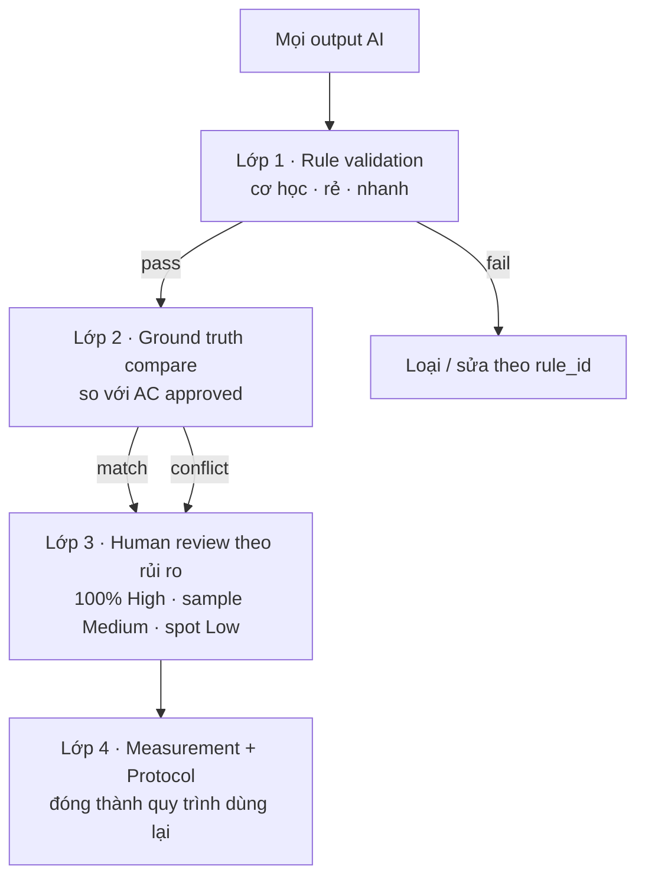
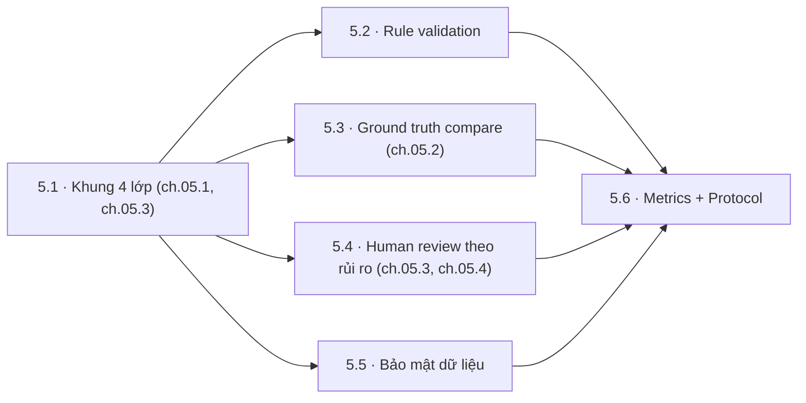
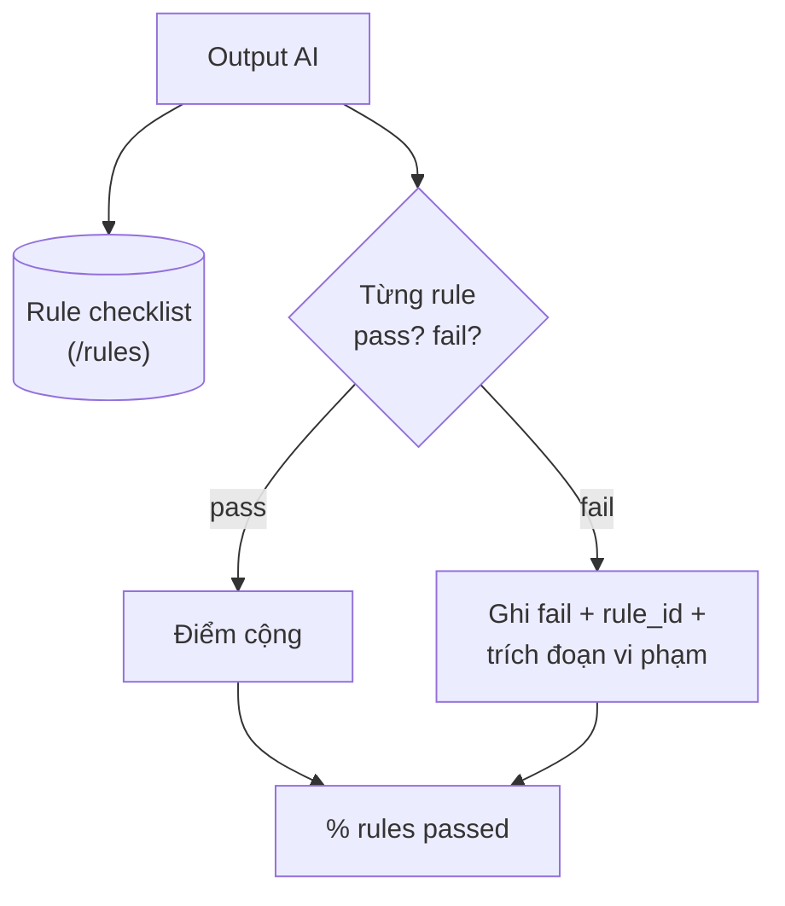
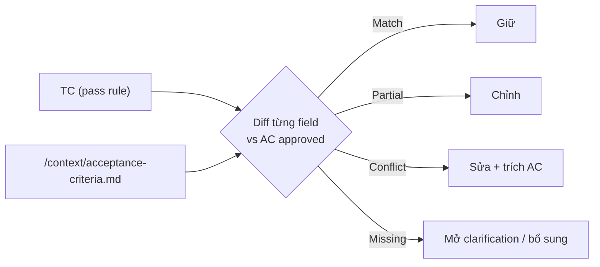
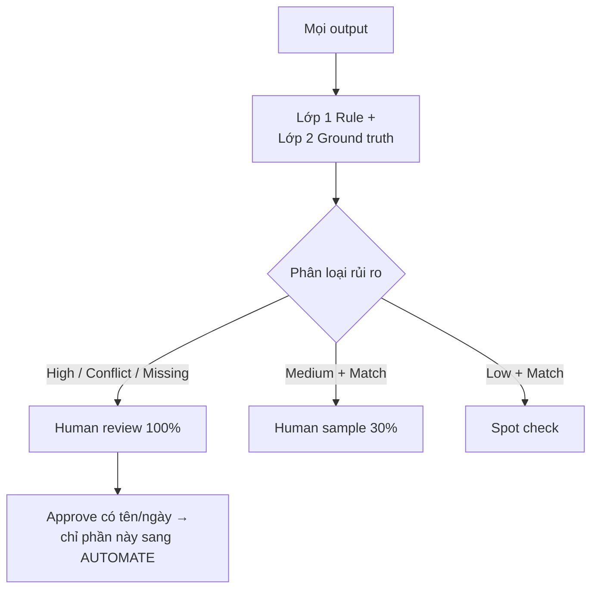
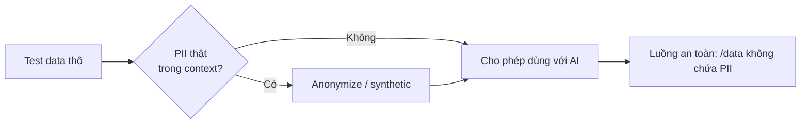
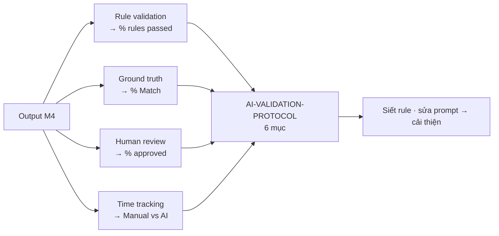

# MODULE 5 — AI Validation

> **Pha:** 2 · AUGMENT — **Cổng kiểm soát trước khi AUTOMATE**
>
> **Năng lực cốt lõi:** Validate · Measure · Control
>
> **AI Handbook:** ch.05 (Validation)
>
> **ISTQB CT-GenAI:** Chương 2 (GenAI-2.3.1) · Chương 3 (GenAI-3.1.2 → 3.2.3)
>
> **Project xuyên suốt:** E-commerce Checkout · Đầu vào: `/output/checkout-testcases.json`, `/rules`, `/context`
>
> **Asset xuất ra:** **`/validation/AI-VALIDATION-PROTOCOL.md`** + metrics + logs
>
> **Thời lượng đề xuất:** 4 giờ

> **Vì sao module này nằm giữa AUGMENT và AUTOMATE (quyết định có chủ đích):**
>
> Mọi test case từ M4 đã "approved". Nhưng approved theo *quyết định con người ở từng bài*.
> M5 biến việc đó thành một **quy trình kiểm soát có thể lặp lại** — để M6 chỉ tự động hoá
> những gì đã vượt qua cổng. Nói ngắn gọn: **Control before Scale.**

---

## Vì sao module này nằm ở đó

Từ M2 đến M4, hình mẫu ngụ ý: *AI sinh → người duyệt*. Cách này còn hai lỗ hổng:

1. **Con người không scale.** 30 TC đọc được; 300 TC đọc khơi khơi.
2. **Con người không ổn định.** Cuối giờ chiều, đầu giờ sáng — mức soi khác nhau.

M5 xây **4 lớp kiểm soát**, độ tinh vi tăng dần, chi phí tăng dần. Lớp rẻ chạy trước để
lọc bớt; lớp đắt chỉ chạy trên phần thực sự cần. **Bám ch.05:** *Source → Rule → Expected →
AI Output; đánh giá bằng nguồn, không bằng "trông có vẻ đúng".*



**ch.05.1 (AI Output Review):** không đánh giá bằng "trông có vẻ đúng" — chỉ đánh giá khi
đi qua Source → Rule → Expected → AI Output. **ch.05.2 (Ground Truth):** tạo một bộ reference
để so. **ch.05.4 (Reject):** bịa nghiệp vụ, thiếu điều kiện, expected không source support,
không trace, unsafe assumption → reject.

---

## Bản đồ module



---

## LESSON 5.1 — Khung 4 lớp: "không được tin, nhưng phải dùng" (ch.05)

### 1. Vấn đề

"Chúng tôi validate bằng cảm giác của tester." Nghe thành thật, nhưng không vận hành
được: ai cũng cảm giác, và cảm giác không trả lời "đủ chưa?" khi sếp hỏi.

### 2. Vì sao quan trọng

Không có khung → chất lượng phụ thuộc cá nhân → không học từ lỗi → không chứng minh.
Khung 4 lớp biến "cảm giác" thành **gates và số liệu**.

### 3. Kiến thức tối thiểu

Bốn lớp xuất phát từ kỹ thuật phát hiện lỗi ISTQB (GenAI-3.1.2): cross-verification,
logical validation, output testing, bias review.

| Lớp | Cơ chế | Bắt chính xác nhất | Chi phí |
|---|---|---|---|
| 1. Rule validation | Pass/fail theo rulebook M3 | Lỗi format, thiếu nguồn, invent thô | Rẻ nhất |
| 2. Ground truth compare | Diff field-by-field vs AC approved | Sai logic nghiệp vụ | Trung bình |
| 3. Human review | Người soi theo rủi ro | Lỗi tinh tế, ngữ cảnh | Đắt |
| 4. Measurement | Bộ số liệu xuyên suốt | Cải tiến prompt/rule qua thời gian | Đầu tư định kỳ |

**Nguyên tắc:** *rẻ trước, đắt sau — chỉ phần sót loại mới tốn tiền.*

### 4. Sơ đồ tư duy
Giữ nguyên sơ đồ ở "Vì sao module này nằm ở đó".

### 5. Demo thực chiến
Lấy 12 TC M4, đẩy qua 4 lớp: *rule* loại 20–30% (thiếu req_id, phạm no-invent), *ground
truth* loại thêm conflict, *human* xử chỗ tinh.

### 6. Thực hành có hướng dẫn
Tự vẽ khung 4 lớp cho **chính output M4**: ước lượng % rớt mỗi lớp trước khi chạy — rồi đo
lại, ghi chênh lệch.

### 7. Nhiệm vụ thật
Phần "Khung 4 lớp" trong `AI-VALIDATION-PROTOCOL.md` (hoàn chỉnh ở 5.6).

### 8. Kiểm chứng
- [ ] Giải thích được vì sao thứ tự 4 lớp là *rẻ → đắt*.
- [ ] Với mỗi lớp, nêu được 1 kiểu lỗi nó bắt tốt nhất.

### 9. Đo lường
% output rớt ở từng lớp.

### 10. Ghi chép & tái sử dụng
Khung này là file chứa của 5.2–5.6.

---

## LESSON 5.2 — Rule validation (ch.05.1)

### 1. Vấn đề
30 TC AI. Không muốn đọc hết mới phát hiện TC thiếu `req_id` hoặc đề xuất payment method
không có trong pack. Đọc hết để tìm lỗi format = đốt giờ.

### 2. Vì sao quan trọng
Rule validation là **máy chấm điểm** — chạy trên toàn bộ output, pass/fail kèm lý do, vài
phút. Lớp duy nhất có thể **tự động hoá hoàn toàn**. Rẻ nhất, chạy trước.

### 3. Kiến thức tối thiểu
Áp **rulebook M3** như checklist cơ học, 4 cột:

```text
Output
  ├─ Traceability : mọi TC có req_id/ac_id hợp lệ?
  ├─ No-invent    : không payment method / bước / rule nào ngoài pack?
  ├─ Format       : JSON parse? đúng schema? 0 field lạ?
  └─ Safety       : 0 PII thật? dữ liệu synthetic đúng chuẩn?
```

### 4. Sơ đồ tư duy



### 5. Demo thực chiến
Chấm 5 TC theo 10 rules mẫu. Hai kiểu fail điển hình: thiếu `ac_id` (traceability) và
payment "COD" chui vào dù pack không có (no-invent).

### 6. Thực hành có hướng dẫn
Dựng **`/validation/rule-checklist-checkout.md`** — bảng rule × TC, pass/fail. Chấm 10 TC.

### 7. Nhiệm vụ thật
Chạy rule validation trên **toàn bộ** `/output/checkout-testcases.json` →
**`/validation/rule-results.md`**.

### 8. Kiểm chứng
- [ ] Mọi fail có rule_id trỏ vào /rules.
- [ ] 0 fail "theo cảm tính".
- [ ] Pass rate tính đúng.

### 9. Đo lường
% rules passed · thời gian rule check vs đọc full · số lỗi chặn trước human review.

### 10. Ghi chép & tái sử dụng
Rule nào fail nhiều → candidate sửa prompt (5.6, M9).

---

## LESSON 5.3 — Ground truth compare (ch.05.2)

### 1. Vấn đề
Một TC có thể "pass rule" hoàn hảo nhưng **expected sai so với AC approved**. Rule kiểm
*hình thức*; không kiểm *nghiệp vụ*.

### 2. Vì sao quan trọng
Lớp mà "format hợp lệ nhưng logic sai" bị bắt. **ch.05.2 Ground Truth:** so với chuẩn vàng
(AC approved) để đo accuracy (GenAI-2.3.1).

### 3. Kiến thức tối thiểu
Ground truth = **AC/BR approved trong /context**. Diff từng trường, phân loại:

| Kết luận | Nghĩa | Hành động |
|---|---|---|
| **Match** | Khớp | Giữ |
| **Partial** | Đúng một phần | Chỉnh sửa |
| **Conflict** | Ngược với AC | **Sửa, có trích AC** |
| **Missing** | AC quy định nhưng TC không có | Mở clarification / bổ sung |

Ví dụ: AC nói *"payment timeout > 90s → huỷ đơn, tối đa 3 lần retry"*, TC AI ghi *"retry vô
hạn"*. Rule không bắt; ground truth bắt.

### 4. Sơ đồ tư duy



### 5. Demo thực chiến
TC "retry vô hạn" vs AC "max 3 lần rồi huỷ" → Conflict kèm trích dẫn AC. Khoảnh khắc thấy
**rule pass nhưng nghiệp vụ sai**.

### 6. Thực hành có hướng dẫn
Bảng `TC_ID | AC_ID | Kết luận` cho **8+ TC**. Conflict: trích AC. Missing: viết clarification.

### 7. Nhiệm vụ thật
**`/validation/ground-truth-diff-checkout.md`** + xử lý (sửa Conflict, mở clarification Missing).

### 8. Kiểm chứng
- [ ] Mọi Conflict có trích AC.
- [ ] Mọi Missing mở clarification — không im lặng coi là đúng.
- [ ] 0 "Match" khi thực chất lệch (peer rà).

### 9. Đo lường
% Match · số Conflict và Missing · thời gian mỗi diff.

### 10. Ghi chép & tái sử dụng
Conflict/Missing là đầu vào ưu tiên human review (5.4) — bằng chứng "AI cần kiểm soát".

---

## LESSON 5.4 — Human review theo rủi ro (ch.05.3, ch.05.4)

### 1. Vấn đề
"Review 100% bằng tay." Nghe an toàn, nhưng với output hàng nghìn dòng, 100% = không ai
review thật hoặc chậm rùa. "0% review" = mọi lỗi trôi vào production.

### 2. Vì sao quan trọng
Human review **100% không scale, 0% nguy hiểm**. Giữa hai cực là **review theo rủi ro**.
**ch.05.4 (Reject):** bịa nghiệp vụ, thiếu điều kiện, expected không source, không trace,
unsafe assumption → reject.

### 3. Kiến thức tối thiểu
Ba tầng sampling:

```text
HIGH risk (payment, inventory, refund, auth)
   └─ Human review 100% — bắt buộc

MEDIUM risk
   └─ Human review sample N% (vd 30%)

LOW risk + đã Match (5.3)
   └─ Spot check
```

Kèm **Human Review Charter**: ai review, SLA, quy trình sign-off, hạn xử lý reject.

### 4. Sơ đồ tư duy



### 5. Demo thực chiến
Chia 12 TC thành 3 bucket (rủi ro + kết quả 5.3). Khoanh 100% High + Conflict.

### 6. Thực hành có hướng dẫn
Viết **Human Review Charter** cho nhóm (dù giả định): roles, SLA, risk tiers, sign-off.

### 7. Nhiệm vụ thật
**`/validation/human-review-log-checkout.md`** — log thực tế: ai review gì, kết luận, tên/ngày.

### 8. Kiểm chứng
- [ ] 0 High chưa human review.
- [ ] Approve có tên/ngày.
- [ ] Reject có lý do.

### 9. Đo lường
% output cần human · thời gian human tổng · "escape defect".

### 10. Ghi chép & tái sử dụng
Log giúp 5.6 đo human cost, giúp M6 biết **đâu là phần được phép automate**.

---

## LESSON 5.5 — Bảo mật dữ liệu khi dùng GenAI

### 1. Vấn đề
Test data có thể dính email thật, số thẻ thật. Paste vào AI = đưa ra hệ thống ngoài tổ
chức — rủi ro tuân thủ (GDPR) và kỹ thuật (GenAI-3.2.1).

### 2. Vì sao quan trọng
ISTQB liệt kê nhóm rủi ro này rất nặng (GenAI-3.2.1 → 3.2.3). Với test data, lỗi này
thường nhất và đắt nhất.

### 3. Kiến thức tối thiểu
Ba chiến lược (GenAI-3.2.3):

| Chiến lược | Áp vào test |
|---|---|
| **Data minimization** | Chỉ đưa tối thiểu; không dán production dump |
| **Anonymization / pseudonymization** | Thay email/số thẻ thật bằng synthetic giữ định dạng |
| **Môi trường an toàn** | Dữ liệu nhạy → secure cloud / in-house model |

Hai attack vector gần với BA/Tester (GenAI-3.2.2): **context manipulation** (prompt cực dài
đẩy AI rò rỉ), **request manipulation** (input độc lừa AI sinh sai AC/bước ảo).

### 4. Sơ đồ tư duy



### 5. Demo thực chiến
Rà test data M4.5. Quan sát tester "giỏi tự viết" vẫn vi phạm ở chi tiết (email đẹp chưa
kiểm tra). Lý do **bảo mật là một mục của checklist, không nằm trong tài năng** (ch.05).

### 6. Thực hành có hướng dẫn
Checklist sanitize: *PII? secret? token? thẻ? quá mức cần thiết?* — chạy lên toàn bộ
artifact M2→M4.

### 7. Nhiệm vụ thật
Mục **"Cấm ship"** trong protocol + làm sạch vi phạm nếu có.

### 8. Kiểm chứng
- [ ] 0 PII thật trong mọi artifact.
- [ ] Checklist sanitize đủ 5 mục.
- [ ] Nêu được 1 attack vector + cách tránh.

### 9. Đo lường
Số vi phạm PII (về 0 sau vòng sửa) · thời gian checklist.

### 10. Ghi chép & tái sử dụng
Mục "Cấm ship" theo protocol sang M8 (RAG/agents — rủi ro dữ liệu tăng) và M9.

---

## LESSON 5.6 — Metrics & đóng AI-VALIDATION-PROTOCOL

### 1. Vấn đề
Đội nói "AI giúp". Hỏi "giúp đến đâu, chỉ số nào" thì mỗi người một số — hoặc không số.
Không metric chung = không siết prompt, không chứng minh giá trị.

### 2. Vì sao quan trọng
ISTQB (GenAI-2.3.1): dựa trên dữ liệu thống kê, không một lần chạy may — vì LLM
non-deterministic.

### 3. Kiến thức tối thiểu
Bảy metrics chuẩn (GenAI-2.3.1):

| Metric | Câu hỏi | Đo ở đâu |
|---|---|---|
| **Accuracy** | Output đúng với chuẩn (AC) đến đâu? | 5.3 ground truth |
| **Precision** | Phần đúng, có bao nhiêu *không thừa*? | % field dùng được |
| **Recall** | Phần cần có, AI bắt được bao nhiêu? | Coverage AC → TC |
| **Relevance** | Bám test basis không? | Số ý ngoài pack bị loại |
| **Diversity** | Có lặp/thiếu biên không? | Đếm trùng · boundary |
| **Execution Success** | TC chạy được ngay không? | Parse JSON; chạy thử (M6/M7) |
| **Time Efficiency** | Nhanh hơn manual bao nhiêu? | Manual vs AI |

### 4. Sơ đồ tư duy



### 5. Demo thực chiến
Điền toàn bộ bảng metrics từ 5.1–5.5 vào **`/validation/metrics-checkout.md`**. Đánh dấu ô
*đo được thật* vs *ước lượng* — không tráo lẫn (siết lại ở 9.3).

### 6. Thực hành có hướng dẫn
Với mỗi metric, viết câu "cải thiện bằng cách nào": cải prompt, cải rule, hay đổi cách chấm.

### 7. Nhiệm vụ thật
**`/validation/AI-VALIDATION-PROTOCOL.md`** đủ **6 mục**:

1. **Gates** — thứ tự 4 lớp, điều kiện pass.
2. **Checklists** — rule + sanitize.
3. **Sampling** — 100% / 30% / spot.
4. **Metrics** — 7 metrics + cách đo.
5. **Ship-Blockers** — "Cấm ship".
6. **Links** — /rules, /context, /output, /validation.

### 8. Kiểm chứng
- [ ] Đủ 6 mục.
- [ ] Có before/after hoặc Manual vs AI bằng số.
- [ ] Có Ship-Blockers cụ thể.

### 9. Đo lường
Bảng metrics hoàn chỉnh (số thật ≥ nửa các ô; còn lại đánh dấu ước lượng).

### 10. Ghi chép & tái sử dụng
Protocol là **trung tâm kiểm soát**: M7 validate code AI, M8 đánh giá vendor, M9 chứng
minh giá trị.

---

## Đọc thêm

- **AI Handbook** — ch.05 (Validation): đặc biệt 05.1 (Output Review), 05.2 (Ground Truth),
  05.4 (Reject).
- **ISTQB CT-GenAI Syllabus v1.1** — Chương 3 (GenAI-3.1.2 → 3.4.1) + 2.3.1 (metrics).
- **NIST AI Risk Management Framework 1.0** — khung quản trị rủi ro AI.
- **Winteringham, M., *Software Testing with Generative AI*, Manning, 2024** — đánh giá
  AI-generated testware.

---

## Hết Module 5 — bạn có gì?

1. **Khung 4 lớp** kiểm soát output AI với thứ tự chi phí tăng dần.
2. **AI-VALIDATION-PROTOCOL** 6 mục — gate, checklist, sampling, metrics, cấm ship, links.
3. **Bộ số liệu đầu tiên**: % rules passed, % Match, human cost, PII violations.
4. **Thói quen bảo mật** thành checklist, không phải tài năng.

**Cầu sang M6:** Bạn có điều hiếm: **test case đã qua 4 lớp kiểm soát**. Chỉ phần approved
này sang AUTOMATE. M6 dạy *Understand before Automate* (ch.06) trước khi động Playwright.

> Nhớ quyết định thiết kế: **M5 nằm giữa AUGMENT và AUTOMATE có chủ đích**.
> Bạn không thể tự động hoá thứ mình không kiểm soát — kể cả khi AI tạo ra.
