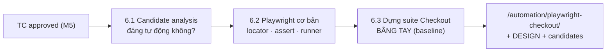
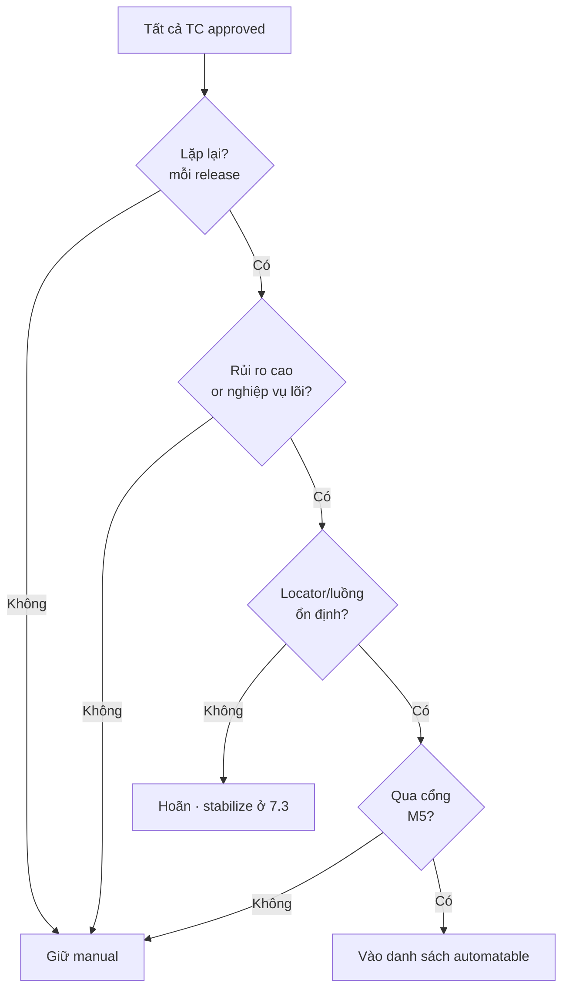
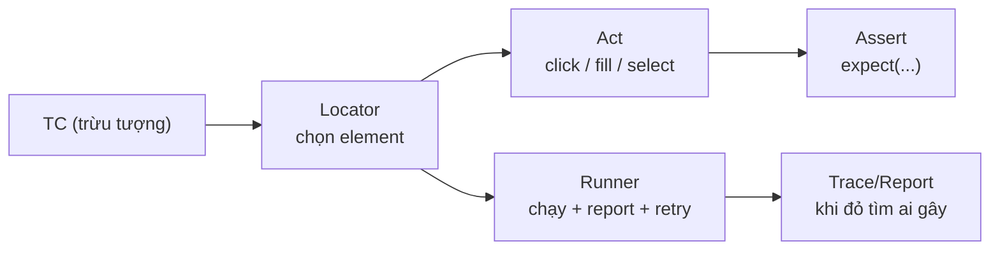

# MODULE 6 — Playwright: nền tảng Automation

> **Pha:** 3 · AUTOMATE — chỉ tự động hoá cái đã qua cổng M5
>
> **Năng lực cốt lõi:** Understand → Automate
>
> **AI Handbook:** ch.06 (Automation — Playwright)
>
> **ISTQB CT-GenAI:** Module kỹ thuật (công cụ: Playwright) — chuẩn bị GenAI-4.1.3 ở M7
>
> **Project xuyên suốt:** E-commerce Checkout · Đầu vào: `/validation/AI-VALIDATION-PROTOCOL.md`
>
> **Asset xuất ra:** `/automation/candidates-checkout.md` + `/automation/DESIGN-checkout.md` + suite `/automation/playwright-checkout/`
>
> **Thời lượng đề xuất:** 6 giờ

---

## Vì sao có module này

Từ Module 2 đến Module 5 ta nói về **quyết định**: làm gì, dùng AI sao đúng, kiểm soát ra
sao. Từ module này bạn bắt đầu **giao công việc chạy cho máy**. Nhưng BA/Tester không thể
giao điều mình không hiểu. Module này xây nền **Playwright bằng tay** — một baseline trung
thực — để module tiếp theo có thứ so: *tay viết được chừng này, AI viết được chừng nào, chỗ
nào phải sửa.*

Tư duy xuyên suốt là **hiểu trước khi tự động hoá** — bạn không viết test cho một luồng mình
chưa từng bước đi qua. Và ba cám dỗ cần né ngay từ đầu:

| Cám dỗ | Cách né |
|---|---|
| "Tự động hoá hết" | chỉ chọn TC qua cổng M5 + có ROI |
| "Viết test rồi đỡ nghĩ" | hiểu locator/assert là hiểu sản phẩm đang mô hình hoá |
| "AI viết toàn bộ cho mình" | viết baseline bằng tay trước — để đo AI ở module sau |



---

## 6.1 Chọn đúng cái để tự động hoá

"Viết automation cho toàn bộ Checkout" nghe rất quyết đoán — nhưng làm hết ngay thì tốn tuần
cho mấy case chạy một lần, bảo trì test trùng, và tự động hoá cả những TC chưa qua cổng M5.
Handbook đưa ra bộ lọc rất rõ về **khi nào nên automation**:

| Ưu tiên automation khi | Không ưu tiên khi |
|---|---|
| **Repeated** — lặp lại | **Rapidly changing** — thay đổi nhanh |
| **Stable** — ổn định | **Exploratory** — thăm dò |
| **Deterministic** — đầu ra quyết định được | **One-off** — một lần |
| **High-frequency** — chạy thường xuyên | **Business-judgment heavy** — dựa phán đoán nghiệp vụ |

Test automation thường chết vì tự động hoá **sai thứ** và **quá sớm**, không phải vì thiếu
code. Đứng trước mỗi TC approved từ M5, hỏi **bốn câu** — trả lời CÓ hết mới đưa vào:

1. **Lặp lại?** — case này có chạy lại mỗi release không?
2. **Rủi ro cao?** — bug ở đây có đắt tiền/uy tín không (payment, inventory)?
3. **Ổn định?** — locator/luồng có thay đổi khắp nơi không? (chỗ chưa ổn thì để "stabilize"
   ở module sau)
4. **Qua cổng M5?** — đã approved, không Conflict/Missing chưa?



Những case "chạy một lần" — ví dụ *"hết tiền lúc 23:59"* — thú vị nhưng **không đáng auto**,
vì ROI chỉ tính trên case lặp qua nhiều release. Danh sách kết quả phải có cả phần
**"chủ động không automate"** kèm lý do — một danh sách kiểm soát cả hai hướng.

---

## 6.2 Playwright cũng chỉ là ba khái niệm

Nhiều người nghe "Playwright" như của thiêng; sự thật là nó chỉ gói **ba khái niệm**: chọn
đối tượng (locator), khẳng định kết quả (assert), chạy tất cả (runner + config).

**Locator là API mô hình hoá sản phẩm** — nếu hiểu nó, bạn bắt được lỗi `getByText` mà AI
sinh ra ở module sau (nút "Thanh toán" hoá ra không tồn tại); nếu không hiểu, bạn tin lời
nút. Thứ tự ưu tiên chọn locator:

```text
getByRole        → theo vai trò + tên ("button", "Đặt hàng")   ← ưu tiên cao nhất
getByLabel       → theo nhãn ("Số thẻ")
getByPlaceholder → theo placeholder ("•••• 1111")
getByText        → theo text hiển thị   ← dễ trùng, dễ đứt vỡ
CSS/XPath        → chi tiết nhưng dễ giòn
```

Một spec tối thiểu đọc như một câu chuyện — `Arrange → Act → Assert`:



```ts
import { test, expect } from '@playwright/test';

test('thêm sản phẩm vào giỏ', async ({ page }) => {
  await page.goto('/checkout');
  await page.getByRole('button', { name: 'Thêm vào giỏ' }).click();
  await expect(page.getByTestId('cart-count')).toHaveText('1');
});
```

Lưu ý `expect` có **auto-wait** — Playwright tự chờ element, bạn không bao giờ cần `sleep`.
Thấy `sleep` trong code là dấu hiệu đang đi sai hướng.

**Thực hành:** 3 bài nhỏ — (a) điền hai field bằng `getByLabel`, (b) `expect` hai trạng thái
sau một click, (c) chọn option bằng `selectOption`.

---

## 6.3 Xây suite baseline bằng tay — rồi hãy để AI so kè

Muốn AI viết toàn bộ test, hãy kiềm lại một nhịp: **nếu bạn chưa từng "viết tay" suite của
mình, bạn không phân biệt được code AI tốt vs code "nhìn hợp lý mà phá suite".** Chuỗi
*manual → automation* trong handbook: *Test Case → Identify actions → Identify locators →
Identify assertions → Write test → Run.* `Baseline-before-AI` chính là nguyên tắc Module 2
nâng lên cấp test: phải biết trọng lượng việc trước khi đo mức nhẹ bớt.

Quy cách spec viết tay cũng là cây gậy đánh giá code AI về sau:

- Một TC = một `test()` ngắn, đọc như chuyện kể; test dài → tách helpers.
- Test data đọc từ file (`/data/checkout.testdata.json`), **không hardcode** — nguồn chính là
  file data đã sanitize từ Module 4.

```text
/automation/playwright-checkout/
  ├── playwright.config.ts
  ├── data/checkout.testdata.json
  ├── helpers/cart.ts  helpers/payment.ts
  └── tests/
       ├── 01-add-to-cart.spec.ts
       ├── 02-checkout-success.spec.ts
       └── 03-payment-fail.spec.ts
```

Khi viết tay 3 spec cho 3 TC ưu tiên, **đếm thành phần**: bao nhiêu locator, bao nhiêu
assert, bao nhiêu bước dựng dữ liệu. Đó là "kho gạo" để AI tạo cùng cấu trúc ở module sau,
và là **baseline đo lường**: tổng thời gian viết, số locator/assert, thời gian chạy, tỷ lệ
pass. Module 7 và Module 9 sẽ so với đúng con số này.

---

## Di sản của bạn sau Module 6

1. **Candidate list** có lý do chọn/không chọn (ROI + cổng M5).
2. **Baseline suite viết tay** — green, có cấu trúc, có số.
3. **DESIGN file** map TC → spec — tài liệu để module sau kiểm AI.

Đây là mối quan hệ quan trọng nhất của phần Automation: **suite bạn viết tay là chuẩn mực.
Code AI phải pass cùng test set, giữ cùng cấu trúc, nhanh hơn baseline** — nếu không, AI chỉ
là "viết nhiều hơn", không phải "viết tốt hơn". Module 7 lấy chính baseline này làm đối
chứng: sinh code bằng AI, duyệt theo đúng chuẩn bạn vừa dựng, và đo thời gian cùng chất
lượng.

> Automation tốt không phải là stack tool ảo diệu.
> Nó là **đo đạc liên tục**: baseline của tay → delta của AI → thu về cái luôn green
> và bảo trì được.