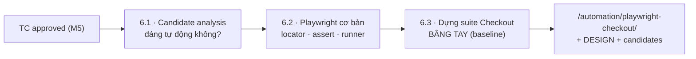
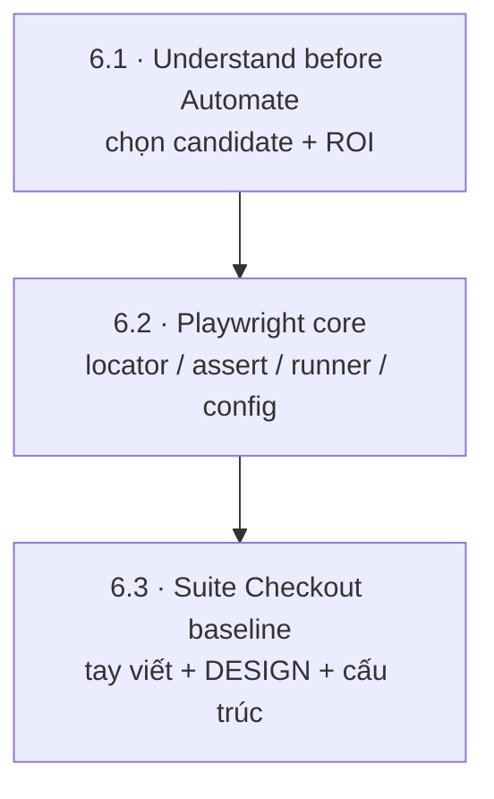
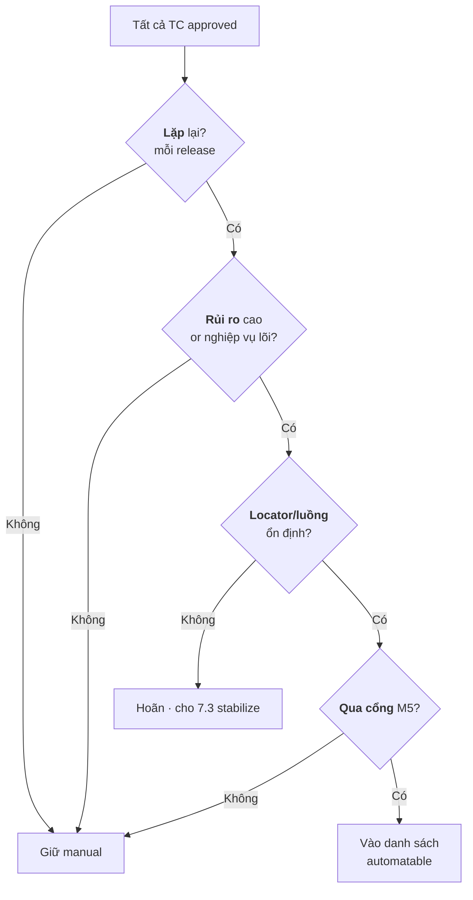
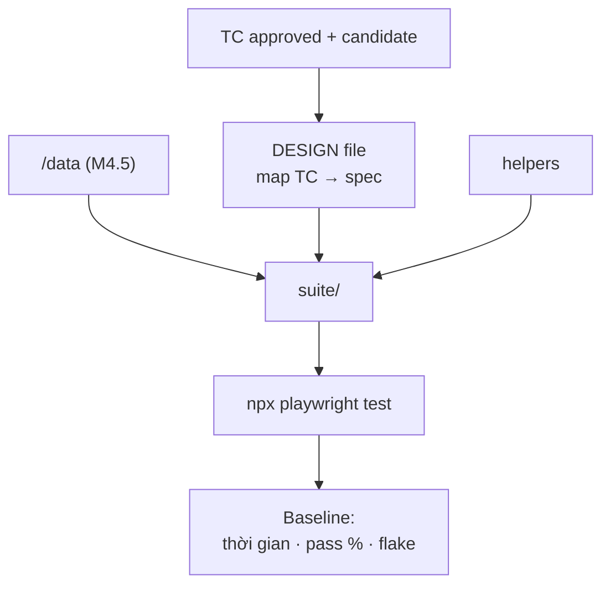

# MODULE 6 — Playwright: nền tảng Automation

> **Pha:** 3 · AUTOMATE — Chỉ tự động hoá cái đã qua cổng M5
>
> **Năng lực cốt lõi:** Understand → Automate
>
> **AI Handbook:** ch.06 (Automation — Playwright)
>
> **ISTQB CT-GenAI:** Module kỹ thuật (công cụ: Playwright) — chuẩn bị GenAI-4.1.3 ở M7
>
> **Project xuyên suốt:** E-commerce Checkout · Đầu vào: `/validation/AI-VALIDATION-PROTOCOL.md` (approved TCs)
>
> **Asset xuất ra:** `/automation/candidates-checkout.md` + `/automation/DESIGN-checkout.md` + suite `/automation/playwright-checkout/`
>
> **Thời lượng đề xuất:** 6 giờ

> **Vì sao cần một module "thuần kỹ thuật" giữa khoá GenAI:**
>
> M2–M5 giảng về *quyết định*: làm gì, dùng AI sao đúng, kiểm soát ra sao. Từ M6 bạn bắt
> đầu giao *công việc chạy* cho máy. Nhưng BA/Tester không thể giao điều mình không hiểu.
> Module này xây **gốc Playwright bằng tay** — baseline trung thực — để M7 có thứ so:
> *tay viết được chừng này, AI viết được chừng nào, chỗ nào phải sửa.*

> **Bám handbook ch.06:** Ưu tiên automation khi task *Repeated · Stable · Deterministic ·
> High-frequency*; không ưu tiên khi *Rapidly changing · Exploratory · One-off ·
> Business-judgment-heavy*. Và chuỗi manual → automation: *Test Case → Identify actions →
> Identify locators → Identify assertions → Write test → Run.*

---

## Vì sao module này nằm ở đó

Hai module trước trả lời *"cái gì đáng làm"* và *"ai chịu trách nhiệm"*. M6 trả lời:
**làm bằng máy thì ra sao, và làm bao nhiêu?** Ba cám dỗ và cách né:

| Cám dỗ | Cách né |
|---|---|
| "Tự động hoá hết" | 6.1: chỉ chọn TC qua cổng M5 + có ROI |
| "Viết test rồi đỡ nghĩ" | 6.2: hiểu locator/assert là hiểu sản phẩm đang mô hình hoá |
| "AI viết toàn bộ cho mình" | 6.3: viết baseline bằng tay trước — để đo AI ở M7 |

Tư duy xuyên suốt: **Understand before Automate** (ch.06.1). Bạn không viết test cho form
mình chưa bước qua.



---

## Bản đồ module



---

## LESSON 6.1 — Understand before Automate: chọn đúng candidate (ch.06.1)

### 1. Vấn đề
"Viết automation cho toàn bộ Checkout". Nếu làm hết ngay: tốn tuần cho case chạy một lần,
bảo trì test trùng, và tự động hoá cả TC chưa qua cổng M5.

### 2. Vì sao quan trọng
**ch.06.1 khi nào automation:** ưu tiên khi *Repeated · Stable · Deterministic ·
High-frequency*; không khi *Rapidly changing · Exploratory · One-off · Business-judgment heavy*.
Test automation chết vì tự động hoá **sai thứ** và **quá sớm**, không phải thiếu code.

### 3. Kiến thức tối thiểu
Bộ lọc candidate 4 câu — trả lời `CÓ` thì đáng tự động:

| Câu hỏi | Ý nghĩa | Checkout |
|---|---|---|
| Chạy nhiều lần? (repetitive) | Mỗi release/tính năng | ✔ |
| Rủi ro cao? (high impact) | Bug gây cháy tiền/uy tín | ✔ payment, inventory |
| Ổn định? (stable) | Locator/luồng ổn định | Treo vào M7.3 |
| Qua cổng M5? (validated) | Approved, không Conflict/Missing | ✔ tuyệt đối |

**ROI:** chỉ tính TC lặp qua nhiều release; còn lại manual/hoãn. Loại thẳng: *TC chạy 1 lần · hệ
thống khó dựng · visual phức tạp* (tạm thời, nói ở M8).

### 4. Sơ đồ tư duy



### 5. Demo thực chiến
Cầm `/output/checkout-testcases.json` (đã M5), chạy bộ lọc 4 câu. Chỉ ra TC "hết tiền lúc
23:59" — thú vị nhưng **chạy 1 lần** → loại khỏi automate.

### 6. Thực hành có hướng dẫn
Bảng candidate: `TC_ID | lặp? | risk? | stable? | M5? | Kết luận`.

### 7. Nhiệm vụ thật
**`/automation/candidates-checkout.md`** — danh sách vào automation + "chủ động không
automate" kèm lý do.

### 8. Kiểm chứng
- [ ] Mọi TC trong list pass đủ 4 câu.
- [ ] Có mục "không automate" với lý do rõ.
- [ ] Danh sách từ TC M5 approved, không phát sinh TC mới.

### 9. Đo lường
% TC được chọn / tổng approved (target 30–70%) · thời gian phân tích.

### 10. Ghi chép & tái sử dụng
File mở: sau mỗi release chạy lại bộ lọc. Ở M7.3 nó quyết định chỗ AI giúp "stabilize".

---

## LESSON 6.2 — Playwright core: locator · assert · runner (ch.06.2)

### 1. Vấn đề
"Viết Playwright" nghe như của thiêng sĩ. Sự thật: Playwright là **ba khái niệm** — chọn
đối tượng (`locator`), khẳng định kết quả (`expect`), chạy tất cả (`config + test`).

### 2. Vì sao quan trọng
**ch.06.2:** browser · page · locator · action · assertion · test · fixture · screenshot ·
trace. Locator là **API mô hình hoá sản phẩm**. Người hiểu locator sẽ bắt lỗi `getByText('Thanh
toán')` (nút không tồn tại) mà AI sinh ra ở M7; người không hiểu sẽ tin lời nút.

### 3. Kiến thức tối thiểu
**Locator = lệnh tìm element.** Ưu tiên:

```text
getByRole        → theo vai trò + tên ("button", "Đặt hàng")  ← ưu tiên cao nhất
getByLabel       → theo nhãn ("Số thẻ")
getByPlaceholder → theo placeholder ("•••• 1111")
getByText        → theo text hiển thị  ← dễ trùng, dễ đứt vỡ
CSS/XPath        → chi tiết nhưng dễ giòn
```

**Assert** (`toHaveValue`, `toContainText`, `toBeVisible`) — auto-wait, không `sleep`.
**Runner** — config + `npx playwright test`, `--project`, `--headed`, `--ui`, report/trace.

### 4. Sơ đồ tư duy


### 5. Demo thực chiến
Viết tay 1 TC Checkout mini:

```ts
import { test, expect } from '@playwright/test';

test('thêm sản phẩm vào giỏ', async ({ page }) => {
  await page.goto('/checkout');
  await page.getByRole('button', { name: 'Thêm vào giỏ' }).click();
  await expect(page.getByTestId('cart-count')).toHaveText('1');
});
```

Quan sát auto-wait hoạt động, locator theo role đúng tên.

### 6. Thực hành có hướng dẫn
3 bài nhỏ: (a) điền 2 field bằng `getByLabel`, (b) `expect` 2 trạng thái sau click,
(c) chọn option bằng `selectOption`.

### 7. Nhiệm vụ thật
`/automation/playwright-checkout/` — cấu trúc + `playwright.config.ts` + 1 spec chạy được.

### 8. Kiểm chứng
- [ ] `npx playwright test` green trên spec đầu tiên.
- [ ] 0 `sleep` trong code.
- [ ] Locator ưu tiên role.

### 9. Đo lường
Thời gian viết tay baseline (so AI ở 7.2) · thời gian chạy bộ.

### 10. Ghi chép & tái sử dụng
Ba khái niệm là "giao diện" với M7: AI sinh code được review theo đúng chuẩn trên.

---

## LESSON 6.3 — Dựng suite Checkout bằng tay (baseline) (ch.06.3)

### 1. Vấn đề
Muốn AI viết toàn bộ test. Cám dỗ lớn sau 6.2. Nhưng nếu chưa từng "viết tay" suite của
mình, bạn không phân biệt được code AI tốt vs code "nhìn hợp lý mà phá suite".

### 2. Vì sao quan trọng
**ch.06.3 manual → automation:** *Test Case → actions → locators → assertions → write test → run.*
Baseline-before-AI là nguyên lý M2.5 nâng lên test: phải biết trọng lượng việc trước khi đo
mức nhẹ bớt. Suite baseline = "cột 0m" để đo "AI giúp 40%" ở M9.

### 3. Kiến thức tối thiểu
Quy cách spec thống nhất:

```text
import + test.beforeEach (page sạch)
  → AAA: Arrange → Act → Assert (đọc như câu chuyện)
  → 1 TC = 1 test() ngắn; dài → chia "test helpers"
  → test data đọc từ file (không hardcode)
```

Kiến trúc thư mục:

```text
/automation/playwright-checkout/
  ├─ playwright.config.ts
  ├─ data/checkout.testdata.json      ← nguồn từ M4.5 giữ an toàn
  ├─ helpers/cart.ts  helpers/payment.ts
  └─ tests/
       ├─ 01-add-to-cart.spec.ts
       ├─ 02-checkout-success.spec.ts
       └─ 03-payment-fail.spec.ts
```

### 4. Sơ đồ tư duy



### 5. Demo thực chiến
Viết tay spec checkout-success 30 dòng, **đếm thành phần**: bao nhiêu locator, bao nhiêu
expect, bao nhiêu bước dựng dữ liệu — "kho gạo" để AI tạo cùng cấu trúc ở M7.

### 6. Thực hành có hướng dẫn
Chuyển **3 TC ưu tiên** từ candidates thành 3 spec theo quy cách, dùng helpers.

### 7. Nhiệm vụ thật
Hoàn thành **suite baseline** (payment-fail + out-of-stock báo lỗi) +
**`/automation/DESIGN-checkout.md`**.

### 8. Kiểm chứng
- [ ] 100% spec green.
- [ ] 0 hardcode data trong test.
- [ ] DESIGN map 1:1 sang file tồn tại.

### 9. Đo lường
Ghi baseline: tổng thời gian viết, số locator/assert, thời gian chạy, pass %. **Lưu lại —
M7 & M9 so với con số này.**

### 10. Ghi chép & tái sử dụng
Suite này không bỏ khi sang M7: nó là **chuẩn mực**. Code AI phải pass cùng test set,
giữ cùng cấu trúc, nhanh hơn baseline — nếu không, AI chỉ viết nhiều hơn, không tốt hơn.

---

## Đọc thêm

- **AI Handbook** — ch.06 (Automation — Playwright).
- **Playwright Documentation** — https://playwright.dev/docs/intro — Locators, Web-first
  assertions (auto-retry), Writing Tests.
- **ISTQB CT-GenAI Syllabus v1.1** — chuẩn bị Chương 4 (GenAI-4.1.3).
- **Test Data** — dùng lại `/data/checkout-testdata.md` từ M4.5 (đã sanitize).

---

## Hết Module 6 — bạn có gì?

1. **Candidate list** có lý do chọn/không chọn (ROI + cổng M5).
2. **Baseline suite viết tay** — green, có cấu trúc, có số.
3. **DESIGN file** map TC → spec — tài liệu để M7 kiểm AI.

**Cầu sang M7:** Bạn nắm suite viết tay đủ để *đo* AI. M7 lấy baseline làm đối chứng:
sinh code bằng AI, review theo chuẩn 6.2/6.3, đo thời gian và chất lượng. Nơi AI thắng tay —
thêm vào. Nơi AI thua — giữ baseline.

> Automation tốt không phải stack tool ảo diệu. Nó là **đo đạc liên tục**:
> baseline của tay → delta của AI → thu về cái luôn green và bảo trì được.
