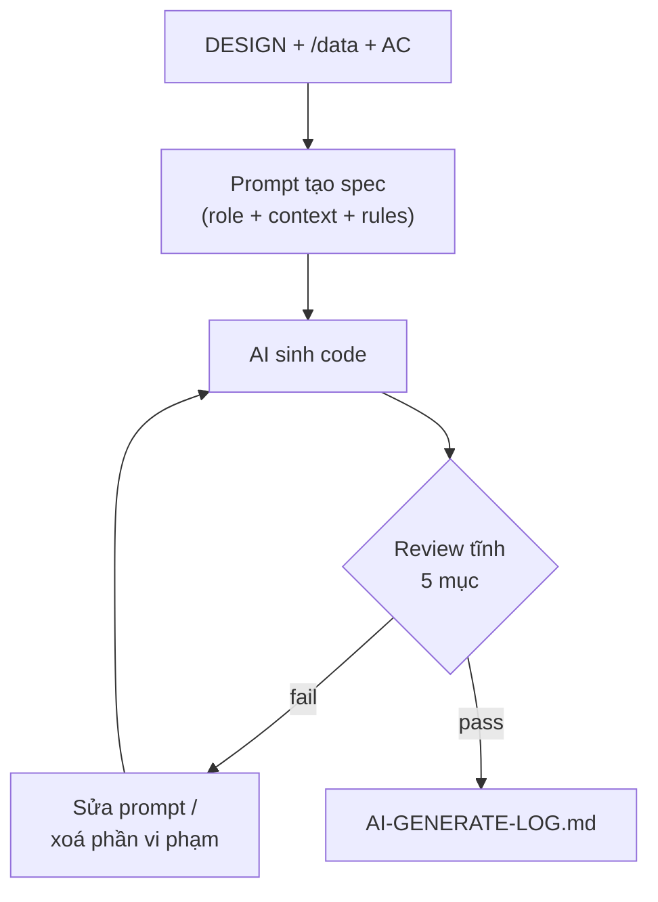
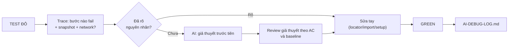
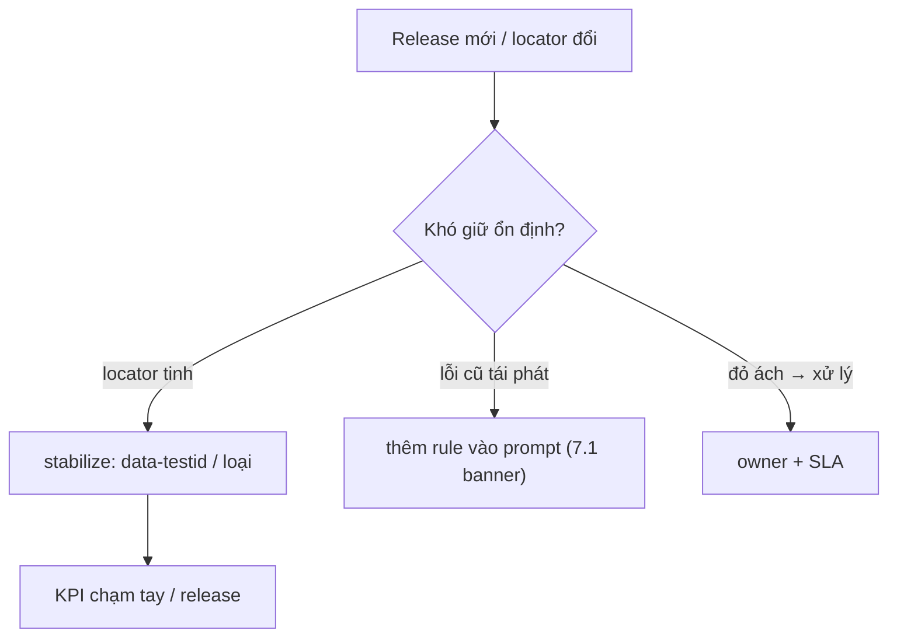

# MODULE 7 — Playwright với AI: sinh · gỡ · bảo trì

> **Pha:** 3 · AUTOMATE — AI trở thành đồng viết, bạn giữ quyền ra đề và duyệt sửa
>
> **Năng lực cốt lõi:** Automate · Validate (áp khung M5 lên mã)
>
> **AI Handbook:** ch.07 (AI + Playwright — Generate · Debug · Maintain)
>
> **ISTQB CT-GenAI:** GenAI-2.2.3 (prompt cho code), 2.2.5 (chọn technique) · GenAI-4.1.3 (agent nền)
>
> **Project xuyên suốt:** E-commerce Checkout · Đầu vào: baseline suite M6 + `/validation/AI-VALIDATION-PROTOCOL.md`
>
> **Asset xuất ra:** `/automation/AI-GENERATE-LOG.md` + `AI-DEBUG-LOG.md` + `AI-ASSISTED-PLAYWRIGHT-WORKFLOW.md`
>
> **Thời lượng đề xuất:** 6 giờ

---

## Vì sao có module này

Module 6 cho bạn suite viết tay green và bộ tiêu chuẩn review (role-first, no sleep, AAA,
data từ file). Module này là **cuộc đua chính**: để AI sinh code, rồi xử theo đúng chuẩn ấy.
Khác Module 4 (AI làm tài liệu), ở đây AI làm **hàng chạy** — code phải **execute** được,
không "viết cho đẹp".

Quy tắc xuyên suốt: **AI sinh, con người duyệt. Mọi code AI chưa qua khung 4 lớp của
Module 5 đều là "rác tiềm năng".** "Validate" ở đây có hai tầng:

| Tầng | Hỏi gì |
|---|---|
| **Tầng tĩnh** | Code đúng chuẩn M6 không — locator tồn tại? assert có nghĩa? 0 sleep? |
| **Tầng động** | Chạy thật — green? ổn định? không flake? |


---

## 7.1 Sinh code — trả công một bản thiết kế

"Chú giúp tao viết 10 test Playwright" — prompt như vậy thường ra mớ code bóng bẩy: cấu trúc
đẹp, song locator không tồn tại, assert không kiểm thứ gì. Muốn AI sinh tốt, phải **trả công
một bản thiết kế** (file DESIGN từ Module 6) — và muốn dùng được kết quả, xử với **review**.

Một prompt sinh code tốt đủ bốn nhóm **role, context, target, rules**:

```text
Role   : Tester viết Playwright TypeScript, theo đúng quy ước spec dự án.
Context: đọc /automation/DESIGN-checkout.md + /data/checkout.testdata.json
         + /context/checkout/acceptance-criteria.md
Target : Sinh spec cho AC-05 (thanh toán thành công), đúng cấu trúc AAA,
         chỉ dùng nguyên liệu trong context, test data đọc từ file.
Rules  : role-first locator · 0 sleep · expect mang ý nghĩa · tên test mô tả TC.
Output : chỉ 1 file .spec.ts, không giải thích dài.
```

Sau khi nhận sản phẩm, **review tĩnh** theo 5 mục:

- [ ] Locator role-first & tên khớp element thật?
- [ ] AAA đủ ba phần, một test = một story?
- [ ] Data từ file, không hardcode?
- [ ] Assert kiểm trạng thái đúng (không "expect true" vô nghĩa)?
- [ ] 0 `sleep`/`waitForTimeout`?



Quan trọng để đo: **mỗi lần sinh đều ghi sổ** — prompt, code ra, kết quả review tĩnh, thời
gian, số vòng sửa. Từ đó bạn biết mình đang "khao AI" ở đâu, và chỗ nào lỗi tái phát thì sửa
**banner prompt** (thêm một rule) chứ không sửa tay từng lần.

**Thực hành:** sinh 1 spec theo prompt trên, tự review 5 mục, ghi pass/fail — và tự **sửa**
code vi phạm (đừng chờ AI làm hộ).

---

## 7.2 Gỡ mã — đừng dán cả file, hãy trả cắm đúng chỗ

Test đỏ. Nhiều người mệ "chú ơi test đỏ chữa giúp" và dán **cả file** 500 dòng — AI chỉ biết
đoán. Một lỗi thường đến từ nơi tinh nhất: element chưa render, text sai, network không trả.
Cách đúng là **bốn bước**:

1. Mở **trace/report** → step nào fail? element nào? network gì?
2. Hỏi đúng: hệ thống ở trạng thái nào trước khi fail? (setup đủ chưa?)
3. Đưa AI **đoạn test tối thiểu + trích trace** — KHÔNG cả file.
4. Yêu cầu AI **nêu giả thuyết trước khi viết fix** — rồi mình duyệt.



Đây là bản chất của vòng *failure + trace + screenshot → AI → possible cause → tester verify*
trong handbook: **AI đưa hypothesis, không phải final diagnosis.** Không có trace, AI chỉ
đoán — và "AI đoán fix" là mảnh đất tốt nhất cho regression ngầm.

**Thực hành:** với 3 lỗi thật, ghi 3 giả thuyết **tay trước** khi dùng AI; sau mỗi lỗi, log
vào `AI-DEBUG-LOG.md` (lỗi → trace → giả thuyết → xử lý → kết quả + thời gian). Log này về
sau thành "từ điển lỗi": nếu AI lặp lại lỗi cũ, bạn có bằng chứng để thêm rule vào prompt
thay vì sửa tay mãi.

---

## 7.3 Bảo trì — ai lo code này ba tháng nữa?

Suite green hôm nay. Nhưng product đổi, locator đổi, feature mới. Ba tháng sau ai đứng giữa
mớ code này? **Nếu AI viết mà bạn "sợ đụng", suite thành đồ nội thất bạc: đắt làm, đắt bỏ.**

Bảo trì gồm ba việc:

| Việc | Cách làm | Khi nào |
|---|---|---|
| **Stabilize** | Locator "tinh" (text trùng) → `data-testid`, hoặc loại khỏi automation | Locator dễ đứt vỡ, lỗi tái phát |
| **Phản hồi prompt** | Lỗi cũ tái phát → thêm rule vào banner sinh code | Đã sửa tay 2 lần cùng một kiểu |
| **Chủ sở hữu + SLA** | Mỗi spec có owner, khi đỏ sửa trong bao lâu, review định kỳ | Từ khi dựng suite |



Ví dụ demo: release đổi tên nút "Đặt hàng" → "Xác nhận mua". Xử đúng không phải sửa từng
test — sửa **một chỗ** (data-testid hoặc một rule prompt) là cả suite xanh trở lại. KPI bảo
trì là **số lần chạm tay vào test / release**, không phải số test.

Khi ai đó hoài nghi "AI thay tester à?" — câu trả lời đã nằm ngay đây: **ai đòi giả thuyết
rồi quyết định stabilize cho code do AI viết, thì người đó chính là tester.**

---

## Di sản của bạn sau Module 7

1. **Prompt chuẩn** sinh Playwright + banner rule dùng lại.
2. **AI-GENERATE-LOG + AI-DEBUG-LOG** — cặp ảnh thật của "AI chủ động, con người duyệt".
3. **AI-ASSISTED-PLAYWRIGHT-WORKFLOW** — sinh → review tĩnh → chạy → debug → stabilize
   → owner.
4. **Suite AI-cùng-viết** có baseline M6 đối chứng, delta số thật.

Nền kỹ thuật giờ đã tự đứng được. Đã đến lúc ngước nhìn hệ sinh thái: module tiếp đưa bạn
sang các AI test tools và agent/browser, dạy bạn **giữ cây kiểm soát** — không tin lời mời
"thay ta làm hết" của vendor.

> AI sinh, con người duyệt — không phải AI viết, con người tin.