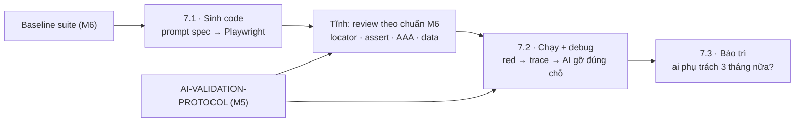
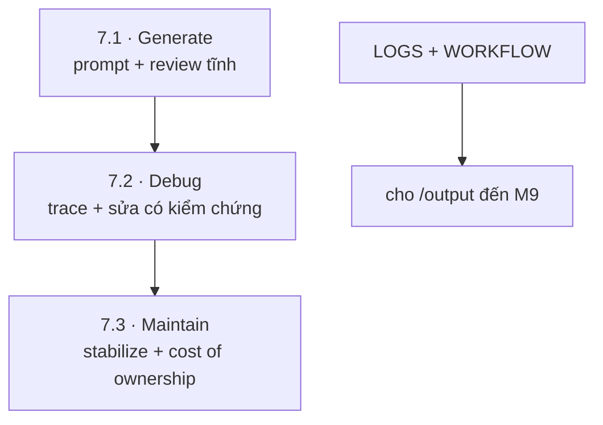
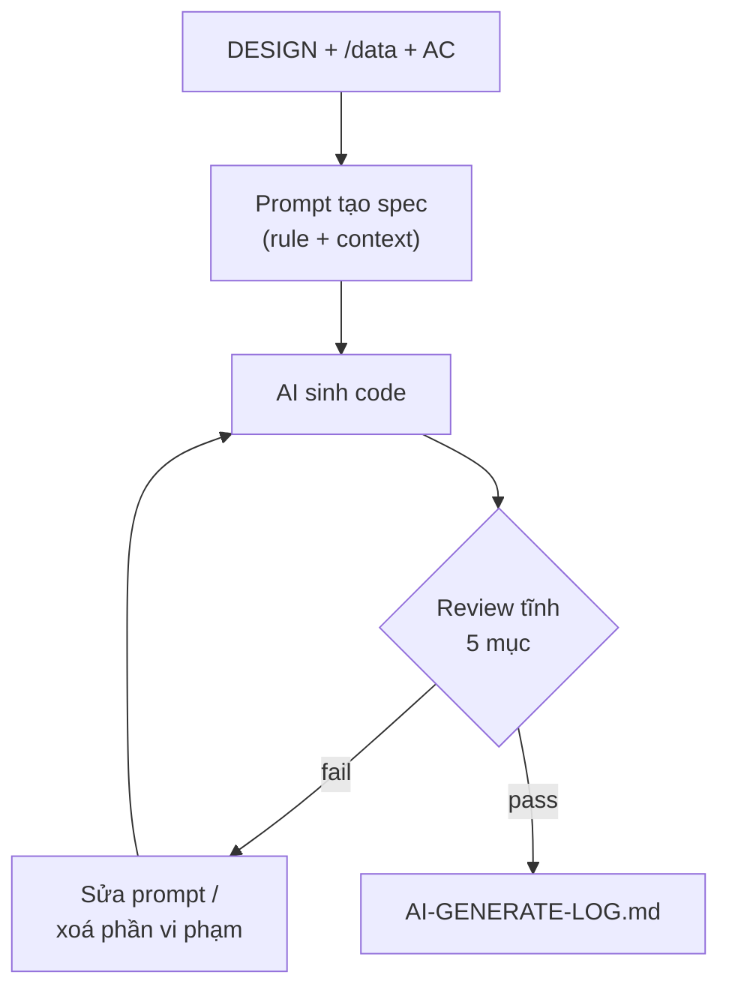
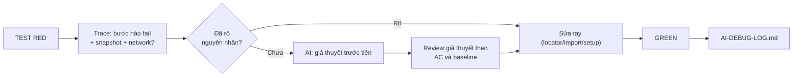
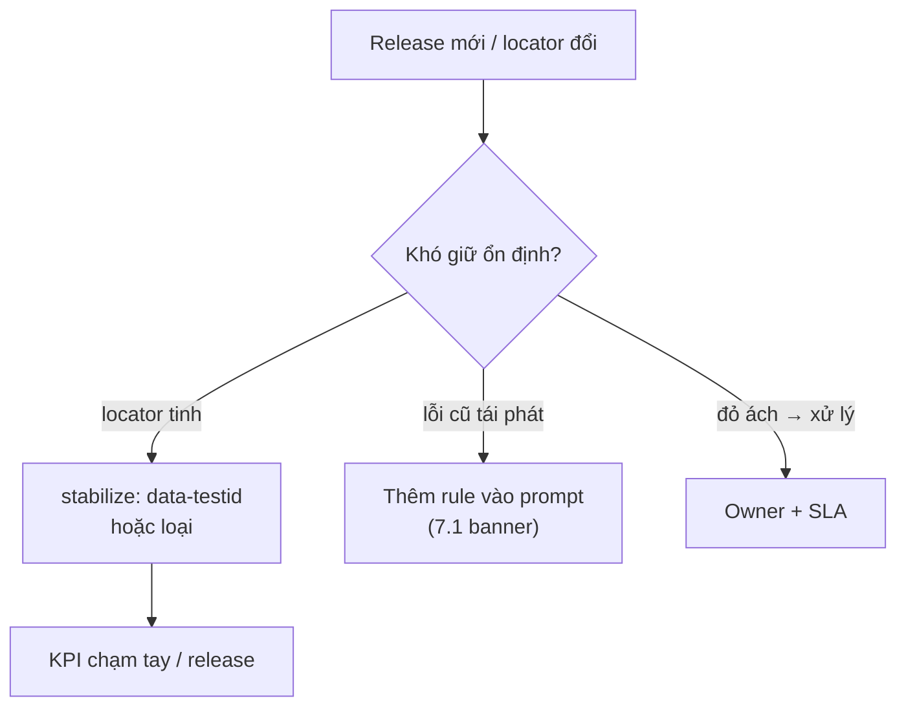

# MODULE 7 — Playwright với AI: sinh · gỡ · bảo trì

> **Pha:** 3 · AUTOMATE — AI trở thành đồng viết, bạn giữ quyền ra đề và duyệt sửa
>
> **Năng lực cốt lõi:** Automate · Validate (áp khung M5 lên mã)
>
> **AI Handbook:** ch.07 (AI + Playwright — Generate · Debug · Maintain)
>
> **ISTQB CT-GenAI:** GenAI-2.2.3 (prompt cho code), 2.2.5 (chọn technique) · **GenAI-4.1.3** (tự động hoá test với công cụ AI)
>
> **Project xuyên suốt:** E-commerce Checkout · Đầu vào: baseline suite M6 + `/validation/AI-VALIDATION-PROTOCOL.md`
>
> **Asset xuất ra:** `/automation/AI-GENERATE-LOG.md` + `AI-DEBUG-LOG.md` + `AI-ASSISTED-PLAYWRIGHT-WORKFLOW.md`
>
> **Thời lượng đề xuất:** 6 giờ

---

## Vì sao module này nằm ở đó

M6 cho bạn suite viết tay green + bộ tiêu chuẩn review (role-first, no sleep, AAA, data từ
file). M7 là **cuộc đua chính**: để AI sinh code, rồi xử theo chuẩn ấy.

Quy tắc suốt module:

> **AI sinh, con người duyệt. Mọi code AI chưa qua 4 lớp của M5 đều là "rác tiềm năng".**

> **Bám handbook ch.07:** *Test Case → AI → Playwright; Tester phải Review · Run · Fix.*
> Debug: *Failure + Trace + Screenshot → AI → Possible Cause → Tester Verify.* AI đưa
> **hypothesis**, không phải final diagnosis. Maintain: *Failing Test → AI Analysis →
> Suggested Fix → Tester Verify.*

Khác M4 (AI làm tài liệu), ở M7 AI làm **hàng chạy**: code phải execute được. "Validate" có
2 tầng:
1. **Tầng tĩnh** — code đúng chuẩn 6.2/6.3 không: locator tồn tại? assert nghĩa? 0 sleep?
2. **Tầng động** — chạy thật: green? ổn định? không flake?



---

## Bản đồ module



---

## LESSON 7.1 — Sinh code bằng AI + review tĩnh (ch.07.1)

### 1. Vấn đề
"Chú giúp tao viết 10 test Playwright" — prompt vậy thường ra mớ code bóng bẩy: cấu trúc
đẹp, song locators không tồn tại, assert không kiểm thứ gì. Muốn AI sinh tốt, phải **trả
công một bản thiết kế** (DESIGN M6.3); muốn dùng kết quả, xử với **review** (bản mẫu M5).

### 2. Vì sao quan trọng
**ch.07.1 Generate Automation:** *Test Case → AI → Playwright; Tester Review · Run · Fix.*
GenAI-4.1.3: công cụ AI gen test hiệu quả khi prompt được chuẩn hoá và output được kiểm
soát như mọi testware khác. Kỹ năng prompt M3 + validate M5 gặp nhau trên **code**.

### 3. Kiến thức tối thiểu
Prompt sinh code chuẩn hoá:

```text
Role   : Tester viết Playwright TypeScript, theo đúng quy ước spec dự án.
Context: đọc /automation/DESIGN-checkout.md + /data/checkout.testdata.json
         + /context/checkout/acceptance-criteria.md
Target : Sinh spec cho AC-05 (thanh toán thành công), đúng cấu trúc AAA,
         chỉ dùng nguyên liệu trong context, test data đọc từ file.
Rules  : role-first locator · 0 sleep · expect mang ý nghĩa · tên test mô tả TC.
Output : chỉ 1 file .spec.ts, không giải thích dài.
```

Sau khi nhận, **review tĩnh** — checklist 5 mục:

- [ ] Locator role-first & tên khớp element thật.
- [ ] AAA đủ ba phần, một test = một story.
- [ ] Data từ file, không hardcode.
- [ ] Assert kiểm trạng thái đúng.
- [ ] 0 `sleep`/`waitForTimeout`.

### 4. Sơ đồ tư duy



### 5. Demo thực chiến
Yêu cầu AI sinh spec cho *checkout success* bằng prompt "nặc", rồi prompt chuẩn hoá — so
hai đầu ra. Nhét lỗi locator giả (đổi tên nút) và chạy review tĩnh bắt nó.

### 6. Thực hành có hướng dẫn
Sinh 1 spec theo prompt chuẩn. Tự review 5 mục; ghi pass/fail — *sửa* code vi phạm (đừng
chờ AI làm hộ).

### 7. Nhiệm vụ thật
**`/prompt/checkout-generate-playwright.md`** + **`/automation/AI-GENERATE-LOG.md`**: mỗi
lần sinh — prompt, code ra, kết quả review tĩnh, thời gian, số vòng sửa.

### 8. Kiểm chứng
- [ ] Mọi code AI ra đều ghi GENERATE-LOG (kể cả bản loại).
- [ ] Không code nào vào repo chưa qua review tĩnh.
- [ ] Log có cột "locator vi phạm" nuôi M7.3.

### 9. Đo lường
Thời gian sinh + review vs baseline tay M6 · % spec pass review tĩnh lần 1.

### 10. Ghi chép & tái sử dụng
Prompt banner dùng lại cho từng AC mới. Log là dữ liệu cho 9.3.

---

## LESSON 7.2 — Chạy, đọc trace, và debug đúng chỗ (ch.07.2)

### 1. Vấn đề
Red test. Nhiều người mệ "chú ơi test đỏ chữa giúp" và dán **cả file** 500 dòng. AI hỏi:
chạy lại lệnh nào để tôi biết trace? Một lỗi thường đến từ nơi tinh nhất: element chưa
render, text sai, network không trả.

### 2. Vì sao quan trọng
**ch.07.2 Debug:** *Failure + Trace + Screenshot → AI → Possible Cause → Tester Verify.*
AI đưa **hypothesis**, không phải final diagnosis. Debug bằng việc **trả cắm đúng chỗ**:
đọc trace trước, rồi đưa đoạn code + trích trace cho AI. Không có trace, AI chỉ đoán — và
"AI đoán fix" là mảnh đất tốt nhất cho regression ngầm.

### 3. Kiến thức tối thiểu
Debug bốn bước:

```text
1. Mở trace/report → step nào fail? element nào? network gì?
2. Hỏi đúng: hệ thống ở trạng thái nào trước khi fail? (setup đủ?)
3. Đưa AI: đoạn test tối thiểu + trích trace (KHÔNG cả file).
4. Yêu cầu AI nêu GIẢ THUYẾT trước khi viết fix — rồi mình duyệt.
```

Hai pattern flake: `toHaveValue` vs `toHaveText` cho input auto-format; element cần hover
trước khi visible.

### 4. Sơ đồ tư duy



### 5. Demo thực chiến
Lấy spec đỏ cố tình (đổi `getByRole` → `getByText` trùng). Mở trace, đưa AI mẩu + trích
trace; nó sửa locator. Đòi giả thuyết trước khi sửa ở lỗi thứ hai.

### 6. Thực hành có hướng dẫn
Viết 3 hypothesis tay trước khi dùng AI trên 3 lỗi thật.

### 7. Nhiệm vụ thật
**`/automation/AI-DEBUG-LOG.md`**: lỗi → trace → giả thuyết → xử lý → kết quả + time.

### 8. Kiểm chứng
- [ ] Mọi lỗi log kèm trích trace (không chỉ message).
- [ ] Không dán cả file vào prompt.
- [ ] Giả thuyết ghi trước khi sửa.

### 9. Đo lường
Thời gian TB đỏ → xanh · số vòng AI · số flake còn lại (so 7.3).

### 10. Ghi chép & tái sử dụng
Log là "từ điển lỗi": ở 7.3 và M9, chỗ nào AI lặp lỗi cũ, bạn có bằng chứng để thêm rule
vào prompt thay vì sửa tay.

---

## LESSON 7.3 — Bảo trì: ai lo code này ba tháng nữa? (ch.07.3)

### 1. Vấn đề
Suite green hôm nay. Nhưng product đổi, locator đổi, feature mới. Ba tháng sau ai đứng giữa
mớ code này? Nếu AI viết mà bạn "sợ đụng", suite thành **đồ nội thất bạc**: đắt làm, đắt bỏ.

### 2. Vì sao quan trọng
**ch.07.3 Maintain:** *Failing Test → AI Analysis → Suggested Fix → Tester Verify.* Chi phí
automation là chi phí bảo trì lâu dài. AI phải **giảm cost of ownership** — stabilize
locator, giữ log — không phải tăng màu mè.

### 3. Kiến thức tối thiểu
Bảo trì gồm ba việc:

1. **Stabilize** — locator tinh (text trùng) → `data-testid` hoặc xoá khỏi automation.
2. **Phản hồi prompt** — lỗi cũ tái phát → thêm rule vào prompt (AI-GENERATE banner). Đây
   là continuous improvement của ISTQB.
3. **Kế hoạch chủ sở hữu** — mỗi spec có owner + SLA sửa khi đỏ, ngày review định kỳ.

KPI bảo trì: **số lần chạm tay vào test / release**, không phải số test.

### 4. Sơ đồ tư duy



### 5. Demo thực chiến
Giả lập release đổi tên nút "Đặt hàng" → "Xác nhận mua". Chạy suite: đỏ. Xử đúng: không
sửa từng test mà sửa locator một chỗ (data-testid) hoặc 1 rule prompt — suite xanh với 1 thao tác.

### 6. Thực hành có hướng dẫn
Viết **SLA-owner matrix**: mỗi spec, ai chủ, sửa bao lâu khi đỏ. Với 1 locator tinh: viết
replacement 2 lựa chọn (testid vs loại) + chọn lý do.

### 7. Nhiệm vụ thật
**`/automation/AI-ASSISTED-PLAYWRIGHT-WORKFLOW.md`** — quy trình: sinh → review tĩnh →
chạy → debug → stabilize → owner.

### 8. Kiểm chứng
- [ ] Mọi spec có owner + SLA.
- [ ] Lỗi tái phát chuyển thành rule trong prompt.
- [ ] KPI "chạm tay / release" có baseline.

### 9. Đo lường
Chạm tay / release · % locator ổn định · thời gian stabilize/release.

### 10. Ghi chép & tái sử dụng
WORKFLOW là "hộp công cụ" mang sang M8, M9. Trả lời hoài nghi "AI thay tester à?":
Không — ai đòi hypothesis rồi owner quyết stabilize cho code do AI viết?

---

## Đọc thêm

- **AI Handbook** — ch.07 (AI + Playwright).
- **ISTQB CT-GenAI Syllabus v1.1** — GenAI-4.1.3, Chương 4 khái quát automated generation.
- **Playwright Trace Viewer** — https://playwright.dev/docs/trace-viewer.
- **Winteringham, M., *Software Testing with Generative AI*, Manning, 2024** — "AI dialog
  cho debugging", triết lý "con người giữ quyết định, AI dọn tầng".
- **M5 protocol** — tái sử dụng để duyệt mã AI.

---

## Hết Module 7 — bạn có gì?

1. **Prompt chuẩn** sinh Playwright + banner rule dùng lại.
2. **GENERATE-LOG + DEBUG-LOG** — cặp ảnh thật của "AI chủ động, con người duyệt".
3. **WORKFLOW** — sinh → review → chạy → stabilize → owner.
4. **Suite AI-cùng-viết** với baseline M6 đối chứng, delta số thật.

**Cầu sang M8:** Nền kỹ thuật đã đủ tự đứng. Giờ ngước nhìn hệ sinh thái — M8 đưa bạn qua
AI test tools (ch.08) và agent/browser (ch.09), dạy bạn **cầm con trỏ so sánh**, đừng tin
lời mời "thay ta làm hết" của vendor.

> M8 không để bạn chọn "nhà vô địch toàn năng". M8 trao một **frame đánh giá** — dùng nó
> như cái la bàn, không phải danh sách giá.
