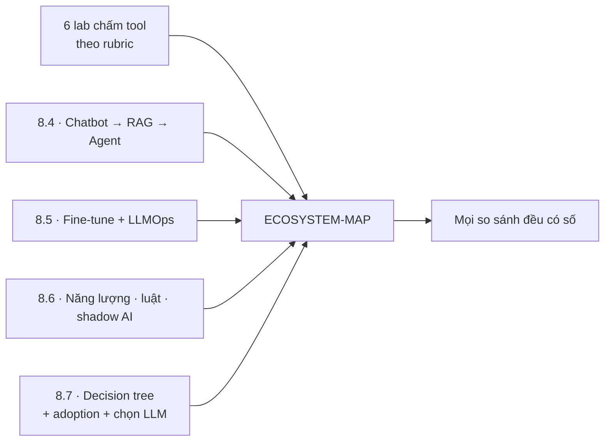
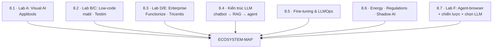
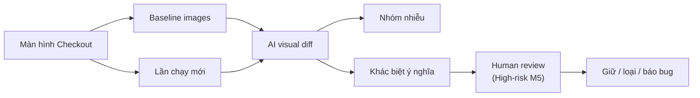
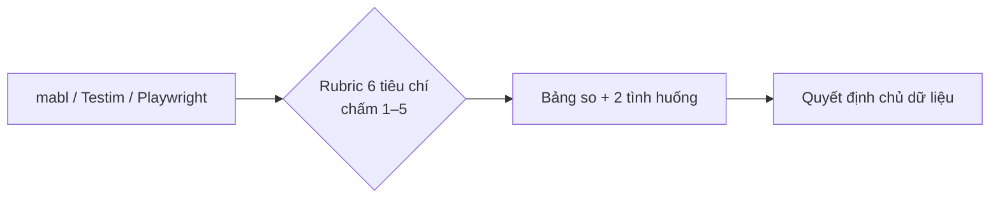
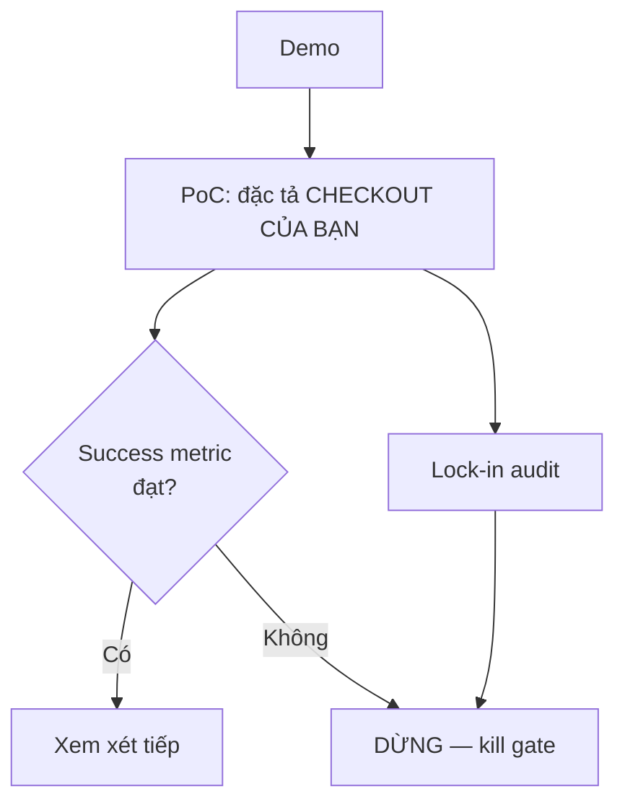
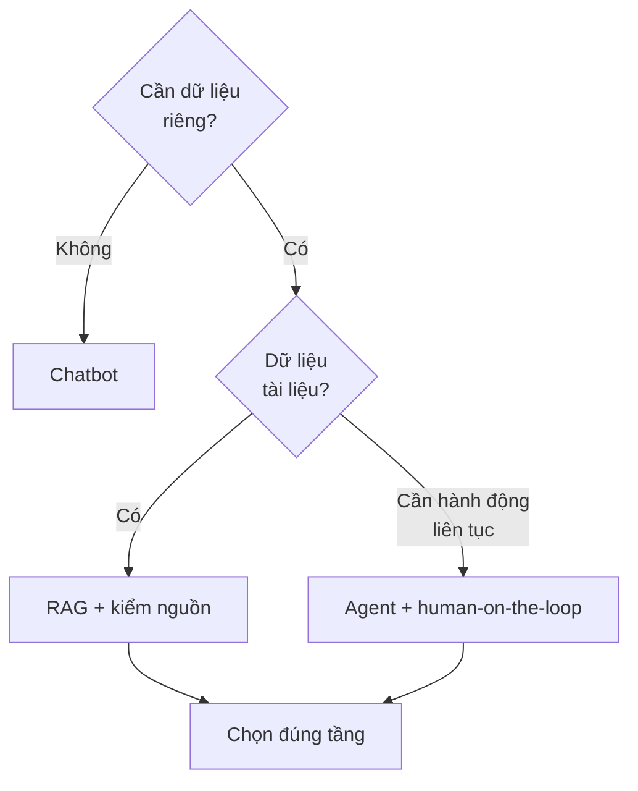
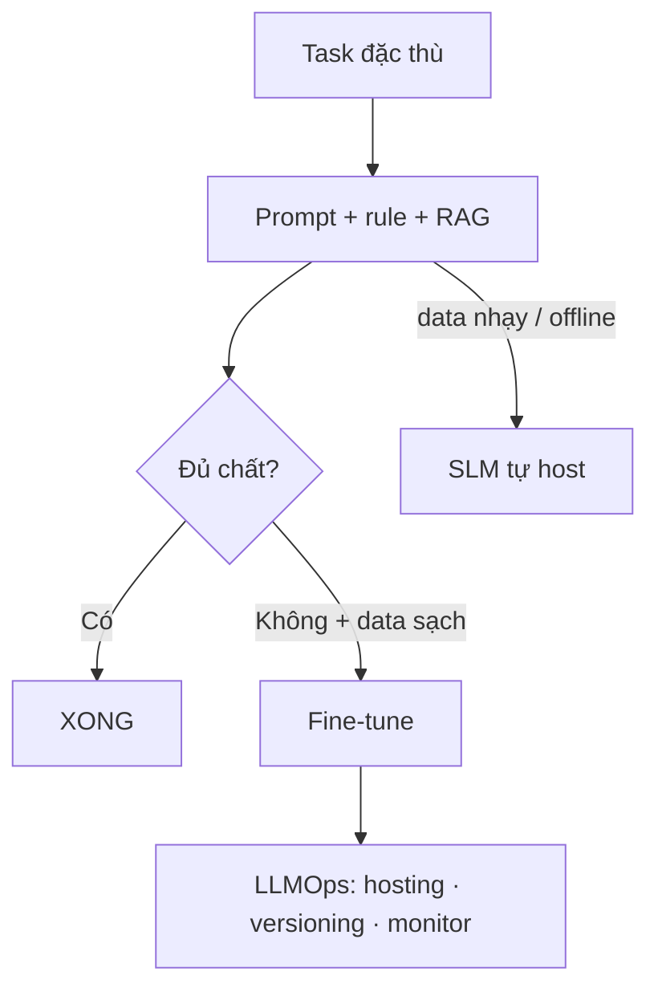
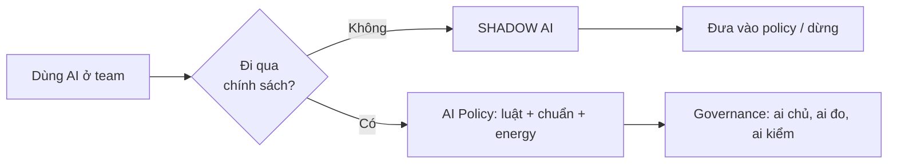
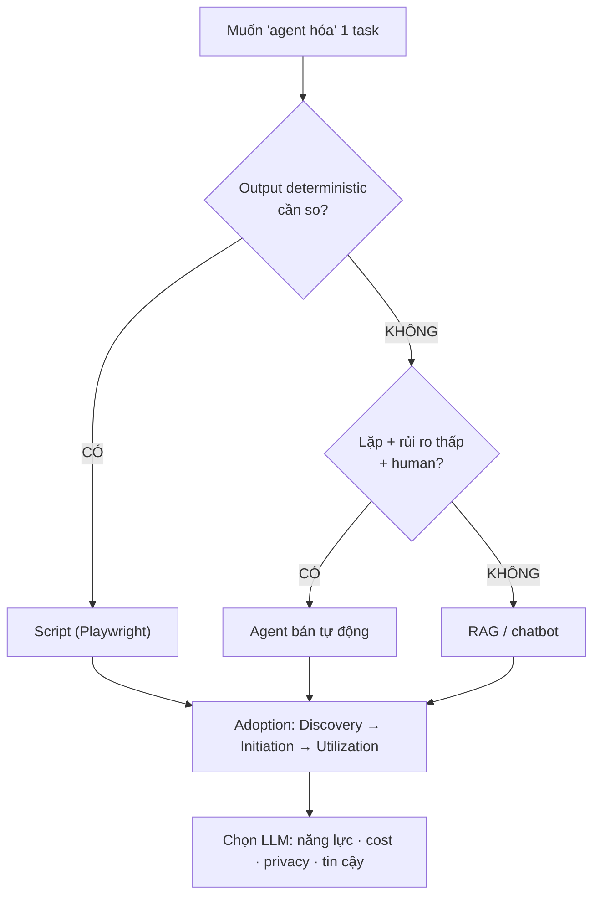

# MODULE 8 — Ecosystem, Agents & Chiến lược AI

> **Pha:** 4 · CONTROL & PROVE — Nhìn toàn cảnh để giữ kiểm soát
>
> **Năng lực cốt lõi:** Measure · Improve · Control
>
> **AI Handbook:** ch.08 (AI Testing Tools) · ch.09 (AI Browser / Agent)
>
> **ISTQB CT-GenAI:** Chương 3 (GenAI-3.3.1, 3.4.1), Chương 4 (GenAI-4.1.1 → 4.2.2), Chương 5 (GenAI-5.1.1 → 5.1.4, 5.2.2)
>
> **Project xuyên suốt:** E-commerce Checkout · Đầu vào: baseline M6 + protocol M5
>
> **Asset xuất ra:** `/lab/B-mabl.md`, `/lab/C-testim.md`, `/lab/D-functionize.md`, `/lab/E-tricentis.md`, `/lab/F-agent-browser.md`, `/lab/A-applitools.md`, **`/lab/ECOSYSTEM-MAP.md`**
>
> **Thời lượng đề xuất:** 8 giờ (7 lesson + labs)

---

## Vì sao module này nằm ở đó

Tới M7 bạn có hệ thống tự đứng. Virus chung của đội QA là **đổi công cụ trong lúc dư đà**:
"nghe nói Applitools hay", "mabl có AI tìm locator", "agent tự test hết".

M8 tiêm **liều miễn dịch cuối**: khả năng *đánh giá* — đọc một sản phẩm AI test, tách
marketing khỏi năng lực, map vào công việc của bạn, quyết định "dùng / không dùng / dùng ở
đâu" dựa trên **problem của bạn**, không dựa trên demo của họ.

> **Bám handbook ch.08:** Applitools (visual regression), mabl (AI E2E authoring), Testim
> (low-code), Functionize (AI-driven creation), Tricentis (enterprise). Và **ch.09:** agent ≠
> automation cố định — *Automation: Script → Execute*; *Agent: Goal → Observe → Reason →
> Act → Observe*.

"Con nào cũng bắt được gì đó" — nhưng không con nào bắt mọi thứ. Bài toán của bạn quyết
định con cờ đúng, không phải tên tuổi tool.



---

## Bản đồ module



---

## LESSON 8.1 — Lab A: Visual AI (Applitools) (ch.08)

### 1. Vấn đề
Suite M6 bắt "nút bấm sai", "giá sai". Nó **không bắt được** "nút lệch 2px" hoặc "hình mờ
đi 5%". Functional test là thị giác của người cận thị đứng xa: chính xác về chữ, không biết
gì về hình.

### 2. Vì sao quan trọng
**ch.08 Applitools:** visual regression — dùng khi *"UI có thể thay đổi nhưng functional
assert vẫn pass"*. Visual là **bổ sung, không thay thế** functional. Chạy functional (M6) +
visual checkpoint Chỉ trên **màn đắt tiền** — checkout render, không phải mọi màn.

### 3. Kiến thức tối thiểu
- **Baseline:** vài screenshot đầu = chuẩn cho lần sau.
- **AI visual diff:** so hình theo "ý nghĩa", không so pixel đơn — gộp khác biệt ý nghĩa
  thành checkpoint, loại nhiễu.
- **GIỚI HẠN:** visual AI không hiểu ngữ nghĩa nghiệp vụ; biết "khác ảnh", **bạn** biết
  "khác ảnh nghĩa gì". Cross-check với M5: checkpoint checkout là High → human review.

### 4. Sơ đồ tư duy



### 5. Demo thực chiến
1 checkpoint Checkout; dịch nút "Đặt hàng" 3px. Visual AI báo "khác biệt" — lỗi functional
không động đến.

### 6. Thực hành có hướng dẫn
Chọn 2 màn Checkout cần "1.000 mắt": cart summary + confirmation. Ghi reason mỗi checkpoint.

### 7. Nhiệm vụ thật
**`/lab/A-applitools.md`**: 1 checkpoint + baseline + 1 ví dụ chỉ visual bắt được. Tách rõ
cái nào visual phát hiện, cái nào functional — hai danh sách không trùng.

### 8. Kiểm chứng
- [ ] Có ≥1 lỗi "chỉ visual bắt được" ghi rõ.
- [ ] Checkpoint High đi qua human review (M5).
- [ ] Không khuyến nghị "thay functional bằng visual".

### 9. Đo lường
Số defect do visual bắt thêm (vs chỉ functional) · thời gian review checkpoint.

### 10. Ghi chép & tái sử dụng
Entry "Visual AI" trong ECOSYSTEM-MAP: năng lực, chi phí, khi nào dùng.

---

## LESSON 8.2 — Lab B & C: Low-code (mabl · Testim) (ch.08)

### 1. Vấn đề
"Viết test không cần code!" — mũi nhọn mabl/Testim (Testim nay thuộc Tricentis). Nhưng
"không code" ≠ "không nghiệp vụ": bạn vẫn cần condition, expected, traceability (M4–M6).
Câu hỏi đúng không phải "có code không", mà "ai chịu trách nhiệm mỗi lớp".

### 2. Vì sao quan trọng
**ch.08 mabl/Testim:** AI-assisted E2E authoring/execution/maintenance. Đa số team mua
low-code vì demo đẹp rồi khổ vì: test ở cloud vendor, khó version control, claim "tự sửa
locator" không kiểm soát được. Bài này dạy **rubric đánh giá tool**, không cảm tình.

### 3. Kiến thức tối thiểu
Rubric 6 tiêu chí (1–5):

| Tiêu chí | Hỏi gì |
|---|---|
| **Coverage** | Bắt được loại lỗi nào? |
| **Ownership** | Code/data ở repo tôi hay cloud vendor? Version control? |
| **Reliability** | Pass "thật vì đúng" vs "thật vì tự sửa không công khai"? |
| **Learning curve** | BA/Tester mới cần bao lâu? Kỹ năng code gì? |
| **Cost & lock-in** | Chi phí user/run? Migrate ra được? |
| **Validation** | Output qua được protocol M5 không, hay tin "tự tin"? |

Trade-off trung tâm: **low-code cloud (nhanh, lệ thuộc) vs code-first in-repo (kiểm soát,
cần kỹ năng)** — trả lời theo nhóm bạn.

### 4. Sơ đồ tư duy



### 5. Demo thực chiến
Chạy cùng luồng Checkout bằng (a) Playwright M6 và (b) bản mô phỏng low-code. Xem claim
"self-healing" khi đổi locator — câu hỏi: *ai kiểm tra nó tự sửa ĐÚNG chứ không chỉ tự sửa?*

### 6. Thực hành có hướng dẫn
Chấm mabl, Testim theo rubric. Ghi khác biệt theo *nguồn chân thực*: tài liệu / thử nghiệm / testimonial.

### 7. Nhiệm vụ thật
**`/lab/B-mabl.md`**, **`/lab/C-testim.md`** — mỗi file rubric + 1 quyết định "dùng/không
dùng ở đâu" cho Checkout + 1 hàng lock-in risk.

### 8. Kiểm chứng
- [ ] Rubric đủ 6 tiêu chí.
- [ ] Mọi claim có nguồn.
- [ ] Nêu 2 tình huống: phù hợp low-code vs giữ code-first.

### 9. Đo lường
Tổng rubric / 30 + thời gian "tay nghề để useful" — so ở 8.7.

### 10. Ghi chép & tái sử dụng
Entry low-code vào ECOSYSTEM-MAP. Vào decision tree 8.7: "low-code khi nào".

---

## LESSON 8.3 — Lab D & E: Auto-gen + Enterprise (Functionize · Tricentis) (ch.08)

### 1. Vấn đề
Functionize và Tricentis bán "auto-generate test từ đặc tả" + "nền tảng enterprise toàn
diện". Demo luôn đẹp vì họ **chọn kịch bản đẹp**. Bạn không có quyền chọn — bạn có Checkout của bạn.

### 2. Vì sao quan trọng
**ch.08:** enterprise-scale ecosystem — "AI nằm ở đâu và enterprise dùng để làm gì". Mua
theo problem, không theo demo. "Enterprise" = **đắt**: license, đào tạo, migration, lock-in.
Bài này dạy viết **PoC plan 1 trang** trước khi ký cam kết tài chính.

### 3. Kiến thức tối thiểu
- **Auto-gen platform** (Functionize): sinh test từ đặc tả. Giới hạn: scaffold có, nhưng AC
  chồng chéo, edge case, data — vẫn của bạn.
- **Enterprise suite** (Tricentis, với Testim): nền tảng quản trị test lớn. Giá trị ở **quản
  trị + reporting**, không phải "tự test".

PoC plan 1 trang — 6 dòng:

```text
1. Problem    : lỗi gì team khổ nhất (số liệu)?
2. Success    : theo metrics nào?
3. Scope      : 3 test Checkout chọn trước.
4. Owner      : ai đo, khi nào kết thúc.
5. Lock-in    : data/scripts migrate ra được không? phí?
6. Kill gate  : điều kiện nào DỪNG (số cụ thể).
```

### 4. Sơ đồ tư duy



### 5. Demo thực chiến
Viết PoC plan 1 trang cho Functionize với 3 test Checkout M6. Dòng 2: "success = số dòng
code thật vào repo ít hơn baseline, KHÔNG phải số test trong demo".

### 6. Thực hành có hướng dẫn
Điền **cột 5 Lock-in** cho Tricentis/Testim: script chạy ngoài nền tảng? Export locator/data?
Phí khi rời?

### 7. Nhiệm vụ thật
**`/lab/D-functionize.md`**, **`/lab/E-tricentis.md`** — claim mkt → rubric → PoC 1 trang
→ kill gate.

### 8. Kiểm chứng
- [ ] Mỗi claim đối chiếu "success metric" đo được.
- [ ] PoC 1 trang, có chủ, có ngày kết thúc.
- [ ] Lock-in có hành động cụ thể.

### 9. Đo lường
Chi phí ước tính (license + migration + training) 2 hướng vs ROI baseline M6 — "giá để hỏi"
khi vendor gọi.

### 10. Ghi chép & tái sử dụng
Dạy **quy trình mua tool** tái dùng trong project thật. Entry Enterprise: *mua theo problem
có kill gate*.

---

## LESSON 8.4 — Kiến trúc LLM: chatbot → RAG → agent (ch.09 nền)

### 1. Vấn đề
Trước mắt không phải "tool nào", mà "kiến trúc nào". Ba tầng hay bị dồn một chỗ: chatbot
(trả lời), RAG (trả lời CÓ NGUỒN dữ liệu riêng), agent (tự làm việc). Đoán sai tầng = mua
sai, tốn tiền và công bảo trì.

### 2. Vì sao quan trọng
**ch.09:** *Agent khác automation cố định: Goal → Observe → Reason → Act → Observe*. ISTQB
GenAI-4.1.1→4.1.3 phân biệt interaction model — mỗi loại có độ **kiểm soát** khác nhau.

### 3. Kiến thức tối thiểu

| Tầng | Cơ chế | Kiểm soát | Chi phí | Dùng cho |
|---|---|---|---|---|
| **Chatbot** | LLM thuần, không data riêng | Duyệt từng prompt/answer | Thấp | Hỏi-đáp, draft một lần |
| **RAG** | LLM + truy xuất tài liệu (chunk → embedding → vector DB) | Nguồn trích có kiểm | Trung bình | Nội dung riêng (BR/AC/testware) |
| **Agent** | LLM tự quyết chuỗi hành động | Rủi ro cao, cần human-on-the-loop | Cao | Nhiệm vụ lặp chuẩn, rủi ro thấp |

**Nút thắt của agent:** *non-deterministic.* Cùng prompt, agent làm khác mỗi lần → phá vỡ
"lần chạy so được". Đó là lý do **không khuyến nghị thay suite M6 bằng agent**.

### 4. Sơ đồ tư duy



### 5. Demo thực chiến
Map 3 task Checkout vào 3 tầng: (a) *hỏi BR out-of-stock* → RAG; (b) *chuỗi bước lặp kiểm
data* → agent bán tự động có human giữa vòng; (c) *giải thích JSON* → chatbot. Chỉ rõ vì sao
(a) không nên phóng thành agent.

### 6. Thực hành có hướng dẫn
Lấy 1 luồng Checkout hằng ngày. Trả lời: tầng nào, kiểm soát nào ở giữa, lỗi nào tầng đó bỏ sót?

### 7. Nhiệm vụ thật
Mục **"Chọn kiến trúc"** trong `/lab/ECOSYSTEM-MAP.md`: bảng 3 tầng × 3 task + quyết định +
"khi nào KHÔNG cần RAG/agent".

### 8. Kiểm chứng
- [ ] Phân biệt chatbot/RAG/agent bằng 1 câu mỗi loại (ch.09).
- [ ] Mỗi task có chọn tầng + lý do.
- [ ] Không có khuyến nghị "agent thay suite M6".

### 9. Đo lường
Chi phí ước tính (hosting, embedding, vector DB, retry) cho tầng chọn.

### 10. Ghi chép & tái sử dụng
Phần này là "lăng kính" khi team cần công cụ mới: *nó ở tầng nào, tôi kiểm được không?*

---

## LESSON 8.5 — Fine-tuning & LLMOps

### 1. Vấn đề
"Thử fine-tune mô hình riêng!" Nghe hay, nhưng data phải **sạch và đủ**, cần GPU, thời
gian, chi phí vận hành. Hầu hết nhu cầu team QA **không cần fine-tune** — cần prompt đúng + RAG.

### 2. Vì sao quan trọng
ISTQB GenAI-4.2.1, 4.2.2 trỏ nút thắt: chi phí vận hành và chọn LLM-as-service vs **SLM tự
host** khi dữ liệu nhạy cảm/offline.

### 3. Kiến thức tối thiểu
- **Fine-tuning** = huấn luyện thêm trên data riêng: chỉ khi output tùy ngữ cảnh rất đặc
  thù mà prompt+RAG không đạt. Rủi ro: **overfitting** ("học vẹt"), nuốt data không ngắn gọn.
- **SLM vs LLM:** SLM rẻ/nhanh/tại chỗ nhưng kém reasoning — bài toán quality cần accuracy,
  lựa chọn không chỉ "tiền rẻ".

Workflow quyết định — **Prompt/RAG trước, fine-tune sau**:

```text
task → prompt chuẩn + rule (M3) → RAG (8.4) → đạt? → XONG
                                     → chưa + data liên tục → fine-tune
```

### 4. Sơ đồ tư duy



### 5. Demo thực chiến
QA data 1.000 yêu cầu/ngày. Tính 2 đường: LLM-as-service theo token vs tự host SLM 1 GPU.
Điền CAPEX/OPEX/cost-per-request. Chỉ ra mô hình nào thắng, đừng tự động chọn "tự host rẻ".

### 6. Thực hành có hướng dẫn
Bảng cost 2 hướng (ghi rõ giả định). Nêu 1 tình huống gần mình mà *fine-tune thật sự đáng*.

### 7. Nhiệm vụ thật
Mục **"Fine-tune? Khi nào"** trong `/lab/ECOSYSTEM-MAP.md` + bảng cost 2 hướng
(`/lab/llm-cost-estimate.md`).

### 8. Kiểm chứng
- [ ] Bảng cost có số + giả định rõ.
- [ ] Nêu được điều kiện "cần fine-tune" và "không cần".
- [ ] Không claim SLM "rẻ nên dùng" thiếu số.

### 9. Đo lường
Cost/tháng 2 hướng + thời gian đạt chất lượng (prompt+RAG vs fine-tune).

### 10. Ghi chép & tái sử dụng
LLMOps là "ngôn ngữ" trao đổi với infra. Nuôi 8.7 (chọn LLM theo chi phí + năng lực).

---

## LESSON 8.6 — Năng lượng · Regulations · Shadow AI

### 1. Vấn đề
"Chạy AI tốn điện", "GDPR về AI", "đồng nghiệp dùng Claude riêng trên data production". Ba
câu liên quan nhau: chi phí môi trường theo scale, pháp lý siết, và **shadow AI** — AI dùng
ngoài tầm kiểm soát — là rủi ro data số 1, không ai đếm được.

### 2. Vì sao quan trọng
ISTQB GenAI-3.3.1 (chất lượng/rủi ro), 3.4.1 (đạo đức/môi trường), 5.1.1 (nhận diện rủi ro).
Shadow AI nguy hiểm nhất vì **không ai chủ**, không ai validation, data chảy ra ngoài.

### 3. Kiến thức tối thiểu
- **Năng lượng:** inference LLM tốn điện đáng kể. QA chạy nhiều lần → carbon cộng dồn.
- **Hai chuẩn + một luật:**
  - **ISO/IEC 42001** — khung quản trị hệ thống AI.
  - **ISO/IEC 23053** — khung hệ thống dùng ML.
  - **EU AI Act** — quy định theo mức rủi ro; cùng NIST AI RMF.
- **Shadow AI = AI dùng vượt chính sách tổ chức.** Dấu hiệu: tool AI mua lẻ không qua
  IT/council, prompt web với data test thật, "mượn" API key.

### 4. Sơ đồ tư duy



### 5. Demo thực chiến
Scenario thật: "tester dán test data Checkout lên ChatGPT cá nhân". Phân tích 4 góc: data
risk · pháp lý · đạo đức · shadow. Kết: rủi ro này **không nằm trong validation** — chỉ
policy + hạ tầng cấm mới đụng được.

### 6. Thực hành có hướng dẫn
Checklist rủi ro cho scenario dùng AI của team: *ai chủ? data gì? luật nào? điện? ai duyệt?*

### 7. Nhiệm vụ thật
Mục **"Governance"** trong `/lab/ECOSYSTEM-MAP.md`: policy 1 trang, chuẩn (42001, 23053),
luật (EU AI Act), 1 ví dụ lỗi shadow AI + cách xử.

### 8. Kiểm chứng
- [ ] Nêu chính xác **2 chuẩn (42001, 23053) + 1 luật (EU AI Act)**.
- [ ] Governance có chủ, có ngày review.
- [ ] Có 1 shadow AI scenario + xử lý rõ.

### 9. Đo lường
Số "góc trắng" (nơi AI dùng chưa kiểm) · thời gian policy review.

### 10. Ghi chép & tái sử dụng
Entry governance là "nóc nhà": lần nào xài AI, check đầu tiên là *có trong policy không?* —
nối với 9.4.

---

## LESSON 8.7 — Lab F: Agent-browser + chiến lược triển khai + chọn LLM (ch.09)

### 1. Vấn đề
Agent-browser (hay "AI agent test") hứa: "bạn ra lệnh, nó tự lướt web, tự verify". Đúng với
**tính demo**, nhưng test thật thì agent non-deterministic (8.4) — mất "lần chạy so được".
Bạn cần **decision tree** để biết khi nào agent là lựa chọn, khi nào là bẫy.

### 2. Vì sao quan trọng
**ch.09 agent-browser:** thực hành browser interaction theo hướng agent — *Open → Snapshot →
Find → Action → Observe*; **browser-use:** dùng cho task exploratory/goal-oriented. Chọn AI
theo *năng lực-vấn đề*, không theo *demo-nổi tiếng*. Adoption (GenAI-5.1.3, 5.1.4):
Discovery → Initiation → Utilization.

### 3. Kiến thức tối thiểu
**Decision tree Agent vs Script:**

```text
1. Task có deterministic output cần so được không?  CÓ → Script (M6/M7).
2. Task lặp, luật rõ, rủi ro thấp?                 CÓ → Agent ok + human-on-the-loop.
3. Cần nguồn tài liệu riêng?                       CÓ → RAG (8.4).
4. Không → chatbot / không đáng tự động.
```

**3 phase adoption** (ISTQB 5.1.3, 5.1.4): Discovery → Initiation → Utilization. Không nhảy
cóc — thất bại vì "Utilization ngay" với policy trống.

**Chọn LLM theo 4 tiêu chí:** năng lực task · chi phí/token · privacy/data (host at chỗ) ·
độ tin cậy & hỗ trợ. Không chọn theo "nổi tiếng".

### 4. Sơ đồ tư duy



### 5. Demo thực chiến
Demo agent-browser chạy 1 luồng Checkout: quan sát khác biệt 2 lần chạy (non-determinism).
Đối chiếu suite M6 deterministic. Kết luận: agent "wow cho demo", nhưng **deterministic test
không dùng agent**.

### 6. Thực hành có hướng dẫn
Chọn 1 task nhỏ Checkout, chạy decision tree: ghi quyết định + lý do. Viết **3 phase
adoption** cho team 1 trang.

### 7. Nhiệm vụ thật
**`/lab/F-agent-browser.md`** + kết khối **`/lab/ECOSYSTEM-MAP.md`** 4 phần: capability ·
chọn kiến trúc · fine-tune · governance. Thêm **bảng chọn LLM** theo 4 tiêu chí (2–3 ứng viên,
có cost).

### 8. Kiểm chứng
- [ ] Decision tree trả lời đúng cho ≥3 task Checkout (ch.09).
- [ ] 3 phase adoption có giai đoạn + số.
- [ ] Không khuyến nghị thay suite M6 bằng agent.
- [ ] Bảng LLM có cost + lý do.

### 9. Đo lường
So 3 cách: thời gian script vs agent vs RAG cho 1 task — bằng chứng "chọn theo số, không
theo tiếng".

### 10. Ghi chép & tái sử dụng
ECOSYSTEM-MAP là **tài liệu sống**: task mới → chạy lại decision tree. M9 dùng MAP làm
evidence Capstone.

---

## Đọc thêm

- **AI Handbook** — ch.08 (AI Testing Tools), ch.09 (AI Browser/Agent).
- **ISTQB CT-GenAI Syllabus v1.1** — Chương 4 (GenAI-4.1.1 → 4.2.2), Chương 5 (5.1.1 → 5.1.4, 5.2.2).
- **ISO/IEC 42001:2023**, **ISO/IEC 23053**, **EU AI Act** — 3 tài liệu đọc nhanh.
- **Playwright + tool comparison** — tài liệu chính thức + tự thử (rubric 8.2 yêu cầu 3 nguồn).
- **Winteringham, M., *Software Testing with Generative AI*, Manning 2024** — đánh giá vendor + agents.

---

## Hết Module 8 — bạn có gì?

1. **6 lab rubric** — mỗi tool một file, mỗi quyết định một lý do.
2. **ECOSYSTEM-MAP** 4 mảnh: capability · architecture · fine-tune · governance.
3. **Decision tree** Agent vs Script thử trên Checkout.
4. **Bảng chọn LLM** có số chi phí, không "nghe nói hay".
5. **Adoption 3 phase** cho tổ chức.

**Cầu sang M9:** Bạn có SẴN mọi mảnh ghép — Req đến measurement, validation đến hệ sinh
thái. M9 không dạy nội dung mới: dạy **ghép lại thành câu chuyện có bằng chứng** — Capstone.
M9 biến 8 module thành "pack" thuyết phục được quản lý và chính bạn.

> Khác biệt giữa "học rồi" và "chứng minh được" nằm ở khả năng kể câu chuyện
> có số liệu đứng sau mỗi lời khẳng định.
