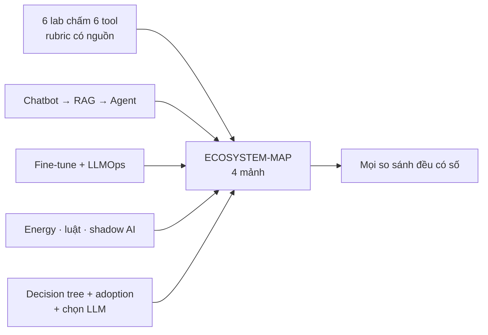
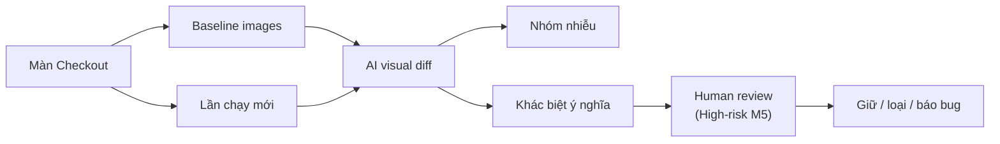
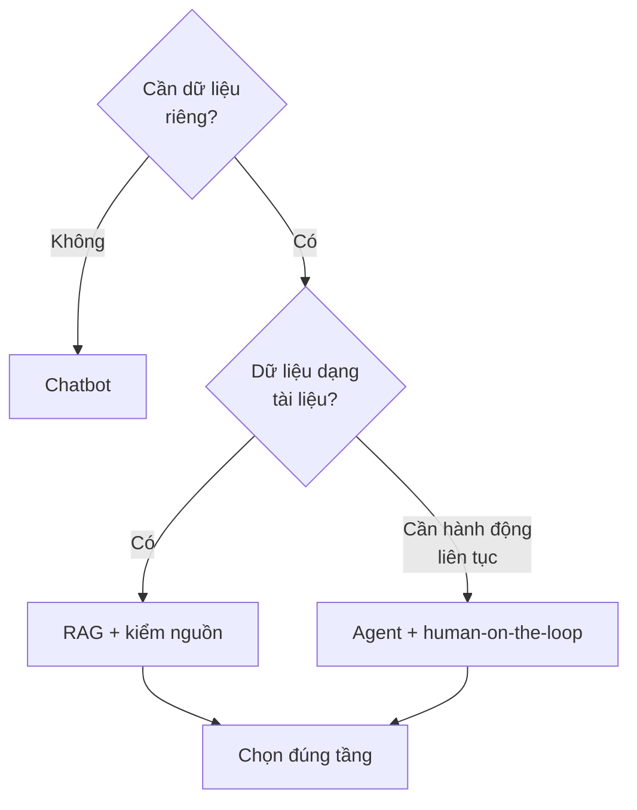
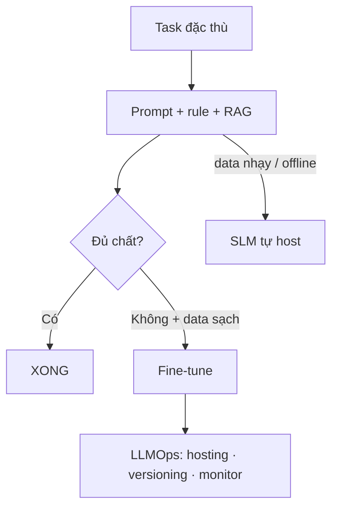
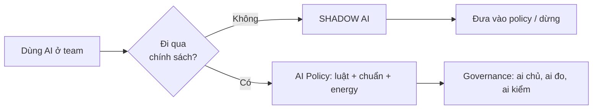
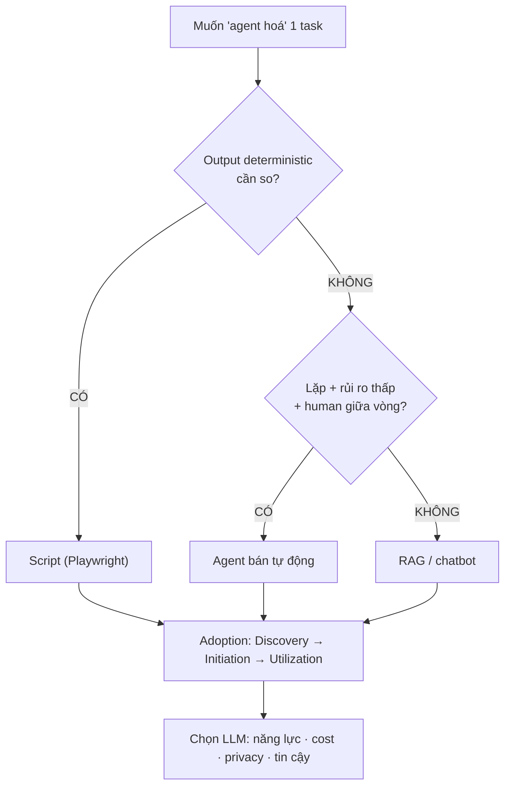

# MODULE 8 — Ecosystem, Agents & Chiến lược AI

> **Pha:** 4 · CONTROL & PROVE — nhìn toàn cảnh để giữ kiểm soát
>
> **Năng lực cốt lõi:** Measure · Improve · Control
>
> **AI Handbook:** ch.08 (AI Testing Tools) · ch.09 (AI Browser / Agent)
>
> **ISTQB CT-GenAI:** Chương 3 (GenAI-3.3.1, 3.4.1) · Chương 4 (GenAI-4.1.1 → 4.2.2) · Chương 5 (GenAI-5.1.1 → 5.1.4, 5.2.2)
>
> **Project xuyên suốt:** E-commerce Checkout
>
> **Asset xuất ra:** `/lab/A-applitools.md` … `/lab/F-agent-browser.md` + **`/lab/ECOSYSTEM-MAP.md`**
>
> **Thời lượng đề xuất:** 8 giờ

---

## Vì sao có module này

Đến cuối Module 7 bạn đã có một hệ thống tự đứng được. Đây là lúc xuất hiện cám dỗ mới:
**đổi công cụ giữa chừng vì dư đà** — "nghe nói Applitools hay", "mabl có AI tìm locator",
"thử agent tự test hết". Cái chết lặng lẽ của nhiều team QA không phải do thiếu công cụ, mà
do **tin lời marketing thay vì đánh giá**.

Module này tiêm liều miễn dịch cuối: khả năng **đọc một sản phẩm AI test, tách marketing
khỏi năng lực thật, map vào công việc của bạn, và quyết định "dùng / không dùng / dùng ở
đâu" dựa trên problem của bạn** — không dựa trên demo của họ. Toàn module xoay quanh một
câu: **bài toán của bạn quyết định con cờ đúng, không phải tên tuổi tool.**



---

## Chạm ba kiểu tool AI test (ch.08)

Thị trường tool AI test gom về ba họ. Biết họ nào bắt lỗi nào là nửa trận đánh.

### Visual AI — Applitools

Suite Playwright của bạn bắt "nút bấm sai", "giá sai". Nó **không bắt được** "nút lệch 2px"
hoặc "hình mờ đi 5%" — functional test là con mắt của người cận thị đứng xa: chính xác về
chữ, mù về hình. **Visual regression** là bổ sung, không thay thế functional: chạy functional
như bình thường, rồi thêm **visual checkpoint** trên những màn **đắt tiền** (checkout render),
không phải mọi màn hình.

Cách nó hoạt động: vài screenshot đầu thành **baseline**; lần sau AI **so hình theo ý
nghĩa**, không so pixel đơn — gộp khác biệt thành checkpoint, loại nhiễu.



Giới hạn quan trọng: visual AI biết "khác ảnh" — **bạn** biết "khác ảnh nghĩa gì". Trên email
checkout, visual "khác" chỉ là một con glint — vẫn phải **human review** theo khung rủi ro
M5. **Thực hành:** 1 checkpoint trên trang Checkout; dịch nút "Đặt hàng" 3px; ghi lỗi "chỉ
visual bắt được" vào `/lab/A-applitools.md`, tách rõ danh sách visual vs functional.

### Low-code authoring — mabl · Testim

"Viết test không cần code!" — thế mạnh của mabl và Testim (Testim nay thuộc Tricentis). Nhưng
*"không code" ≠ "không nghiệp vụ"*: bạn vẫn cần condition, expected, traceability — thứ bạn
học ở Module 4–6. Câu hỏi đúng không phải "có code không", mà **"ai chịu trách nhiệm mỗi
lớp"**.

Chấm mọi tool bằng **rubric 6 tiêu chí** trước khi tin lời demo:

| Tiêu chí | Hỏi gì |
|---|---|
| **Coverage** | Bắt được loại lỗi nào? |
| **Ownership** | Code/data ở repo tôi hay cloud vendor? Version control được không? |
| **Reliability** | Pass "thật vì đúng" vs "thật vì tự sửa không công khai"? |
| **Learning curve** | BA/Tester mới cần bao lâu? Cần code ở mức nào? |
| **Cost & lock-in** | Chi phí user/run? Migrate ra được không? |
| **Validation** | Output qua khung 4 lớp M5 không, hay tool tự tin mà không soi? |

Điểm nhạy nhất là **"self-healing"**: khi locator đổi, tool tự sửa — nhưng **ai kiểm tra nó
tự sửa ĐÚNG, không chỉ tự sửa?** Đây là nơi tin tưởng mù bắt đầu. **Thực hành:** chạy cùng
luồng Checkout bằng Playwright (M6) và bản mô phỏng low-code; chấm mabl/Testim theo rubric,
mỗi claim có nguồn; ghi vào `/lab/B-mabl.md` và `/lab/C-testim.md`.

### Auto-gen + Enterprise — Functionize · Tricentis

Functionize bán "auto-generate test từ đặc tả", Tricentis bán "nền tảng enterprise toàn
diện". Demo luôn đẹp vì họ **chọn kịch bản đẹp** — bạn không có quyền chọn, bạn có Checkout
của bạn.

Cách tiếp cận trước khi mua: viết một **PoC plan 1 trang** với 6 dòng:

```text
1. Problem    : lỗi gì team khổ nhất (có số)?
2. Success    : đo bằng metrics nào?
3. Scope      : 3 test Checkout chọn trước.
4. Owner      : ai đo, khi nào kết thúc.
5. Lock-in    : scripts/data migrate ra được không? phí?
6. Kill gate  : điều kiện nào DỪNG (con số cụ thể).
```

Giới hạn của auto-gen platforms: scaffold có, nhưng AC chồng chéo, edge case, test data — vẫn
là việc của bạn. Enterprise suite có giá trị ở **quản trị + reporting**, không phải ở "tự
test". **Thực hành:** viết PoC 1 trang cho Functionize với 3 test Checkout M6; điền cột
Lock-in cho Tricentis; ghi vào `/lab/D-functionize.md` và `/lab/E-tricentis.md`.

---

## Kiến trúc đứng sau các tool: chatbot → RAG → agent

Trước mắt không phải "tool nào", mà **"kiến trúc nào"**. Ba tầng hay bị chộn một chỗ — đoán
sai tầng = mua sai cả tiền lẫn công bảo trì:

| Tầng | Cơ chế | Kiểm soát | Chi phí | Dùng cho |
|---|---|---|---|---|
| **Chatbot** | LLM thuần, không data riêng | Duyệt từng prompt/answer | Thấp | Hỏi-đáp, nháp một lần |
| **RAG** | LLM + truy xuất tài liệu riêng (chunk → embedding → vector DB) | Nguồn trích có kiểm | Trung bình | Nội dung của bạn (BR, AC, testware) |
| **Agent** | LLM tự quyết chuỗi hành động | Rủi ro cao, cần human-on-the-loop | Cao | Nhiệm vụ lặp chuẩn, rủi ro thấp |



Điểm mấu chốt của **agent** trong handbook: nó **khác automation cố định** — không phải
*script → execute* mà là *goal → observe → reason → act → observe*. Và vấn đề cốt tử của
agent là **non-deterministic**: cùng một goal, nó làm khác nhau mỗi lần. Điều đó phá vỡ "lần
chạy so được" — lý do vì sao **không dùng agent thay suite Playwright** đã tốn công build ở
M6–M7.

Với Checkout, map nhanh: *hỏi BR out-of-stock* → RAG; *chuỗi bước lặp kiểm data* → agent bán
tự động có human giữa vòng; *giải thích JSON* → chatbot. **Thực hành:** lấy 1 luồng Checkout
hằng ngày, trả lời: tầng nào, kiểm soát nào ở giữa, lỗi nào tầng đó bỏ sót — ghi vào phần
"chọn kiến trúc" của ECOSYSTEM-MAP.

---

## Fine-tuning & LLMOps: khi nào thực sự đáng

"Thử fine-tune mô hình riêng!" — nghe hay, nhưng cần **data sạch và đủ**, GPU, thời gian,
và chi phí vận hành. Sự thật cho phần lớn nhu cầu QA: **không cần fine-tune** — cần prompt
đúng + RAG.

```text
task → prompt chuẩn + rule (M3) → RAG (8.4)
         → đạt? → XONG
         → chưa + data liên tục → fine-tune
```

Fine-tuning chỉ đáng khi output rất đặc thù ngữ cảnh mà prompt+RAG không đạt, và bạn có nguồn
data liên tục. Rủi ro lớn nhất là **overfitting** — mô hình "học vẹt" data riêng, mất tính
khái quát. Trong khi đó **SLM (small model) tự host** là lựa chọn khi data nhạy cảm/offline —
nhưng đừng dùng lý do "rẻ" mà chọn: SLM kém reasoning, mà bài toán chất lượng cần chính xác.



**Thực hành:** với QA data 1.000 yêu cầu/ngày, tính 2 đường — LLM-as-service theo token vs
tự host SLM 1 GPU; điền CAPEX/OPEX/cost-per-request vào `/lab/llm-cost-estimate.md`. Chọn mô
hình thắng, không tự động chọn "tự host rẻ".

---

## Năng lượng · Regulations · Shadow AI

"Chạy AI tốn điện", "GDPR về AI", "đồng nghiệp dùng Claude riêng trên data production" — ba
câu liên quan nhau qua **quản trị**. Càng chạy nhiều inference càng tốn điện, carbon cộng dồn
(QA chạy lại nhiều lần, lưu ý chi phí môi trường). Càng dùng AI lung tung càng vướng **pháp
lý**: hai chuẩn **ISO/IEC 42001** (khung quản trị AI) và **ISO/IEC 23053** (khung hệ thống
dùng ML), cùng **EU AI Act** (quy định theo mức rủi ro) và NIST AI RMF.

Điều nguy hiểm nhất, không ai đếm được, là **shadow AI** — AI dùng ngoài tầm kiểm soát:
tester dán test data Checkout lên ChatGPT cá nhân. Nó nguy hiểm vì **không ai chủ**: không ai
validation, không ai đếm data chảy ra ngoài.



Bạn không sửa shadow AI bằng tài năng — sửa bằng **chính sách** (cái gì dùng được, cái gì
cấm) và **hạ tầng** (cấm data ra ngoài). **Thực hành:** với scenario "tester dán test data
lên ChatGPT cá nhân", phân tích 4 góc — data risk · pháp lý · đạo đức · shadow; đưa policy 1
trang + chuẩn + luật vào mục "governance" của ECOSYSTEM-MAP.

---

## Chiến lược triển khai và chọn LLM

Cuối module, gom toàn bộ vào **`ECOSYSTEM-MAP.md`** bốn mảnh: *capability* (ai win gì, rubric
có nguồn) · *kiến trúc* (chatbot/RAG/agent cho từng task) · *fine-tune* (khi nào đáng) ·
*governance* (policy + chuẩn + luật). Đó là tài liệu sống: task mới → chạy lại decision tree.

Ba điều còn lại để giữ kiểm soát:

1. **Adoption theo 3 phase** — *Discovery → Initiation → Utilization*. Không nhảy cóc sang
   "Utilization ngay" với policy trống — đó là nhát đâm của shadow AI.
2. **Agent lab thật** — chạy một agent-browser trên luồng Checkout, quan sát 2 lần chạy cho
   2 kết quả khác nhau (non-determinism). Bằng chứng không thể xin ở demo.



3. **Chọn LLM theo 4 tiêu chí** — năng lực task · chi phí/token · privacy (host ở đâu) · độ
   tin cậy & hỗ trợ. Không chọn theo "nổi tiếng". **Thực hành:** bảng chọn LLM 2–3 ứng viên
   có cost, vào `/lab/F-agent-browser.md` + `/lab/ECOSYSTEM-MAP.md`.

---

## Di sản của bạn sau Module 8

1. **6 lab rubric** — mỗi tool một file, mỗi quyết định một lý do.
2. **ECOSYSTEM-MAP** 4 mảnh: capability · architecture · fine-tune · governance.
3. **Decision tree** Agent vs Script đã thử trên Checkout.
4. **Bảng chọn LLM** có số chi phí, không "nghe nói hay".
5. **Adoption 3 phase** cho tổ chức.

Bạn giờ có SẴN mọi mảnh ghép — từ requirement đến measurement, từ validation đến hệ sinh
thái. Module cuối không dạy nội dung mới: nó dạy **ghép lại thành câu chuyện có bằng chứng**.
Capstone biến 8 module thành một "pack" thuyết phục được quản lý — và chính bạn.

> Khác biệt giữa "học rồi" và "chứng minh được" nằm ở khả năng kể câu chuyện
> có số liệu đứng sau mỗi lời khẳng định.