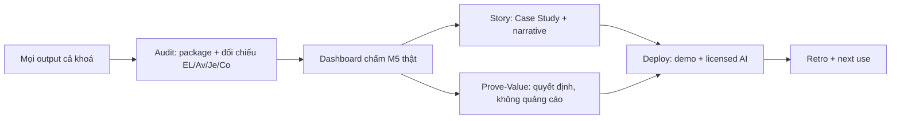
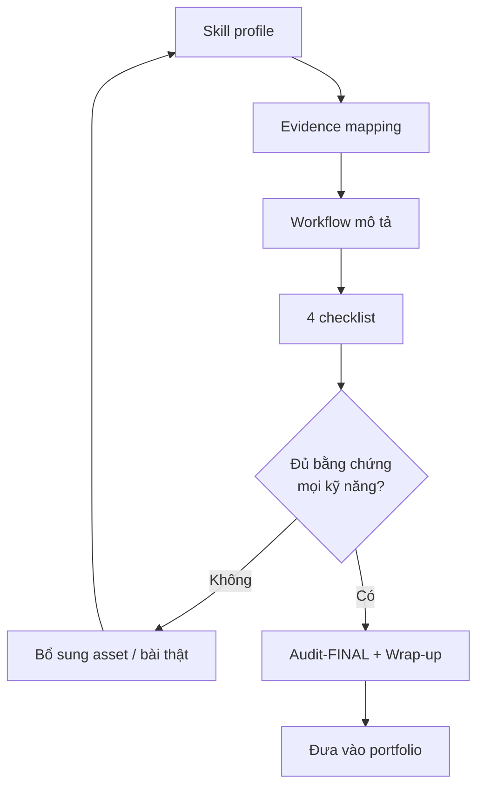
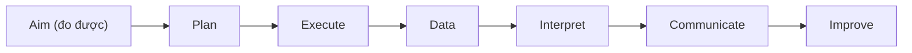

# MODULE 9 — Capstone: kể câu chuyện bằng bằng chứng

> **Pha:** 4 · CONTROL & PROVE — chứng minh giá trị bằng dataset, không bằng lời kể
>
> **Năng lực cốt lõi:** Prove Value · Communication
>
> **AI Handbook:** ch.10 (Case Studies) · ch.11 (Workflows) · ch.12 (Playbooks)
>
> **ISTQB CT-GenAI:** đối xuất toàn bộ EL/Av/Je/Co qua dataset của bạn
>
> **Project xuyên suốt:** E-commerce Checkout · Đầu vào: mọi asset của cả khoá
>
> **Asset xuất ra:** `/capstone/AUDIT.md` + `STORY.md` + `PROVE-VALUE.md`
>
> **Thời lượng đề xuất:** 8 giờ

---

## Vì sao có module này

Bạn đã: prompt đúng chuẩn, validate bằng 4 lớp, dựng automation, sói toàn hệ sinh thái. Nguy
hiểm cuối cùng không nằm ở kỹ thuật — nằm ở việc **không ai tin bạn** khi bạn nói "AI giúp
tôi nhiều lắm". Một câu khẳng định không số liệu sẽ đập vào tường ngay trước mặt các anh
quản lý chỉ quan tâm chất lượng và chi phí.

Capstone dạy **kể câu chuyện có bằng chứng**: đưa lời khẳng định về *"AI giúp"* thành một
**dataset rõ ràng**, rồi từ dataset xây ba bài (audit · story · prove-value). Đây không phải
để kiểm bạn — mà để lúc quay lại công việc thật, bạn bước vào phòng họp với số trên tay.



---

## 9.1 Dataset trước, giọng văn sau

Primitive đầu tiên của dòng này là **biết cách đối chiếu**: checklist dùng không lệ thuộc
module — và nhất là **mọi số liệu đều phải đo được**, không phải ước lượng (bài học M5).

Số liệu đi xuyên suốt cả khoá:

| Metric chuẩn | Giữ gì mà đo |
|---|---|
| Human vs AI | Time per TC (M4–M7) |
| Accuracy | % match (M5) |
| Coverage | AC → TC (M4) |
| PII violations | Dem 0 trong validation (M5) |
| Rejected files | % bị reject review (M4/5) |
| Stability | Locator rework (M7) |
| Automation delta | Speed/man-hour M6 vs M7 |

Mọi thứ ghi nhận lúc làm, không "hồi tưởng" lại ở cuối — **memory-log chi tiết, đúng chỗ**.
File nào không có nguồn thì ghi rõ "ước lượng", không tô vẽ.

---

## 9.2 Audit: đóng gói và chứng thật

Audit không phải viết "quá trình của tôi tốt". Nó là **kỹ thuật đóng gói**: bộ rà soát
checklist để xác định xem package của mình đã chứng minh được gì.

```text
PART 1 — Skill profile     : mapping skillset từ các bài thực hành.
PART 2 — Evidence mapping  : đối chiếu kỹ năng → bằng chứng (mỗi kỹ năng có người giữ)?
PART 3 — Workflow          : mô tả luồng cơ bản của riêng bạn (chart).
PART 4 — Checklist         : M5. Pipeline Links. Coverage Evidence. Case Study.
PART 5 — Adjust & Close    : thêm phần sót, update ngày, ghép.
```



Chỉ kết thúc khi **mọi skill đều có evidence** — không có dòng "tôi tin là tôi làm được".
Đây cũng là nơi bạn đặt **metrics-final** và lập các pipeline links, markdown checklist,
case study. Nhớ: *mỗi lời khẳng định trong audit phải có asset hoặc số đứng sau.*

---

## 9.3 Story: viết như chuyên gia, đừng viết như sinh viên

**Case study** trong handbook là kỹ thuật chứng minh — viết **có sản phẩm và kết quả đo**,
không "tôi học được…". Giọng điệu chuẩn:

> KHÔNG nên: *"Trong project này tôi đã dùng AI rất nhiều và hiệu quả."*
>
> NÊN làm: *"Trong 3 tuần, nhờ công thức prompt-then-validate, tôi giảm 60% thời gian duyệt
> test case trong khi 0 PII violation phát sinh (xem metrics table)."*

Câu chuyện tốt đi theo vành: **aim (mục tiêu đo được) → plan → execute → data → interpret
→ communicate**. Sau cùng, tổng hợp thành một **SQL của mình** — schema, bảng, cột — để câu
chuyện trung thực, không thiên vị. Kể mạch, không kể theo module.



**Thực hành:** 7 chủ đề gợi ý đầu story (Problem Statement · baseline · AI usage · 4 gradients
kết quả · case study · implement steps · kịch bản future skills). Chốt 1 "story spine": thống
nhất từ audit đến report, dùng feature gì liên quan, dependency gì trong pipeline. Cuối
module chạy Retrospective 4W — **What went well / Went wrong / Learned / Apply**.

---

## 9.4 Prove-Value: quyết định, không quảng cáo

Phần thuyết phục nhất nằm ở số thật, không phải cảm xúc. Build a **Value-Case** giống report
cho anh quản lý:

| Điều quản lý hỏi | Số của bạn |
|---|---|
| Tiết kiệm gì? | Đơn vị thời gian/chi phí, có baseline đối chứng |
| Chất lượng đổi ra sao? | % accuracy trên ground truth |
| Rủi ro gì khi dùng AI? | **Cần cả Phụ lục "Có những chỗ không nên dùng AI"** |
| Không làm thì sao? | Chi phí cơ hội rõ số |

Một **"Level-5 evidence"** có đủ 5 mức, chứng minh được bằng **dashboard metrics** cuối khoá.
Đừng cắt bỏ phụ lục xấu — một report chỉ "tốt đẹp" là một report dối: quản lý nhiều kinh
nghiệm sẽ bắt giò, còn không bắt thì bạn mất lòng tin về sau. **Nguyên tắc: decision để
management đưa; của bạn là đưa số trung thực.**

**Thực hành:** 4 doanh nghiệp theo 4 gradient — *sẵn sàng cao · vừa · thấp · chống đối* — xác
định điểm thuyết phục phù hợp (innovation champion / adoption queuing / skeptical / wallet).
Chia phần **invoice demo** 2 phút và **deep dive** 10 phút; soạn Risk & Trust Plan 1 trang.
Chạy demo 2 lần trước người thật, ghi nhận câu hỏi khó vào "FAQ" và học cách ấn định **SLA
cho AI** (người trả lời, thời gian, chậm thì thế nào).

Mẫu so sánh "trước/sau" kèm cột trách nhiệm rất có tác dụng: *manual — partner human* ·
*AI-assisted — partner human* · *automated — partner human* với AI đổi vai giữa "doer" và
"reviewer". Tránh mất lòng an toàn: chứng minh bằng số rằng AI giao cho đúng người chịu
trách nhiệm.

---

## 9.5 Từ Capstone đến công việc thật

Bộ ba asset — `AUDIT` · `STORY` · `PROVE-VALUE` — là kết tinh của cả khoá, bạn mang chúng
luôn về team:

| Asset | Dùng để |
|---|---|
| AUDIT.md | Chứng thật kỹ năng + sửa thiếu sót |
| STORY-case-study.md | Hồ sơ / demo năng lực |
| PROVE-VALUE-report.md | Thuyết phục quản lý, plan adoption |

Quy tắc cuối: **AI giúp bạn xuất sắc, nhưng sự xuất sắc được chứng minh bằng dataset.**
"Delegate work, not thinking" hóa thành *"AI xử công việc; bạn xử quyết định và đo lường."*
Khi ai hỏi "AI có thay automation tester được không" — bạn đưa họ xem số: rẻ hơn, kiểm soát
được, có người chịu trách nhiệm, có cơ chế an toàn. Câu trả lời nằm ở hồ sơ bạn vừa đóng
gói, không cần lời giải thích thêm.

> Do not delegate thinking — delegate work.