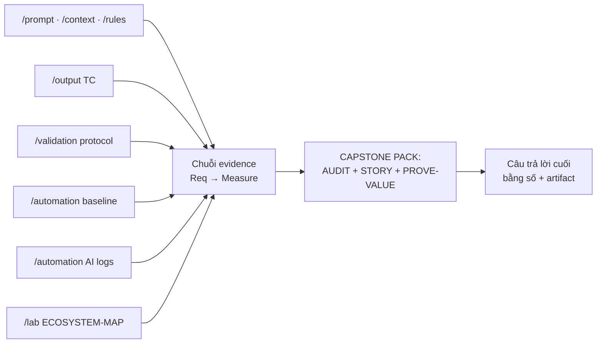
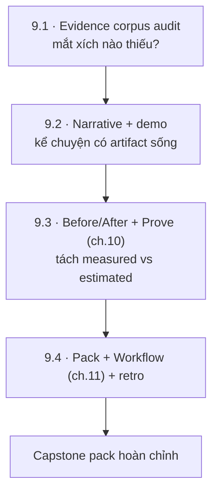
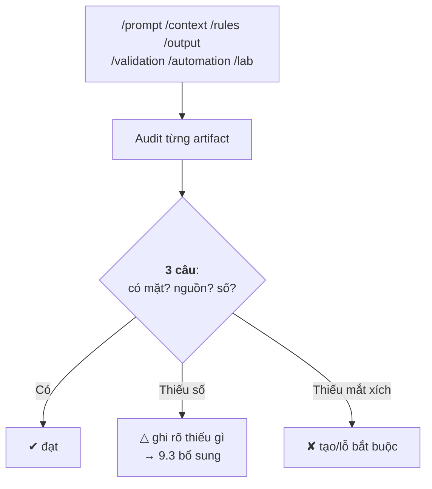
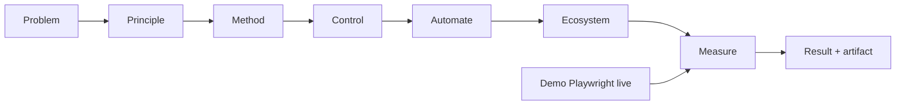
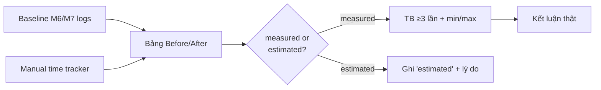
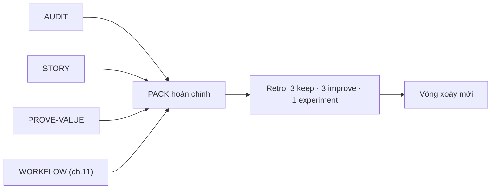

# MODULE 9 — Capstone: End-to-End Project

> **Pha:** 4 · CONTROL & PROVE — Không nội dung mới, chỉ dựng bằng chứng
>
> **Năng lực cốt lõi:** Prove · Improve · Communicate
>
> **AI Handbook:** ch.10 (Prove Value) · ch.11 (Workflow)
>
> **ISTQB CT-GenAI:** Chương 5 (GenAI-5.1.2, 5.2.1 → 5.2.3) + tổng hợp KPI Chương 2
>
> **Đầu vào:** toàn bộ artifact từ M1→M8 — module "dọn kho" cuối
>
> **Asset xuất ra:** **`/capstone/AUDIT.md` + `/capstone/STORY-checkout.md` + `/capstone/PROVE-VALUE.md` + capstone pack**
>
> **Thời lượng đề xuất:** 8 giờ

> M1→M8 là 8 module *làm*. M9 là 1 module *chứng minh*.
> Nó lặp lại đúng câu hỏi của mục đích chương trình:
> *"AI đổi công việc BA/Tester như thế nào, bằng số liệu nào?"*
> Nếu không trả lời được, không phải AI hỏng — là process thiếu evidence.

> **Bám handbook ch.10:** *Không nói AI tốt hơn. Có bằng chứng AI tốt hơn ở task đó.*
> Manual vs AI-assisted phải đi kèm quality không giảm. Và **ch.11 (Workflow):**
> Req → Test → Automation → Diagnosis — ba chuỗi chính phải kể lại được bằng artifact.

---

## Vì sao module này nằm ở đó

Mọi module trước để lại artifact: `/context`, `/prompt`, `/rules`, `/output`,
`/validation`, `/automation`, `/lab`. Đến M9 chúng còn rời rạc. Capstone **dựng khung**:
từ một tài liệu đến một *corpus* — và bạn thấy hành trình "Req → Test → Automation →
Proof" như một dây chuyền có mắt xích.



---

## Bản đồ module



---

## LESSON 9.1 — Evidence corpus audit

### 1. Vấn đề
Bạn "nhớ là đã có file". Nhưng Capstone không chạy trên trí nhớ — chạy trên **audit**:
đếm chuỗi Req → Measure có còn mắt xích nào, và mắt xích đó chân thực hay chỉ "tôi nghĩ là có".

### 2. Vì sao quan trọng
**ch.10:** *Có bằng chứng AI tốt hơn ở task đó.* ISTQB GenAI-5.1.2: kế hoạch AI cần mục
tiêu **đo được** — Capstone trả lời bằng artifact có số, không lời hứa.

### 3. Kiến thức tối thiểu
Audit theo **evidence chain**, mở rộng từ M5:

```text
Req (M3/M4) → AC (M4) → TC JSON (M4) → Validation (M5) → Automation (M6) → AI logs (M7)
   → Metrics (M5/M7/M9) → Governance (M8) → Kết luận (M9)
```

**Checklist audit — 3 câu cho MỌI mắt xích:**

1. **Có mặt?** File tồn tại, không rỗng.
2. **Có nguồn?** Trỏ về nguồn cũ hơn (req_id → AC → §kết luận).
3. **Có số?** Đo được cái gì, con số nào.

Kết quả 3 cột: `✔ đạt` · `△ thiếu số liệu` · `✘ thiếu mắt xích`.

### 4. Sơ đồ tư duy



### 5. Demo thực chiến
Audit `/output/checkout-testcases.json`: req count đúng? đối chiếu `/context/business-rules.md`.
Chỉ ra file "có mặt nhưng thiếu số". Chuẩn mực: *"tồn tại" khác "đủ bằng chứng"*.

### 6. Thực hành có hướng dẫn
Bảng audit 10 artifact quan trọng nhất. Đánh dấu 3 ký hiệu + ghi "thiếu gì".

### 7. Nhiệm vụ thật
**`/capstone/AUDIT.md`** — bảng toàn bộ artifact: trạng thái 3 câu + danh sách phải tạo/lỗ
+ người chủ mỗi mắt xích.

### 8. Kiểm chứng
- [ ] % artifact bắt buộc có mặt ≥80% (mục tiêu rõ).
- [ ] Mọi "thiếu" có hành động + deadline.
- [ ] AUDIT nằm đầu pack — người mới hiểu corpus ngay.

### 9. Đo lường
% artifact đạt 3/3 · % thiếu số · % thiếu mắt xích — "ảnh sức khỏe" của pack.

### 10. Ghi chép & tái sử dụng
AUDIT là "một trang ấn tượng" cho kế hoạch AI của team.

---

## LESSON 9.2 — Narrative end-to-end + demo

### 1. Vấn đề
Có corpus nhưng người xem (quản lý, đồng nghiệp) không đọc corpus — họ nghe **câu chuyện**.
Story thiếu proof = thuyết phục rỗng. Proof thiếu story = kho dữ liệu vô hồn.

### 2. Vì sao quan trọng
**ch.10 Prove Value:** *Manual 40 phút → AI 18 phút; Quality không giảm.* ISTQB GenAI-5.2.1,
5.2.2: giao tiếp, hợp tác, giải thích kết quả. Kể chuyện có bằng chứng là **kỹ năng thật** —
team nào ai cũng có file, nhưng người biết kể mới thuyết phục budget.

### 3. Kiến thức tối thiểu
**Narrative 8 bước** (5 phút + demo):

```text
1. Problem  : "Checkout lỗi hết đợt này đợt khác, không ai đếm được"
2. Principle: "Do not delegate thinking. Delegate work."
3. Method   : Manual → AI → Compare → Validate → Measure (M4)
4. Control  : AI-VALIDATION-PROTOCOL (M5)
5. Automate : baseline M6 → AI-assisted M7 với delta số
6. Ecosystem: ECOSYSTEM-MAP (M8)
7. Measure  : Before/After (9.3) — measured, không estimated
8. Result   : kết luận bằng số + artifact link
```

**Demo trực tiếp** quan trọng: chạy Playwright thật lúc kể; re-run mới đếm flake — không
trim pre-record cho "đẹp".

### 4. Sơ đồ tư duy



### 5. Demo thực chiến
Luyện script 5 phút từ 8 khối, chạy demo Playwright live 30 giây. Khối nào chung chung (thiếu
số), khối nào có artifact — edit ngay.

### 6. Thực hành có hướng dẫn
Viết **story card** mỗi khối: 2 câu + 1 số đo + 1 artifact. Tổng ≤ 5 phút.

### 7. Nhiệm vụ thật
**`/capstone/STORY-checkout.md`** — script 5 phút + link artifact mỗi bước + ghi rõ "demo
chạy được 30s" + 0 blocker.

### 8. Kiểm chứng
- [ ] Mọi bước kể có artifact sống (link mở được).
- [ ] Demo 30 giây chạy, không sửa script giữa chừng.
- [ ] Story không nói "AI tốt/chung chung" thiếu số.

### 9. Đo lường
Thời lượng nói (≤5 phút) · số chi tiết được hỏi sâu mà trả lời từ artifact.

### 10. Ghi chép & tái sử dụng
STORY là khuôn tái dùng cho demo, onboarding, giảng lại cho team.

---

## LESSON 9.3 — Before/After + Prove value (ch.10)

### 1. Vấn đề
"AI giúp tôi nhanh hơn" — nghe vui, chưa thuyết phục. Capstone đòi con số rạch ròi và
**trung thực**: tách *đo được* (measured) khỏi *ước lượng* (estimated). Trộn hai loại = mất
lòng tin kể cả khi số đúng.

### 2. Vì sao quan trọng
**ch.10 Prove Value** là **nguyên tắc áp dụng cho mọi recipe**, không phải chương lý thuyết.
Mục tiêu: *Không nói AI tốt hơn. Có bằng chứng AI tốt hơn ở task đó.* Prove-value là bài
kiểm cuối: dùng metrics 2.3.1 đúng cách chưa, hay để "số đẹp" che "số thật"?

### 3. Kiến thức tối thiểu
Bảng **Before/After** — nối thẳng đo lường M5/M7:

| Chiều | Before (manual) | After (AI-assisted) | Loại |
|---|---|---|---|
| TC draft (giờ/30 TC) | 4h | 1.5h | **measured** (M5.6) |
| Review human (giờ) | 3h | 2h | measured (M5.4) |
| Sinh Playwright (giờ) | 2h | 1h | measured (M7.1 delta) |
| Debug (giờ/bug) | 1h | 0.5h | measured (M7.2) |
| Vision card (giờ/ngày) | — | 0 (đã cắt) | estimated |
| Tỷ lệ flake | — | <20% | measured (M6.3) |

2 luật không gãy:
1. Mỗi ô phải có **Loại** = `measured` hoặc `estimated` — chưa đo thì `estimated` + nói rõ.
2. Không claim cải thiện ở ô chưa đo. measured → trung bình ≥3 lần, ghi min/max.

### 4. Sơ đồ tư duy



### 5. Demo thực chiến
Lấy logs M7, dựng bảng 5 dòng. Cố ý đưa "TC draft 4h → 1.5h" mà mới đo 1 lần — peer phát
hiện yêu cầu "≥3 lần". Đây là "luật chống chỉnh số".

### 6. Thực hành có hướng dẫn
Mỗi ô: ghi số, ghi loại, ghi lần đo (n<3 → estimated).

### 7. Nhiệm vụ thật
**`/capstone/PROVE-VALUE.md`**: bảng Before/After ≥8 dòng + đoạn "điều AI không làm cho tôi"
(trung thực: AI không thay con người duyệt). Link mỗi số về file log.

### 8. Kiểm chứng
- [ ] Mọi dòng có Loại; measured TB ≥3 lần.
- [ ] 0 claim "measured" mà thực chất estimated.
- [ ] Có mục "AI không làm được gì" — trung thực.

### 9. Đo lường
% dòng measured/estimated · kể 1 ô bị peer chặn vì số vô căn cứ.

### 10. Ghi chép & tái sử dụng
PROVE-VALUE là trang để lên slide, gửi sếp, treo trong version control. Mọi con số là giả
thuyết muốn bị bác — bạn làm đúng thế.

---

## LESSON 9.4 — Capstone pack + workflow + retrospective (ch.10, ch.11)

### 1. Vấn đề
Corpus đã có, story đã viết, số đã trung thực. Giờ "đóng gói" thành **portfolio** mang đi
được, và **nhìn lại**: bài học nào giữ, nào đổi, thí nghiệm nào thử (GenAI-5.2.3).

### 2. Vì sao quan trọng
Capstone không phải đích cuối, là **nơi chốt một vòng xoáy** và mở vòng tiếp. **ch.11
Workflow:** Req → Test → Automation → Diagnosis phải kể lại được bằng artifact. Retro làm
cải tiến không phụ thuộc may mắn.

### 3. Kiến thức tối thiểu
**Cấu trúc pack:**

```text
capstone/
  AUDIT.md          → corpus health
  STORY-checkout.md → narrative + demo script
  PROVE-VALUE.md    → measured vs estimated
  README-capstone.md → mục đích + cách đọc pack
  WORKFLOW-checkout.md → 3 chuỗi ch.11 (Req→Test, Test→Automation, Failure→Diagnosis)
  links tới /context /prompt /rules /output /validation /automation /lab
```

**Retro RL:** 3 keep · 3 improve · 1 experiment. Mỗi dòng có *bằng chứng* từ corpus:

| Loại | Điều gì | Evidence |
|---|---|---|
| Keep | Playbook được tái dùng | `/playbook/` link |
| Improve | Prompt v2 hiếm "bịa" hơn v1 | GENERATE-LOG — số |
| Experiment | Thử RAG cho /context | 8.4 — plan 1 trang |

### 4. Sơ đồ tư duy



### 5. Demo thực chiến
Mở pack mẫu trainer: cách mỗi dòng retro đi kèm link artifact. Một dòng không evidence =
không được ghi.

### 6. Thực hành có hướng dẫn
Viết 3 keep, 3 improve, 1 experiment mỗi mục kèm link. Trao peer chấm 1–10.

### 7. Nhiệm vụ thật
**`/capstone/` hoàn chỉnh**: AUDIT + STORY + PROVE-VALUE + WORKFLOW-checkout + README-capstone.
Peer review 2 pack khác: chấm ≥8/10; sửa trước khi đóng.

### 8. Kiểm chứng
- [ ] Pack đủ 5 file chuẩn.
- [ ] Retro mỗi dòng có evidence (link/file).
- [ ] WORKFLOW kể được 3 chuỗi ch.11.
- [ ] Peer chấm ≥8/10 ghi rõ mặt điểm.

### 9. Đo lường
Retro có mở ra "vòng xoáy mới" không (mục experiment có kế hoạch + owner).

### 10. Ghi chép & tái sử dụng
Pack là tài liệu onboarding: đọc AUDIT → hiểu corpus, STORY → hiểu câu chuyện,
PROVE-VALUE → hiểu số, WORKFLOW → hiểu cách vận hành. Nó là **bức tranh toàn khoá**.

---

## Đọc thêm

- **AI Handbook** — ch.10 (Prove Value), ch.11 (Workflow).
- **ISTQB CT-GenAI Syllabus v1.1** — Chương 5 (GenAI-5.1.2, 5.2.1 → 5.2.3).
- **ISTQB Glossary** — https://glossary.istqb.org/ — evidence, corpus, metrics.
- **Tất cả tài liệu module trước** — pack là "mặt trước" của corpus đã dựng.

---

## Hết Module 9 — bạn có gì?

1. **AUDIT** — ảnh sức khỏe corpus, con số %.
2. **STORY** — narrative 8 bước + demo chạy được.
3. **PROVE-VALUE** — Before/After measured vs estimated (ch.10).
4. **WORKFLOW** — 3 chuỗi Req→Test, Test→Automation, Failure→Diagnosis (ch.11).
5. **Pack + retro** — 3 keep · 3 improve · 1 experiment có evidence.

**Vòng khoá hoàn tất.** Trả lời câu hỏi gốc bằng chính artifact:

> **"AI đổi công việc BA/Tester như thế nào?"**
> → Nhanh ở draft, chậm ở bảo trì, đắt ở kiểm soát.
> → Con người không bị thay: con người là *người ra quyết định*.
> → Như câu châm ngôn: **Do not delegate thinking. Delegate work.** — và bạn có
> bằng chứng, không chỉ lời nói. Đó chính là **ch.10 Prove Value** và **ch.14 Core Message**.
