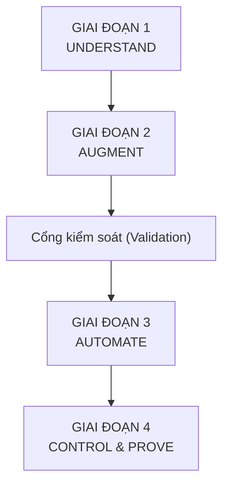
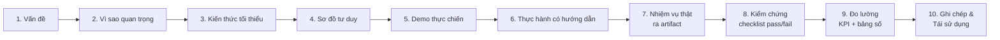
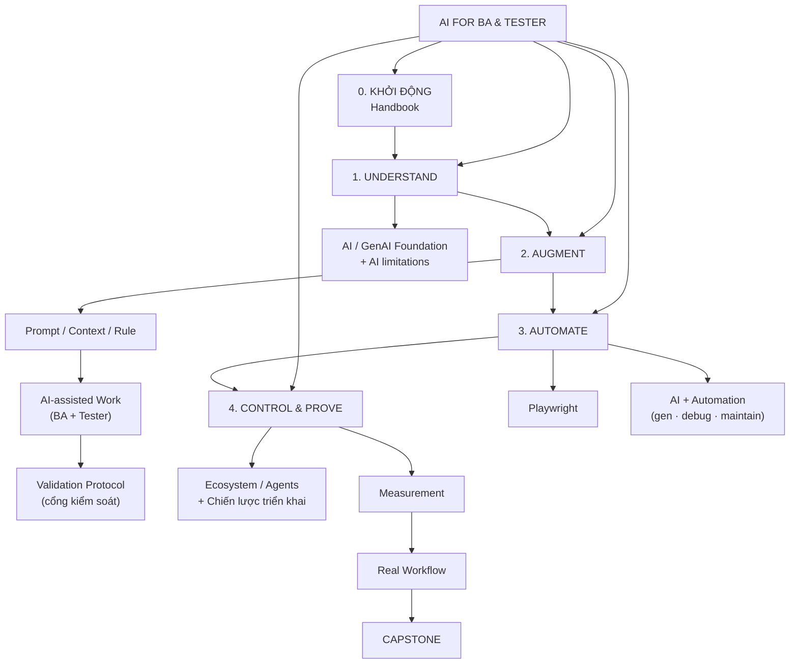

# AI FOR BA & TESTER — TRAINING STRATEGY

> Chương trình đào tạo **Làm việc với AI** cho BA và Tester.
>
> Không phải khoá học Prompt Engineering. Không phải khoá học Playwright.
> Không phải khoá biến BA/Tester thành AI Engineer.
>
> Đây là chương trình xây dựng một **năng lực lao động mới**: nhìn công việc,
> hiểu nó, quyết định Human / AI / Automation, triển khai, kiểm chứng,
> đo lường, và chứng minh giá trị.

---

## 1. Mục đích chương trình

Mục tiêu không phải "dạy dùng ChatGPT". Mục tiêu là chuyển hoá người học qua
sáu bước chuyển năng lực:

```text
Làm việc thủ công
        ↓
Biết AI
        ↓
Biết dùng AI
        ↓
Biết kiểm soát AI
        ↓
Biết tự động hóa
        ↓
Biết đo hiệu quả
        ↓
Biết cải tiến workflow
```

Người học tốt nghiệp phải trả lời được một câu duy nhất:

> **"Tôi dùng AI ở đây vì lý do này; tôi không dùng AI ở đây vì lý do kia; tôi kiểm chứng bằng cách này; và đây là số liệu chứng minh cách làm mới tốt hơn cách cũ."**

### Không phải mục tiêu

- Không học thật nhiều công cụ AI.
- Không học Prompt Engineering như một môn độc lập.
- Không biến Tester thành Automation Engineer.
- Không để AI làm thay toàn bộ công việc.
- Không chứng minh AI luôn đúng.

---

## 2. Xương sống: AI HANDBOOK

Chương trình được dẫn dắt bởi một **AI Handbook** (14 chương) — là tài liệu
ngắn, đọc hàng ngày. Toàn bộ module và lesson bám vào các chương này làm
xương sống:

| Chương handbook | Nội dung | Xuất hiện chính ở |
|---|---|---|
| **00. Start Here** | Mục đích + nguyên tắc | M01 (mở đầu) |
| **01. AI Foundation** | GenAI/LLM · Limitations | M02 |
| **02. Working with AI** | Prompt · Context · Rule · Output | M03 |
| **03. BA Work** | Review · Business Rules · AC · Impact | M04 (nửa BA) |
| **04. Tester Work** | Conditions · Scenarios · TC · Data · Review | M04 (nửa Tester) |
| **05. Validation** | Output review · Ground truth · Reject tiêu chí | M05 |
| **06. Automation — Playwright** | Khi nào automate · Playwright basics | M06 |
| **07. AI + Playwright** | Generate · Debug · Maintain | M07 |
| **08. AI Testing Tools** | Applitools · mabl · Testim · Tricentis | M08 |
| **09. AI Browser / Agent** | agent-browser · browser-use | M08 |
| **10. Prove Value** | Bằng chứng > lời hứa | M09 |
| **11. Workflow** | Req→Test→Automation→Diagnosis | M04 + M09 |
| **12. Playbooks** | Công cụ dùng hàng ngày | M04 |
| **13. Cách đọc Handbook** | Cửa vào dựa trên vai trò/nhu cầu | M01 + README |
| **14. Core Message** | Understand → … → Measure | M01 + M09 |

> Handbook cung cấp **ngôn ngữ chung**; các module biến nó thành **năng lực**
> bằng thực hành có artifact. Cứ mỗi khái niệm trong handbook, có một lesson
> dừng lại để làm thật và để lại tài sản dùng được.

---

## 3. Ba thay đổi về năng lực

Chương trình tạo ra **3 thay đổi** về cách BA và Tester làm việc.

### Thay đổi 1 — Từ "dùng AI" thành "làm việc với AI"

Không còn là héo "ChatGPT ơi", mà là một quy trình có chủ đích:

```text
Task → Context → Prompt → Rule → AI → Validation
```

### Thay đổi 2 — Từ "tin AI" thành "kiểm soát AI"

AI rất hữu ích và vẫn có thể sai. Hai chân lý này cùng tồn tại.
Vì vậy mọi output đều đi qua chuỗi kiểm soát:

```text
AI Output → Check → Evidence → Human Judgment
```

**AI không phải source of truth.**

### Thay đổi 3 — Từ "làm nhanh hơn" thành "chứng minh tốt hơn"

Không kết luận "AI giúp tăng productivity".
Phải chứng minh bằng: thời gian, coverage, quality, rework, số lỗi, effort bảo trì.

---

## 4. Năm phương châm chính thức

| # | Phương châm | Nghĩa |
|---|---|---|
| 1 | **Understand before Automate** | Hiểu công việc trước khi tự động hóa. |
| 2 | **AI assists, Human decides** | AI hỗ trợ, con người quyết định. |
| 3 | **Generate ≠ Correct** | AI tạo ra output không có nghĩa output đúng. |
| 4 | **Prove, don't promise** | Không nói AI có ích; phải chứng minh bằng dữ liệu. |
| 5 | **Problem first, Tool second** | Vấn đề đi trước, công cụ đi sau. |

Và một câu đặt làm **xương sống** của cả chương trình:

> ## Do not delegate thinking. Delegate work.
>
> **Không giao tư duy cho AI. Giao phần việc phù hợp cho AI.**

Quy trình làm việc chuẩn theo phương châm này:

```text
THINK → DECIDE → DELEGATE → VERIFY → MEASURE → IMPROVE
```

---

## 5. Bốn giai đoạn lớn

Toàn bộ chương trình không còn là một danh sách module rời rạc,
mà là **bốn giai đoạn chuyển hoá năng lực**:

### GIAI ĐOẠN 1 — UNDERSTAND

Xây nền: Công việc của tôi, AI là gì, AI làm được và không làm được gì.
*(Handbook ch.00, 01, 13, 14)*

### GIAI ĐOẠN 2 — AUGMENT

Đưa AI vào công việc hàng ngày: Prompt → Context → Rule →
AI-assisted BA → AI-assisted Testing, kết thúc bằng **cổng kiểm soát**.
*(Handbook ch.02, 03, 04, 05, 11, 12)*

### GIAI ĐOẠN 3 — AUTOMATE

Biến phần việc phù hợp thành automation: Automation thinking →
Playwright → AI + Playwright. *(Handbook ch.06, 07)*

### GIAI ĐOẠN 4 — CONTROL & PROVE

Biến AI thành năng lực sử dụng an toàn và chứng minh được:
Validation → Tools/Agents → Measurement → Workflow → Capstone.
*(Handbook ch.05, 08, 09, 10, 11)*



### Ánh xạ 4 giai đoạn vào các module

| Giai đoạn | Module | Handbook | Câu trả lời người học đạt được |
|---|---|---|---|
| **0. KHỞI ĐỘNG** | M1 — Handbook & Cách đọc | ch.00, 13, 14 | Tôi sẽ làm việc với AI theo nguyên tắc nào? |
| **1. UNDERSTAND** | M2 — AI Foundation | ch.01 | Tôi đang làm gì? AI là gì? AI đúng/sai ở đâu? |
| **2. AUGMENT** | M3 — Prompt/Context/Rule | ch.02 | Tôi giao việc gì cho AI? Tôi cấp context gì? |
| **2. AUGMENT** | M4 — BA/Tester + Playbook | ch.03, 04, 11, 12 | Tôi đưa AI vào từng bước công việc thật? |
| **2. AUGMENT (cổng)** | M5 — AI Validation | ch.05 | Tôi kiểm soát AI bằng cách nào, đo bằng số nào? |
| **3. AUTOMATE** | M6 — Playwright | ch.06 | Công việc này có nên automation không? Bằng gì? |
| **3. AUTOMATE** | M7 — AI + Playwright | ch.07 | AI giúp xây / debug / duy trì automation ra sao? |
| **4. CONTROL & PROVE** | M8 — Ecosystem & Chiến lược | ch.08, 09 | Tool nào thật sự tốt hơn? Lúc nào dùng agent? |
| **4. CONTROL & PROVE** | M9 — Capstone | ch.10, 11 | Tôi có bằng chứng nào? Workflow cải tiến gì? |

> **Ghi chú thiết kế (quyết định có chủ đích):**
> M5 được đặt cuối Giai đoạn AUGMENT, trước Giai đoạn AUTOMATE.
> Lý do: **chỉ tự động hóa những test case đã được kiểm chứng**.
> "Control before Scale" — kiểm soát trước khi mở rộng.
> Năng lực Validation và Measurement sẽ được nâng tiếp lên mức
> Vận hành và Proof ở M8–M9 theo vòng xoáy (spiral learning).

---

## 6. Bảy chiến lược đào tạo

| # | Chiến lược | Nội dung |
|---|---|---|
| 1 | **Học theo Problem, không theo Tool** | Mọi chủ đề bắt đầu từ vấn đề thật → kỹ năng cần → công cụ phù hợp → thực hành. |
| 2 | **Project xuyên suốt** | Một project duy nhất (E-commerce Checkout) xử lý từ M2 đến M9, kiến thức liên kết thành hệ thống, không học xong rồi quên. |
| 3 | **Spiral Learning** | Một khái niệm được lặp lại ở nhiều hoàn cảnh, mỗi vòng sâu hơn. Ít kiến thức hơn nhưng nhớ sâu hơn. |
| 4 | **Theory → Practice → Proof** | Mỗi chủ đề qua 3 lớp: hiểu bản chất → tự làm → chứng minh kết quả. |
| 5 | **Baseline trước, AI sau** | Luôn đo manual trước, rồi so sánh với AI-assisted và automation trên cùng một thước đo. |
| 6 | **Mỗi bài đều có Artifact** | Học xong phải để lại một tài sản dùng được: prompt library, context pack, rulebook, test script, validation report… |
| 7 | **Tool xuất hiện muộn, sau khi đã hiểu Problem** | Thứ tự: Testing → AI → Prompt/Context/Rule → AI-assisted Testing → Validation → Automation → Playwright → AI+Playwright → AI Testing Platforms → Agents. |

### Vòng xoáy của các khái niệm chủ chốt

| Khái niệm | Gặp lần đầu | Mức cuối khoá |
|---|---|---|
| AI / GenAI / LLM | M2 — Cơ bản | Đủ dùng, phân biệt đúng loại cho đúng việc |
| Prompt | M2 → M3 — Có cấu trúc | M7 — Production (gen / debug / maintain) |
| Context | M2 → M3 — Context pack | Pack vận hành có nguồn gốc |
| Rule | M3 — Chống hallucination | Vận hành + gates |
| Validation | M2 (soi từng câu) → M5 Protocol | M8/M9 — Operational + prove value |
| Measurement | Xuyên suốt | Prove value bằng số liệu |
| Prompt chaining / few-shot / meta | M3 | Chọn đúng kỹ thuật cho đúng việc (M4, M7) |
| Playwright | M6 | Suite thật, có evidence |
| AI + Automation | M7 | Workflow có log |
| Agent vs Script | M8 | Decision tree trong ecosystem map |
| Dữ liệu & bảo mật | M3 → M5 | Data minimization + sanitization thành thói quen |
| Chiến lược triển khai AI | M8 → M9 | Roadmap, LLM selection, shadow AI, adoption phases |

---

## 7. Chín năng lực cốt lõi

Chương trình cô đọng toàn bộ vào **9 năng lực** — đây cũng chính là thước đo
đánh giá người học ở Capstone:

| # | Năng lực | Định nghĩa vận hành |
|---|---|---|
| 1 | **Understand** | Hiểu nghiệp vụ và hiểu AI — phân biệt được loại AI, biết giới hạn của từng loại. |
| 2 | **Analyze** | Phân tích công việc để tìm điểm có thể tối ưu bằng AI hoặc automation. |
| 3 | **Prompt** | Giao việc cho AI có cấu trúc, có version, tái dùng được. |
| 4 | **Context** | Cung cấp đúng thông tin, đóng gói thành context pack có nguồn gốc. |
| 5 | **Control** | Dùng Rule / Constraint để siết hành vi AI. |
| 6 | **Validate** | Kiểm chứng output qua Rule → Ground Truth → Human review theo rủi ro. |
| 7 | **Automate** | Biến task phù hợp thành automation bằng Playwright. |
| 8 | **Measure** | Đo before/after bằng số liệu thật, tách "đo được" khỏi "ước lượng". |
| 9 | **Improve** | Cải tiến prompt / rule / workflow sau mỗi vòng lặp. |

---

## 8. Công thức của mỗi lesson

Mọi lesson trong toàn bộ chương trình đi theo **một format duy nhất**
(10 bước), để người học tập trung vào nội dung thay vì loay hoay với cấu trúc:

```text
PROBLEM → WHY → MINIMUM THEORY → DIAGRAM → DEMO → TOOL
       → PRACTICE → VALIDATE → MEASURE → REAL PROJECT → REUSE
```



Ví dụ — *Lesson "AI tạo Test Case"*:

```text
Problem    Tester mất 40 phút cho một lô test case lặp lại
Why        Task lặp lại, tốn effort, dễ sót biên
Theory     Test design + AI limitation (hallucination)
Diagram    Manual flow vs AI flow
Demo       AI sinh test case trực tiếp
Tool       Claude + context pack
Practice   Học viên tự viết prompt theo 6 thành phần
Validate   Rule check + Ground truth + Human review
Measure    40 phút → 18 phút; % TC pass review lần 1
Real       Checkout: sinh test case thật
Reuse      Prompt vào Prompt Library / Playbook
```

**Artifact luôn phải có.** Mỗi lesson kết thúc bằng một output cụ thể trong
repository — không có "hiểu" mà không có "để lại được thứ dùng được".

---

## 9. Cấu trúc repository của người học

Toàn bộ artifact được lưu theo quy ước thống nhất — vừa là bài học,
vừa là bộ tài sản nghề nghiệp dùng lại được:

```text
/prompt/       Prompt có version cho từng nhiệm vụ
/context/      Context pack: requirement, business rules, AC, test base
/rules/        Rulebook chống hallucination, có phân loại
/output/       Output AI + các artifact trung gian
/validation/   Checklist, ground-truth diff, human review log, protocol
/automation/   Playwright suite, design sheet, evidence, AI logs
/lab/          Kết quả các lab ecosystem (A–F) + ECOSYSTEM-MAP
/capstone/     Bộ chứng minh cuối khoá
```

---

## 10. Bản đồ năng lực cuối khoá



---

## 11. Tài liệu nguồn và mối quan hệ tri thức

Cấu trúc tri thức của chương trình dựa trên ba lớp, mỗi lớp một vai trò:

| Nguồn | Vai trò | Dùng ở đâu |
|---|---|---|
| **AI Handbook** (14 chương, đi kèm) | Ngôn ngữ chung, nguyên tắc, playbook | Xương sống của mọi module |
| **ISTQB CT-GenAI Syllabus v1.1** | Knowledge foundation — khung khái niệm, risks, LLM infrastructure, chiến lược triển khai | Mỗi module gắn học phần ISTQB tương ứng (`GenAI-x.y.z`) |
| **Mark Winteringham — *Software Testing with Generative AI*, Manning, 2024** | Practical testing reference — cách AI hỗ trợ thực tế từng hoạt động test | Bám vào các lesson thực hành M3–M8 |
| **Project + Measurement + Validation** | Cơ chế biến kiến thức thành năng lực | Toàn bộ, qua format 10 bước và artifact bắt buộc |

> **Đọc thêm về khung tham chiếu:** `docs/curriculum/BLUEPRINT.md` — bảng
> quản lý chính thức Phase → Module → Lesson → Objective → Theory → Practice
> → Tool → Output → KPI → tiêu chí đạt, kèm ma trận coverage ISTQB CT-GenAI.

---

## 12. Mục lục module

| Module | Pha | Handbook | Năng lực trọng tâm | Output chính |
|---|---|---|---|---|
| [MODULE-01](./MODULE-01-ai-handbook.md) | KHỞI ĐỘNG | ch.00, 13, 14 | Understand | Personal AI Working Agreement |
| [MODULE-02](./MODULE-02-ai-foundation.md) | UNDERSTAND | ch.01 | Understand, Analyze | AI Limitation Report |
| [MODULE-03](./MODULE-03-prompt-context-rule.md) | AUGMENT | ch.02 | Prompt, Context, Control | `/prompt` `/context` `/rules` |
| [MODULE-04](./MODULE-04-ai-for-ba-tester.md) | AUGMENT | ch.03, 04, 11, 12 | Prompt→Work, Validate | BA/Tester AI Playbook |
| [MODULE-05](./MODULE-05-ai-validation.md) | AUGMENT (cổng) | ch.05 | Validate, Measure, Control | AI-VALIDATION-PROTOCOL |
| [MODULE-06](./MODULE-06-playwright.md) | AUTOMATE | ch.06 | Automate, Analyze | Playwright suite + evidence |
| [MODULE-07](./MODULE-07-ai-playwright.md) | AUTOMATE | ch.07 | Automate, Prompt, Improve | AI-assisted Playwright workflow |
| [MODULE-08](./MODULE-08-ecosystem-lab.md) | CONTROL & PROVE | ch.08, 09 | Analyze, Control, Improve | ECOSYSTEM-MAP + chiến lược AI |
| [MODULE-09](./MODULE-09-capstone.md) | CONTROL & PROVE | ch.10, 11 | Measure, Improve, Prove | Capstone evidence pack |

---

> **Câu khoá của chương trình:**
>
> Học viên không học AI để biết AI. Họ lấy việc BA/Tester làm thủ công
> → dùng AI đúng chỗ → kiểm soát bằng context/rule → automate phần phù hợp
> bằng Playwright → chứng minh bằng số liệu.
>
> Handbook là ngôn ngữ chung; module là nơi ngôn ngữ ấy trở thành năng lực.
